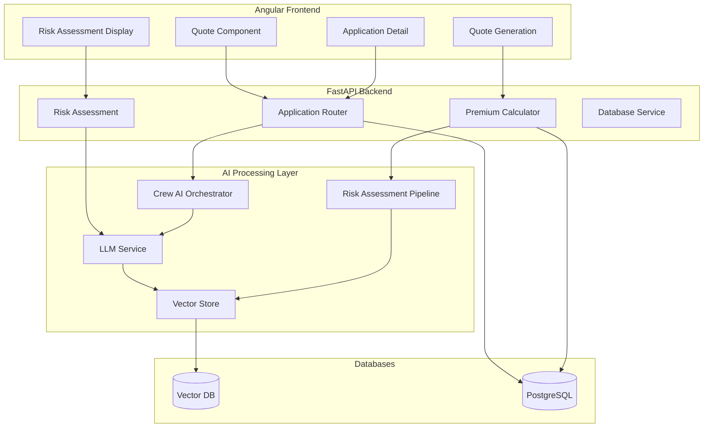
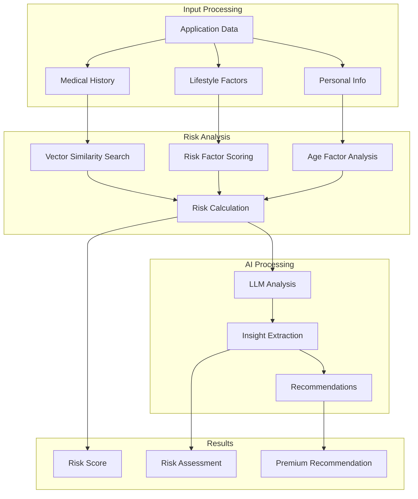
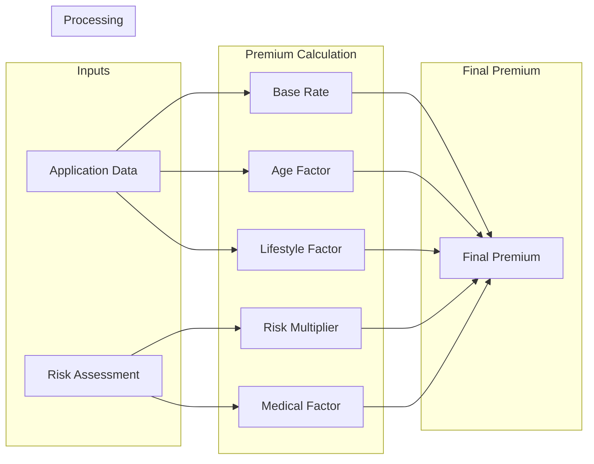
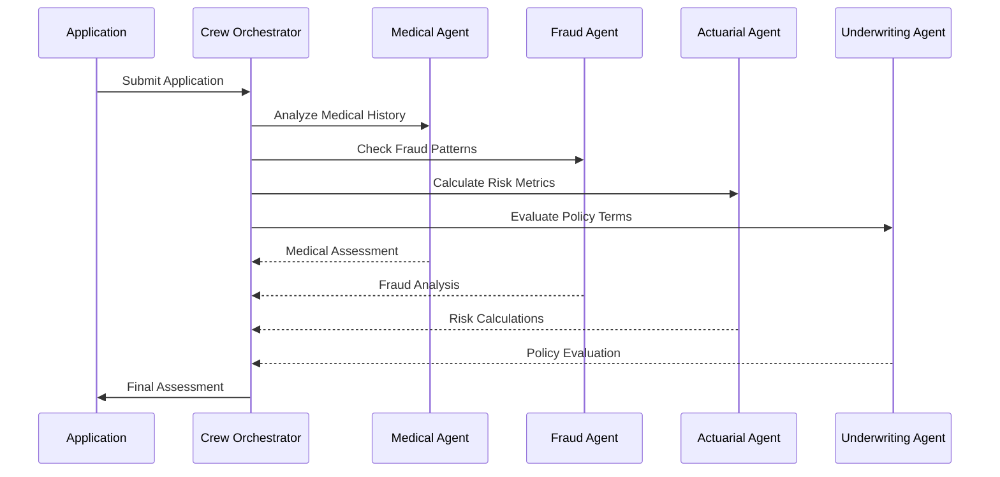
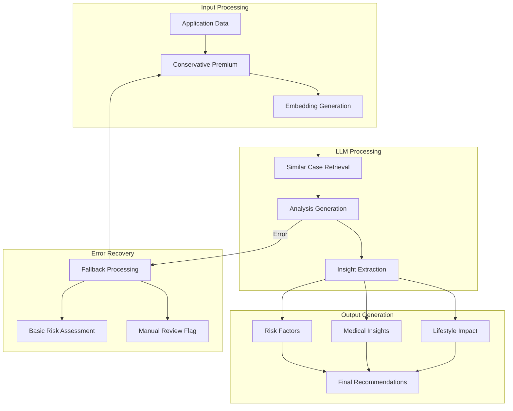

# Insurance System Architecture Diagrams

## System Overview

## Risk Assessment Flow

## Premium Calculation Process

## Crew AI Orchestration

## LLM Service Processing

These diagrams provide a visual representation of the system architecture and key processes described in the implementation guide. Each diagram focuses on a specific aspect of the system:

1. System Overview: Shows the high-level architecture and component interactions
2. Risk Assessment Flow: Details the risk assessment process
3. Premium Calculation Process: Illustrates premium calculation workflow
4. Crew AI Orchestration: Shows the interaction between AI agents
5. LLM Service Processing: Details the LLM service workflow

The diagrams use Mermaid notation, which can be rendered by many Markdown viewers and documentation systems. 