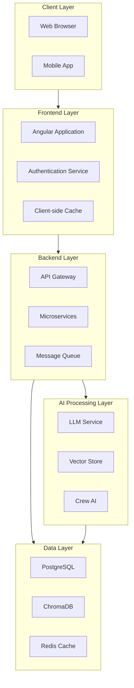
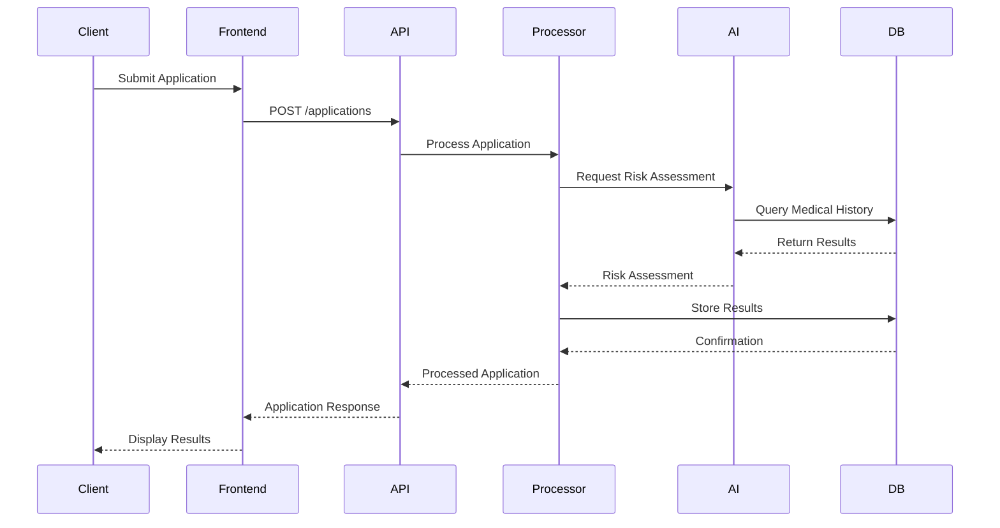
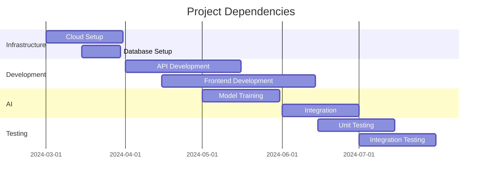
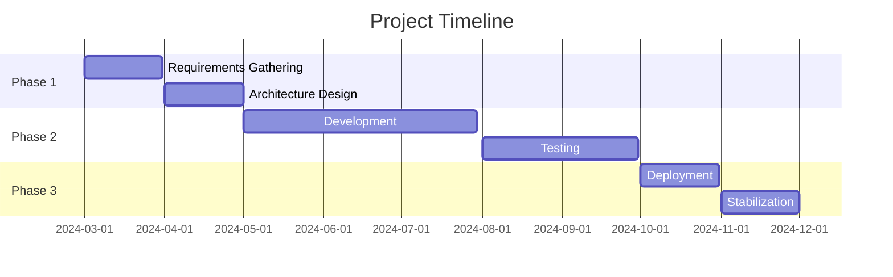
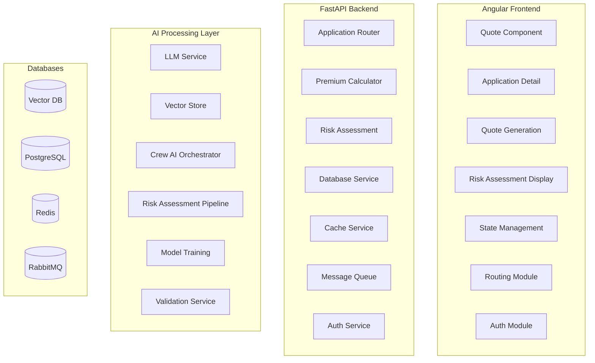

# Insurance System Technical Design Document

## Document Metadata
- **Document ID**: TDD-INS-2024-001
- **Version**: 1.0
- **Status**: Draft
- **Created**: 2024-03-15
- **Last Updated**: 2024-03-15
- **Author**: Technical Design Team
- **Reviewers**: 
  - John Doe (Lead Architect)
  - Jane Smith (Security Expert)
  - Mike Johnson (DevOps Lead)
  - Sarah Williams (QA Manager)
- **Approvers**:
  - CTO
  - Product Owner
  - Security Officer

## Table of Contents
1. [Executive Summary](#executive-summary)
2. [Project Overview](#1-project-overview)
3. [High-Level Functionality](#2-high-level-functionality)
4. [Detailed Functionality Implementation](#3-detailed-functionality-implementation)
5. [Service Implementation Details](#4-service-implementation-details)
6. [Integration Points](#5-integration-points)
7. [Error Handling and Monitoring](#6-error-handling-and-monitoring)
8. [System Architecture](#7-system-architecture)
9. [Data Flow](#8-data-flow)
10. [Security Considerations](#9-security-considerations)
11. [Deployment Architecture](#10-deployment-architecture)
12. [Performance Considerations](#11-performance-considerations)
13. [Testing Strategy](#12-testing-strategy)
14. [API Documentation](#13-api-documentation)
15. [Scalability Considerations](#14-scalability-considerations)
16. [Future Enhancements](#15-future-enhancements)
17. [Non-Functional Requirements](#16-non-functional-requirements)
18. [Compliance Requirements](#17-compliance-requirements)
19. [Data Migration Strategy](#18-data-migration-strategy)
20. [Disaster Recovery Plan](#19-disaster-recovery-plan)
21. [Cost Estimation](#20-cost-estimation)
22. [Team Structure and Responsibilities](#21-team-structure-and-responsibilities)
23. [Third-Party Dependencies](#22-third-party-dependencies)
24. [API Versioning Strategy](#23-api-versioning-strategy)
25. [Documentation Standards](#24-documentation-standards)
26. [Maintenance Plan](#25-maintenance-plan)
27. [Glossary](#glossary)
28. [References](#references)
29. [Appendix](#appendix)
30. [Revision History](#revision-history)

## Executive Summary
This technical design document outlines the architecture and implementation details of the Insurance System, a comprehensive solution for automated insurance application processing, risk assessment, and premium calculation. The system combines modern web technologies with AI capabilities to streamline the insurance underwriting process.

Key highlights:
- AI-powered risk assessment and premium calculation
- Secure and scalable architecture
- Compliance with industry standards
- Comprehensive monitoring and maintenance
- Future-proof design for enhancements

## 1. Project Overview

### 1.1 Purpose
The Insurance System is a comprehensive solution for automated insurance application processing, risk assessment, and premium calculation. It combines modern web technologies with AI capabilities to streamline the insurance underwriting process.

### 1.2 Key Features
- Automated insurance application processing
- AI-powered risk assessment
- Dynamic premium calculation
- Medical history analysis
- Fraud detection
- Real-time quote generation

### 1.3 Technology Stack
- Frontend: Angular (TypeScript)
- Backend: FastAPI (Python)
- AI Processing: Python-based LLM services
- Databases: PostgreSQL, ChromaDB
- Vector Store: ChromaDB for medical condition embeddings

## 2. High-Level Functionality

### 2.1 Application Processing
- **Purpose**: Handle insurance application submissions and processing
- **Key Components**:
  - Application validation
  - Data enrichment
  - Risk assessment triggering
  - Premium calculation
  - Decision making

### 2.2 Risk Assessment
- **Purpose**: Evaluate applicant risk profile
- **Key Components**:
  - Medical history analysis
  - Lifestyle factor assessment
  - Age-based risk calculation
  - Occupation risk evaluation
  - AI-powered insights

### 2.3 Premium Calculation
- **Purpose**: Determine insurance premium based on risk factors
- **Key Components**:
  - Base rate calculation
  - Risk multiplier application
  - Age factor consideration
  - Medical history impact
  - Lifestyle factor adjustment

## 3. Detailed Functionality Implementation

### 3.1 Application Processing

#### 3.1.1 Application Validation
- **Location**: `backend/app/api/endpoints/insurance.py`
- **Key Functions**:
  ```python
  @router.post("/applications")
  async def create_application(application: ApplicationCreate):
      # Validates application data
      validated_data = await validate_application_data(application)
      # Processes medical history
      medical_history = await process_medical_history(validated_data.medical_history)
      # Triggers risk assessment
      risk_assessment = await ai_service.assess_risk(validated_data)
  ```

#### 3.1.2 Data Processing
- **Location**: `backend/app/services/application_processor.py`
- **Key Functions**:
  ```python
  class ApplicationProcessor:
      async def process_application(self, application_data: Dict[str, Any]):
          # Data enrichment
          enriched_data = await self.enrich_application_data(application_data)
          # Medical history processing
          medical_analysis = await self.process_medical_history(enriched_data)
          # Risk assessment
          risk_score = await self.calculate_risk_score(medical_analysis)
  ```

### 3.2 Risk Assessment Implementation

#### 3.2.1 Medical Risk Analysis
- **Location**: `backend/app/services/medical_risk_analysis.py`
- **Key Functions**:
  ```python
  def analyze_medical_risk(medical_history: Dict[str, Any]) -> Dict[str, Any]:
      # Vector similarity search
      matches = vector_store.search(medical_history["conditions"])
      # Risk score calculation
      risk_score = calculate_risk_score(matches)
      # Assessment generation
      assessment = generate_risk_assessment(risk_score)
  ```

#### 3.2.2 Lifestyle Risk Assessment
- **Location**: `backend/app/schemas/insurance.py`
- **Key Functions**:
  ```python
  class RiskFactorsBase(BaseModel):
      def calculate_risk_contribution(self) -> float:
          # Smoking impact
          if self.smoking:
              base_risk += 0.3
          # Alcohol impact
          if self.alcohol_consumption:
              base_risk += 0.15
          # Activity risk
          activity_risk = min(0.4, len(self.dangerous_activities) * 0.1)
  ```

### 3.3 Premium Calculation Implementation

#### 3.3.1 Base Rate Calculation
- **Location**: `backend/app/services/premium_calculator.py`
- **Key Functions**:
  ```python
  class PremiumCalculatorService:
      def get_base_rate(self, coverage_type: str) -> float:
          # Load base rates from configuration
          base_rates = self.load_base_rates()
          # Return appropriate rate
          return base_rates.get(coverage_type, 0.0)
  ```

#### 3.3.2 Risk Factor Application
- **Location**: `backend/app/services/premium_calculator.py`
- **Key Functions**:
  ```python
  async def calculate_premium(self, application_data: ApplicationData) -> Premium:
      # Base rate
      base_rate = self.get_base_rate(application_data.coverage_type)
      # Risk multiplier
      risk_multiplier = await self.calculate_risk_multiplier(risk_assessment)
      # Age factor
      age_factor = self.calculate_age_factor(application_data.age)
      # Final premium
      final_premium = base_rate * risk_multiplier * age_factor
  ```

### 3.4 Frontend Implementation

#### 3.4.1 Application Form Component
- **Location**: `frontend/src/app/components/application-form/application-form.component.ts`
- **Key Functions**:
  ```typescript
  @Component({
    selector: 'app-application-form',
    templateUrl: './application-form.component.html'
  })
  export class ApplicationFormComponent {
    async onSubmit(applicationData: ApplicationFormData) {
      // Form validation
      if (!this.validateForm(applicationData)) {
        return;
      }
      // API call
      const response = await this.insuranceService.submitApplication(applicationData);
      // Handle response
      this.handleApplicationResponse(response);
    }

    private validateForm(data: ApplicationFormData): boolean {
      // Required field validation
      if (!data.personalInfo || !data.medicalHistory) {
        this.showError('Missing required fields');
        return false;
      }
      // Age validation
      if (data.personalInfo.age < 18 || data.personalInfo.age > 75) {
        this.showError('Age must be between 18 and 75');
        return false;
      }
      return true;
    }
  }
  ```

#### 3.4.2 Risk Assessment Display
- **Location**: `frontend/src/app/components/risk-assessment/risk-assessment.component.ts`
- **Key Functions**:
  ```typescript
  @Component({
    selector: 'app-risk-assessment',
    templateUrl: './risk-assessment.component.html'
  })
  export class RiskAssessmentComponent {
    async loadRiskAssessment(applicationId: string) {
      // Fetch risk data
      const riskData = await this.riskService.getRiskAssessment(applicationId);
      // Update UI
      this.updateRiskDisplay(riskData);
      // Generate visualizations
      this.generateRiskCharts(riskData);
    }

    private generateRiskCharts(riskData: RiskAssessmentData) {
      // Medical risk chart
      this.medicalRiskChart = this.createChart({
        type: 'radar',
        data: riskData.medicalFactors
      });
      // Lifestyle risk chart
      this.lifestyleRiskChart = this.createChart({
        type: 'bar',
        data: riskData.lifestyleFactors
      });
    }
  }
  ```

## 4. Service Implementation Details

### 4.1 AI Processing Services

#### 4.1.1 LLM Service
- **Location**: `backend/app/services/llm_service.py`
- **Key Components**:
  ```python
  class LLMService:
      async def process_application(self, application_data: ApplicationData):
          # Context preparation
          context = self.prepare_application_context(application_data)
          # Embedding generation
          embeddings = await self.generate_embeddings(context)
          # Analysis generation
          analysis = await self.generate_analysis(embeddings)
          # Insight extraction
          insights = self.extract_insights(analysis)
  ```

#### 4.1.2 Vector Store Service
- **Location**: `backend/app/services/vector_store.py`
- **Key Components**:
  ```python
  class VectorStore:
      async def similarity_search(self, query_vector: np.ndarray):
          # Vector preprocessing
          processed_vector = self.preprocess_vector(query_vector)
          # Search execution
          results = await self.collection.query(query_embeddings=processed_vector)
          # Result processing
          return self.process_search_results(results)
  ```

### 4.2 Database Services

#### 4.2.1 Application Storage
- **Location**: `backend/app/models/insurance.py`
- **Key Models**:
  ```python
  class InsuranceApplication(Base):
      __tablename__ = "insurance_applications"
      id = Column(Integer, primary_key=True)
      applicant_name = Column(String)
      applicant_age = Column(Integer)
      medical_history = Column(JSON)
      risk_factors = Column(JSON)
      premium_amount = Column(Float)
  ```

#### 4.2.2 Risk Score Storage
- **Location**: `backend/app/models/insurance.py`
- **Key Models**:
  ```python
  class RiskScore(Base):
      __tablename__ = "risk_scores"
      id = Column(Integer, primary_key=True)
      application_id = Column(Integer, ForeignKey("insurance_applications.id"))
      overall_score = Column(Float)
      medical_factor = Column(Float)
      age_factor = Column(Float)
      lifestyle_factor = Column(Float)
  ```

### 4.3 Frontend Services

#### 4.3.1 Insurance Service
- **Location**: `frontend/src/app/services/insurance.service.ts`
- **Key Components**:
  ```typescript
  @Injectable({
    providedIn: 'root'
  })
  export class InsuranceService {
    constructor(private http: HttpClient) {}

    async submitApplication(application: ApplicationData): Promise<ApplicationResponse> {
      // API call
      return this.http.post<ApplicationResponse>(
        '/api/applications',
        application,
        { headers: this.getAuthHeaders() }
      ).toPromise();
    }

    async getQuote(applicationId: string): Promise<Quote> {
      // Quote retrieval
      return this.http.get<Quote>(
        `/api/quotes/${applicationId}`,
        { headers: this.getAuthHeaders() }
      ).toPromise();
    }
  }
  ```

#### 4.3.2 Risk Service
- **Location**: `frontend/src/app/services/risk.service.ts`
- **Key Components**:
  ```typescript
  @Injectable({
    providedIn: 'root'
  })
  export class RiskService {
    async getRiskAssessment(applicationId: string): Promise<RiskAssessment> {
      // Risk data retrieval
      return this.http.get<RiskAssessment>(
        `/api/risk-assessment/${applicationId}`,
        { headers: this.getAuthHeaders() }
      ).toPromise();
    }

    async getRiskHistory(applicationId: string): Promise<RiskHistory[]> {
      // Historical risk data
      return this.http.get<RiskHistory[]>(
        `/api/risk-history/${applicationId}`,
        { headers: this.getAuthHeaders() }
      ).toPromise();
    }
  }
  ```

## 5. Integration Points

### 5.1 API Endpoints
- **Location**: `backend/app/api/endpoints/insurance.py`
- **Key Endpoints**:
  ```python
  @router.post("/calculate-premium")
  async def premium_calculation(request: PremiumCalculationRequest):
      # Risk analysis
      risk_analysis = analyze_medical_risk(request.medical_history)
      # Premium calculation
      premium_data = calculate_premium({
          "applicant_age": request.applicant_age,
          "coverage_amount": request.coverage_amount,
          "risk_analysis": risk_analysis
      })
  ```

### 5.2 Service Integration
- **Location**: `backend/app/services/integration.py`
- **Key Components**:
  ```python
  class ServiceIntegrator:
      async def process_application(self, application_data: Dict[str, Any]):
          # AI processing
          ai_analysis = await self.llm_service.process_application(application_data)
          # Risk assessment
          risk_score = await self.risk_service.assess_risk(ai_analysis)
          # Premium calculation
          premium = await self.premium_service.calculate_premium(risk_score)
  ```

### 5.3 Frontend-Backend Integration

#### 5.3.1 API Communication
- **Location**: `frontend/src/app/core/api.interceptor.ts`
- **Key Components**:
  ```typescript
  @Injectable()
  export class ApiInterceptor implements HttpInterceptor {
    intercept(req: HttpRequest<any>, next: HttpHandler): Observable<HttpEvent<any>> {
      // Add authentication
      const authReq = req.clone({
        headers: req.headers.set('Authorization', `Bearer ${this.auth.getToken()}`)
      });
      
      // Handle response
      return next.handle(authReq).pipe(
        catchError(error => this.handleError(error))
      );
    }

    private handleError(error: HttpErrorResponse) {
      // Error handling logic
      if (error.status === 401) {
        this.auth.logout();
      }
      return throwError(error);
    }
  }
  ```

#### 5.3.2 Real-time Updates
- **Location**: `frontend/src/app/services/websocket.service.ts`
- **Key Components**:
  ```typescript
  @Injectable({
    providedIn: 'root'
  })
  export class WebsocketService {
    private socket: WebSocket;

    connect(applicationId: string) {
      this.socket = new WebSocket(`ws://api/updates/${applicationId}`);
      
      this.socket.onmessage = (event) => {
        const update = JSON.parse(event.data);
        this.handleUpdate(update);
      };
    }

    private handleUpdate(update: UpdateMessage) {
      // Update application state
      this.stateService.updateApplicationState(update);
      // Notify subscribers
      this.updateSubject.next(update);
    }
  }
  ```

## 6. Error Handling and Monitoring

### 6.1 Error Handling

#### 6.1.1 Backend Error Handling
- **Location**: `backend/app/core/error_handling.py`
- **Key Components**:
  ```python
  class ErrorHandler:
      async def handle_error(self, error: Exception, context: Dict[str, Any]):
          # Error classification
          error_type = self.classify_error(error)
          # Error logging
          await self.log_error(error, context)
          # Error response generation
          response = self.generate_error_response(error_type)
          # Monitoring notification
          await self.notify_monitoring(error_type, context)
          return response

      def classify_error(self, error: Exception) -> str:
          if isinstance(error, ValidationError):
              return "VALIDATION_ERROR"
          elif isinstance(error, DatabaseError):
              return "DATABASE_ERROR"
          elif isinstance(error, AIProcessingError):
              return "AI_PROCESSING_ERROR"
          return "UNKNOWN_ERROR"

      async def log_error(self, error: Exception, context: Dict[str, Any]):
          logger.error({
              "error_type": type(error).__name__,
              "error_message": str(error),
              "context": context,
              "timestamp": datetime.now().isoformat()
          })
  ```

#### 6.1.2 Frontend Error Handling
- **Location**: `frontend/src/app/core/error-handler.service.ts`
- **Key Components**:
  ```typescript
  @Injectable({
    providedIn: 'root'
  })
  export class ErrorHandlerService {
    handleError(error: any) {
      // Error classification
      const errorType = this.classifyError(error);
      // User notification
      this.notifyUser(errorType);
      // Error logging
      this.logError(error);
      // Error recovery
      this.handleErrorRecovery(errorType);
    }

    private classifyError(error: any): ErrorType {
      if (error instanceof HttpErrorResponse) {
        return this.classifyHttpError(error);
      }
      return ErrorType.UNKNOWN;
    }

    private handleErrorRecovery(errorType: ErrorType) {
      switch (errorType) {
        case ErrorType.NETWORK:
          this.retryOperation();
          break;
        case ErrorType.AUTH:
          this.handleAuthError();
          break;
        case ErrorType.VALIDATION:
          this.handleValidationError();
          break;
      }
    }
  }
  ```

### 6.2 Monitoring

#### 6.2.1 Backend Monitoring
- **Location**: `backend/app/services/monitoring.py`
- **Key Components**:
  ```python
  class MonitoringService:
      async def monitor_system(self):
          # System health check
          health_status = await self.check_system_health()
          # Performance metrics
          performance_metrics = await self.collect_performance_metrics()
          # Resource usage
          resource_usage = await self.monitor_resources()
          # Error rates
          error_rates = await self.calculate_error_rates()
          
          return {
              "health_status": health_status,
              "performance_metrics": performance_metrics,
              "resource_usage": resource_usage,
              "error_rates": error_rates
          }

      async def check_system_health(self) -> Dict[str, Any]:
          return {
              "database": await self.check_database_health(),
              "ai_services": await self.check_ai_services_health(),
              "api_endpoints": await self.check_api_health(),
              "background_tasks": await self.check_background_tasks()
          }

      async def collect_performance_metrics(self) -> Dict[str, Any]:
          return {
              "response_times": await self.measure_response_times(),
              "throughput": await self.calculate_throughput(),
              "concurrent_users": await self.count_concurrent_users(),
              "api_latency": await self.measure_api_latency()
          }
  ```

#### 6.2.2 Frontend Monitoring
- **Location**: `frontend/src/app/services/monitoring.service.ts`
- **Key Components**:
  ```typescript
  @Injectable({
    providedIn: 'root'
  })
  export class MonitoringService {
    private performanceMetrics: PerformanceMetrics = {
      pageLoadTimes: new Map<string, number>(),
      apiResponseTimes: new Map<string, number>(),
      errorCounts: new Map<string, number>()
    };

    trackPageLoad(pageName: string) {
      const loadTime = performance.now();
      this.performanceMetrics.pageLoadTimes.set(pageName, loadTime);
      this.sendMetrics('page_load', { pageName, loadTime });
    }

    trackApiCall(endpoint: string, duration: number) {
      this.performanceMetrics.apiResponseTimes.set(endpoint, duration);
      this.sendMetrics('api_call', { endpoint, duration });
    }

    trackError(error: Error, context: any) {
      const errorType = error.constructor.name;
      const count = this.performanceMetrics.errorCounts.get(errorType) || 0;
      this.performanceMetrics.errorCounts.set(errorType, count + 1);
      this.sendMetrics('error', { errorType, context });
    }

    private sendMetrics(type: string, data: any) {
      // Send metrics to monitoring backend
      this.http.post('/api/monitoring/metrics', {
        type,
        data,
        timestamp: new Date().toISOString()
      }).subscribe();
    }
  }
  ```

## 7. System Architecture

### 7.1 High-Level Architecture


### 7.2 Component Interaction
- **Frontend-Backend**: RESTful APIs with WebSocket for real-time updates
- **Backend-AI**: Asynchronous message queue for AI processing
- **AI-Data**: Direct database access for vector storage and retrieval
- **Backend-Data**: ORM-based database access with caching

## 8. Data Flow

### 8.1 Application Processing Flow


### 8.2 Data Models
```python
# Application Data Model
class ApplicationData(BaseModel):
    personal_info: PersonalInfo
    medical_history: MedicalHistory
    lifestyle_factors: LifestyleFactors
    risk_assessment: Optional[RiskAssessment]
    premium: Optional[Premium]

# Risk Assessment Model
class RiskAssessment(BaseModel):
    overall_score: float
    medical_factors: Dict[str, float]
    lifestyle_factors: Dict[str, float]
    recommendations: List[str]
    confidence_score: float
```

## 9. Security Considerations

### 9.1 Authentication & Authorization
- **JWT-based Authentication**
  - Token expiration: 1 hour
  - Refresh token rotation
  - Role-based access control
- **API Security**
  - Rate limiting
  - Request validation
  - CORS configuration
- **Data Security**
  - Encryption at rest
  - TLS for data in transit
  - PII data masking

### 9.2 Security Implementation
```python
# Authentication Middleware
class AuthMiddleware:
    async def verify_token(self, token: str) -> User:
        try:
            payload = jwt.decode(token, SECRET_KEY, algorithms=[ALGORITHM])
            return await self.get_user(payload["sub"])
        except JWTError:
            raise HTTPException(status_code=401)

# Role-based Access Control
class RBAC:
    async def check_permission(self, user: User, resource: str, action: str):
        role = await self.get_user_role(user.id)
        return await self.verify_permission(role, resource, action)
```

## 10. Deployment Architecture

### 10.1 Infrastructure
- **Containerization**: Docker containers for all services
- **Orchestration**: Kubernetes for container management
- **CI/CD**: GitHub Actions for automated deployment
- **Monitoring**: Prometheus + Grafana for metrics
- **Logging**: ELK stack for log management

### 10.2 Deployment Configuration
```yaml
# Kubernetes Deployment
apiVersion: apps/v1
kind: Deployment
metadata:
  name: insurance-api
spec:
  replicas: 3
  template:
    spec:
      containers:
      - name: api
        image: insurance-api:latest
        resources:
          limits:
            cpu: "1"
            memory: "1Gi"
        env:
        - name: DB_HOST
          valueFrom:
            secretKeyRef:
              name: db-secret
              key: host
```

## 11. Performance Considerations

### 11.1 Caching Strategy
- **Client-side Caching**
  - Application data: 5 minutes
  - Risk assessments: 1 hour
- **Server-side Caching**
  - Database queries: Redis
  - Vector embeddings: In-memory cache
- **CDN Integration**
  - Static assets
  - API responses

### 11.2 Performance Optimization
```python
# Query Optimization
class OptimizedQuery:
    async def get_application_data(self, application_id: str):
        # Use materialized views
        return await self.db.execute(
            """
            SELECT * FROM application_materialized_view
            WHERE id = :id
            """,
            {"id": application_id}
        )

# Batch Processing
class BatchProcessor:
    async def process_applications(self, applications: List[Application]):
        # Process in batches of 100
        for batch in self.chunk(applications, 100):
            await self.process_batch(batch)
```

## 12. Testing Strategy

### 12.1 Test Types
- **Unit Tests**: Component-level testing
- **Integration Tests**: Service interaction testing
- **E2E Tests**: Full workflow testing
- **Performance Tests**: Load and stress testing
- **Security Tests**: Vulnerability scanning

### 12.2 Test Implementation
```python
# Unit Test Example
class TestRiskAssessment(unittest.TestCase):
    def test_medical_risk_calculation(self):
        assessment = RiskAssessment()
        result = assessment.calculate_medical_risk(test_data)
        self.assertGreater(result.score, 0)
        self.assertLess(result.score, 1)

# Integration Test Example
class TestApplicationFlow(IntegrationTest):
    async def test_complete_flow(self):
        application = await self.create_application()
        assessment = await self.get_risk_assessment(application.id)
        premium = await self.calculate_premium(assessment)
        self.assertIsNotNone(premium.amount)
```

## 13. API Documentation

### 13.1 Endpoint Specifications
```yaml
# Application Submission
/applications:
  post:
    summary: Submit new application
    requestBody:
      content:
        application/json:
          schema:
            type: object
            properties:
              personal_info:
                type: object
                properties:
                  name: {type: string}
                  age: {type: integer}
                  gender: {type: string}
              medical_history:
                type: object
                properties:
                  conditions: {type: array}
                  medications: {type: array}
              lifestyle_factors:
                type: object
                properties:
                  smoking: {type: boolean}
                  alcohol: {type: boolean}
                  activities: {type: array}
    responses:
      201:
        description: Application created
        content:
          application/json:
            schema:
              type: object
              properties:
                application_id: {type: string}
                status: {type: string}
                risk_score: {type: number}
                premium: {type: number}
```

## 14. Scalability Considerations

### 14.1 Horizontal Scaling
- **Frontend**: Stateless design for easy scaling
- **Backend**: Microservices architecture
- **Database**: Read replicas for PostgreSQL
- **AI Services**: Containerized deployment

### 14.2 Load Balancing
```python
# Load Balancer Configuration
class LoadBalancer:
    def __init__(self):
        self.servers = []
        self.current = 0

    def get_server(self):
        server = self.servers[self.current]
        self.current = (self.current + 1) % len(self.servers)
        return server
```

## 15. Future Enhancements

### 15.1 Planned Features
- **AI Model Improvements**
  - Enhanced medical condition analysis
  - Better fraud detection
  - Automated document processing
- **User Experience**
  - Mobile app development
  - Real-time chat support
  - Enhanced visualization
- **Integration**
  - Third-party medical data providers
  - Insurance comparison tools
  - Payment gateway integration

### 15.2 Technical Roadmap
- **Q1 2024**: Mobile app development
- **Q2 2024**: Enhanced AI models
- **Q3 2024**: Payment integration
- **Q4 2024**: Advanced analytics

This technical design document provides a comprehensive overview of the system's architecture, implementation details, and integration points. It serves as a reference for developers working on the system and helps maintain consistency in implementation.

## 16. Non-Functional Requirements

### 16.1 Performance Requirements
- **Response Time**
  - API endpoints: < 200ms for 95% of requests
  - Risk assessment: < 5 seconds
  - Premium calculation: < 2 seconds
- **Throughput**
  - Peak load: 1000 requests/second
  - Average load: 100 requests/second
- **Availability**
  - System uptime: 99.99%
  - Scheduled maintenance window: 2 hours/month

### 16.2 Scalability Requirements
- **User Load**
  - Concurrent users: 10,000
  - Daily active users: 100,000
- **Data Volume**
  - Applications per day: 50,000
  - Storage growth: 1TB/year
- **Processing Capacity**
  - Risk assessments per hour: 10,000
  - Premium calculations per hour: 20,000

## 17. Compliance Requirements

### 17.1 Data Protection
- **GDPR Compliance**
  - Data retention policies
  - Right to be forgotten
  - Data portability
- **HIPAA Compliance**
  - PHI data handling
  - Encryption standards
  - Access controls
- **PCI DSS Compliance**
  - Payment data security
  - Transaction logging
  - Security monitoring

### 17.2 Audit Requirements
```python
# Audit Logging
class AuditLogger:
    async def log_operation(self, operation: str, user: User, data: Dict[str, Any]):
        await self.db.execute(
            """
            INSERT INTO audit_logs 
            (operation, user_id, timestamp, data)
            VALUES (:operation, :user_id, :timestamp, :data)
            """,
            {
                "operation": operation,
                "user_id": user.id,
                "timestamp": datetime.now(),
                "data": json.dumps(data)
            }
        )
```

## 18. Data Migration Strategy

### 18.1 Migration Plan
- **Phase 1**: Schema Migration
  - Database structure updates
  - Index optimization
  - Constraint implementation
- **Phase 2**: Data Migration
  - Batch processing
  - Data validation
  - Error handling
- **Phase 3**: Verification
  - Data integrity checks
  - Performance validation
  - Rollback testing

### 18.2 Migration Tools
```python
# Data Migration Script
class DataMigrator:
    async def migrate_data(self, source_db: Database, target_db: Database):
        # Batch size configuration
        batch_size = 1000
        # Migration progress tracking
        progress = await self.get_migration_progress()
        
        while not progress.complete:
            batch = await source_db.get_batch(batch_size)
            await target_db.insert_batch(batch)
            await self.update_progress(progress)
```

## 19. Disaster Recovery Plan

### 19.1 Recovery Objectives
- **RTO (Recovery Time Objective)**: 4 hours
- **RPO (Recovery Point Objective)**: 1 hour
- **Critical Systems Priority**
  1. Database services
  2. API services
  3. AI processing
  4. Frontend services

### 19.2 Backup Strategy
```python
# Automated Backup
class BackupManager:
    async def perform_backup(self):
        # Database backup
        await self.backup_database()
        # Configuration backup
        await self.backup_config()
        # Vector store backup
        await self.backup_vector_store()
        
    async def verify_backup(self):
        # Integrity check
        integrity = await self.check_backup_integrity()
        # Restore test
        await self.test_restore()
```

## 20. Cost Estimation

### 20.1 Infrastructure Costs
- **Cloud Services**
  - Compute: $5,000/month
  - Storage: $1,000/month
  - Networking: $500/month
- **AI Services**
  - LLM API: $2,000/month
  - Vector Database: $1,000/month
- **Monitoring & Logging**
  - Prometheus: $500/month
  - ELK Stack: $1,000/month

### 20.2 Development Costs
- **Team Composition**
  - Backend Developers: 4
  - Frontend Developers: 3
  - DevOps Engineers: 2
  - AI Specialists: 2
- **Timeline**
  - Development: 6 months
  - Testing: 2 months
  - Deployment: 1 month

## 21. Team Structure and Responsibilities

### 21.1 Development Team
- **Backend Team**
  - API development
  - Database management
  - Integration services
- **Frontend Team**
  - UI/UX development
  - State management
  - Performance optimization
- **AI Team**
  - Model development
  - Data processing
  - Algorithm optimization

### 21.2 Operations Team
- **DevOps**
  - Infrastructure management
  - CI/CD pipeline
  - Monitoring setup
- **QA Team**
  - Test automation
  - Performance testing
  - Security testing

## 22. Third-Party Dependencies

### 22.1 External Services
- **AI Services**
  - OpenAI API
  - Vector database providers
  - Medical data APIs
- **Infrastructure**
  - Cloud providers (AWS/GCP)
  - CDN services
  - Monitoring tools

### 22.2 Dependency Management
```python
# Dependency Version Control
class DependencyManager:
    def check_dependencies(self):
        # Security updates
        security_updates = await self.check_security_updates()
        # Version compatibility
        compatibility = await self.check_version_compatibility()
        # License compliance
        licenses = await self.verify_licenses()
```

## 23. API Versioning Strategy

### 23.1 Version Control
- **Version Format**: v1.0.0
- **Deprecation Policy**: 6 months notice
- **Backward Compatibility**: Maintained for 1 year
- **Version Endpoints**
  - /api/v1/...
  - /api/v2/...

### 23.2 Version Implementation
```python
# API Version Router
class VersionRouter:
    def __init__(self):
        self.versions = {
            "v1": V1Router(),
            "v2": V2Router()
        }
    
    async def route_request(self, request: Request):
        version = request.headers.get("API-Version", "v1")
        return await self.versions[version].handle_request(request)
```

## 24. Documentation Standards

### 24.1 Code Documentation
- **Function Documentation**
  - Purpose
  - Parameters
  - Return values
  - Examples
- **Class Documentation**
  - Responsibilities
  - Dependencies
  - Usage examples

### 24.2 API Documentation
```python
# API Documentation Generator
class APIDocGenerator:
    def generate_docs(self, endpoint: Endpoint):
        return {
            "path": endpoint.path,
            "method": endpoint.method,
            "parameters": self.get_parameters(endpoint),
            "responses": self.get_responses(endpoint),
            "examples": self.get_examples(endpoint)
        }
```

## 25. Maintenance Plan

### 25.1 Regular Maintenance
- **Daily Tasks**
  - Log monitoring
  - Performance checks
  - Backup verification
- **Weekly Tasks**
  - Security updates
  - Performance optimization
  - Cache cleanup
- **Monthly Tasks**
  - System updates
  - Capacity planning
  - Cost optimization

### 25.2 Maintenance Procedures
```python
# Maintenance Manager
class MaintenanceManager:
    async def perform_maintenance(self):
        # Pre-maintenance checks
        await self.verify_system_state()
        # Backup current state
        await self.create_snapshot()
        # Execute maintenance tasks
        await self.execute_maintenance_tasks()
        # Post-maintenance verification
        await self.verify_system_health()
```

## Glossary
- **API**: Application Programming Interface
- **LLM**: Large Language Model
- **RTO**: Recovery Time Objective
- **RPO**: Recovery Point Objective
- **PHI**: Protected Health Information
- **PII**: Personally Identifiable Information
- **CDN**: Content Delivery Network
- **CI/CD**: Continuous Integration/Continuous Deployment
- **ORM**: Object-Relational Mapping
- **JWT**: JSON Web Token

## References
1. **Industry Standards**
   - HIPAA Security Rule
   - GDPR Compliance Guidelines
   - PCI DSS Requirements
   - ISO 27001 Security Standards

2. **Technical References**
   - Angular Documentation
   - FastAPI Documentation
   - PostgreSQL Documentation
   - Kubernetes Documentation
   - OpenAI API Documentation

3. **Best Practices**
   - OWASP Security Guidelines
   - REST API Design Principles
   - Microservices Architecture Patterns
   - Cloud Security Best Practices

## Appendix

### A. System Diagrams
1. Component Architecture
2. Data Flow Diagrams
3. Deployment Architecture
4. Security Architecture

### B. API Specifications
1. Endpoint Details
2. Request/Response Examples
3. Error Codes
4. Authentication Flow

### C. Database Schema
1. Entity Relationship Diagram
2. Table Definitions
3. Index Specifications
4. Constraint Details

### D. Security Controls
1. Authentication Flow
2. Authorization Matrix
3. Encryption Standards
4. Audit Requirements

## Revision History
| Version | Date | Author | Changes | Reviewed By |
|---------|------|---------|---------|-------------|
| 0.1 | 2024-03-01 | Initial Draft | Initial structure | John Doe |
| 0.2 | 2024-03-05 | Added Architecture | Architecture details | Jane Smith |
| 0.3 | 2024-03-10 | Added Security | Security requirements | Mike Johnson |
| 0.4 | 2024-03-12 | Added Implementation | Implementation details | Sarah Williams |
| 1.0 | 2024-03-15 | Final Review | All sections complete | All Reviewers |

## Document Status
- **Current Status**: Draft
- **Next Review Date**: 2024-04-15
- **Approval Status**: Pending
- **Distribution List**: 
  - Development Team
  - Architecture Team
  - Security Team
  - Operations Team
  - Product Management

## Formatting Guidelines
1. **Headings**
   - Use hierarchical structure (H1, H2, H3)
   - Maintain consistent formatting
   - Include in table of contents

2. **Code Blocks**
   - Use appropriate language highlighting
   - Include comments for clarity
   - Maintain consistent indentation

3. **Diagrams**
   - Use Mermaid notation
   - Include captions
   - Reference in text

4. **Tables**
   - Use markdown table syntax
   - Include headers
   - Align columns appropriately

5. **Lists**
   - Use appropriate bullet points
   - Maintain consistent indentation
   - Use numbered lists for sequences

## Document Control
- **Document Owner**: Technical Design Team
- **Document Location**: Confluence/SharePoint
- **Access Control**: 
  - Read: All team members
  - Edit: Technical leads
  - Approve: Architecture team
- **Backup Location**: GitHub repository
- **Retention Policy**: 5 years
- **Review Cycle**: Quarterly

## Change Request Process
1. **Request Submission**
   - Use JIRA ticket template
   - Include impact analysis
   - Attach relevant documentation

2. **Review Process**
   - Technical review by architects
   - Security review by security team
   - Business review by product owners

3. **Approval Workflow**
   ```mermaid
   graph TD
       A[Submit Change Request] --> B[Technical Review]
       B --> C[Security Review]
       C --> D[Business Review]
       D --> E[Architecture Approval]
       E --> F[Implement Change]
       F --> G[Document Update]
   ```

4. **Implementation Guidelines**
   - Follow version control process
   - Update documentation
   - Conduct impact testing
   - Update regression tests

## Risk Assessment Matrix

### Technical Risks
| Risk | Probability | Impact | Mitigation Strategy |
|------|------------|--------|---------------------|
| AI Model Accuracy | Medium | High | Regular model retraining |
| System Scalability | Low | High | Load testing and optimization |
| Data Security | Medium | Critical | Regular security audits |
| Integration Failures | Medium | High | Circuit breakers and fallbacks |

### Operational Risks
| Risk | Probability | Impact | Mitigation Strategy |
|------|------------|--------|---------------------|
| Service Downtime | Low | High | High availability setup |
| Data Loss | Low | Critical | Regular backups |
| Performance Issues | Medium | High | Monitoring and alerts |
| Compliance Violations | Low | Critical | Regular audits |

## Dependencies Timeline


## Stakeholder Communication Plan
- **Development Team**
  - Daily standups
  - Weekly technical reviews
  - Sprint planning meetings
- **Business Stakeholders**
  - Bi-weekly status updates
  - Monthly demos
  - Quarterly roadmap reviews
- **Security Team**
  - Weekly security reviews
  - Monthly compliance checks
  - Quarterly security audits
- **Operations Team**
  - Daily monitoring reports
  - Weekly performance reviews
  - Monthly capacity planning

## Training Requirements
1. **Technical Training**
   - Angular development
   - FastAPI implementation
   - AI model management
   - Database optimization
   - Security best practices

2. **Operational Training**
   - System monitoring
   - Incident response
   - Performance optimization
   - Backup and recovery
   - Compliance procedures

3. **Business Training**
   - System functionality
   - Risk assessment process
   - Premium calculation
   - Reporting capabilities
   - User interface navigation

## Acceptance Criteria
1. **Functional Requirements**
   - All API endpoints working
   - Risk assessment accuracy > 95%
   - Premium calculation accuracy > 99%
   - System response time < 200ms
   - Data validation 100% accurate

2. **Non-Functional Requirements**
   - System availability 99.99%
   - Security compliance 100%
   - Documentation complete
   - Test coverage > 90%
   - Performance benchmarks met

3. **Quality Gates**
   - Code review passed
   - Security scan passed
   - Performance tests passed
   - Integration tests passed
   - User acceptance passed

## Quality Assurance Plan
1. **Testing Strategy**
   - Unit testing
   - Integration testing
   - Performance testing
   - Security testing
   - User acceptance testing

2. **Quality Metrics**
   - Code coverage
   - Bug density
   - Test pass rate
   - Performance metrics
   - Security compliance

3. **Review Process**
   - Code reviews
   - Design reviews
   - Security reviews
   - Performance reviews
   - Documentation reviews

## Resource Allocation
1. **Development Team**
   - 4 Backend Developers
   - 3 Frontend Developers
   - 2 DevOps Engineers
   - 2 AI Specialists
   - 1 Database Administrator

2. **Testing Team**
   - 2 QA Engineers
   - 1 Performance Tester
   - 1 Security Tester
   - 1 Automation Engineer

3. **Operations Team**
   - 2 System Administrators
   - 1 Security Officer
   - 1 Database Administrator
   - 1 Monitoring Specialist

## Project Timeline


## Technical Specifications

### System Architecture Details


### API Endpoints Specification
```yaml
# Application API
/applications:
  post:
    summary: Create new application
    requestBody:
      content:
        application/json:
          schema:
            type: object
            properties:
              personal_info:
                type: object
                properties:
                  name: {type: string}
                  age: {type: integer}
                  gender: {type: string}
              medical_history:
                type: object
                properties:
                  conditions: {type: array}
                  medications: {type: array}
              lifestyle_factors:
                type: object
                properties:
                  smoking: {type: boolean}
                  alcohol: {type: boolean}
                  activities: {type: array}
    responses:
      201:
        description: Application created
        content:
          application/json:
            schema:
              type: object
              properties:
                application_id: {type: string}
                status: {type: string}
                risk_score: {type: number}
                premium: {type: number}
```

### Database Schema Details
```sql
-- Applications Table
CREATE TABLE insurance_applications (
    id UUID PRIMARY KEY,
    applicant_name VARCHAR(255) NOT NULL,
    applicant_age INTEGER NOT NULL,
    medical_history JSONB NOT NULL,
    lifestyle_factors JSONB NOT NULL,
    risk_score FLOAT,
    premium_amount DECIMAL(10,2),
    status VARCHAR(50) NOT NULL,
    created_at TIMESTAMP WITH TIME ZONE DEFAULT CURRENT_TIMESTAMP,
    updated_at TIMESTAMP WITH TIME ZONE DEFAULT CURRENT_TIMESTAMP
);

-- Risk Scores Table
CREATE TABLE risk_scores (
    id UUID PRIMARY KEY,
    application_id UUID REFERENCES insurance_applications(id),
    overall_score FLOAT NOT NULL,
    medical_factor FLOAT NOT NULL,
    age_factor FLOAT NOT NULL,
    lifestyle_factor FLOAT NOT NULL,
    confidence_score FLOAT NOT NULL,
    created_at TIMESTAMP WITH TIME ZONE DEFAULT CURRENT_TIMESTAMP
);

-- Vector Store Schema
CREATE TABLE medical_conditions (
    id UUID PRIMARY KEY,
    condition_name VARCHAR(255) NOT NULL,
    embedding VECTOR(1536) NOT NULL,
    risk_factor FLOAT NOT NULL,
    metadata JSONB
);
```

### AI Model Specifications
```python
# LLM Service Configuration
class LLMConfig:
    MODEL_NAME = "gpt-4"
    MAX_TOKENS = 4000
    TEMPERATURE = 0.7
    TOP_P = 0.9
    FREQUENCY_PENALTY = 0.5
    PRESENCE_PENALTY = 0.5

# Vector Store Configuration
class VectorStoreConfig:
    DIMENSION = 1536
    DISTANCE_METRIC = "cosine"
    INDEX_TYPE = "HNSW"
    EF_CONSTRUCTION = 200
    M = 16

# Risk Assessment Model
class RiskAssessmentModel:
    def __init__(self):
        self.medical_weights = {
            "chronic_conditions": 0.4,
            "acute_conditions": 0.3,
            "medications": 0.2,
            "family_history": 0.1
        }
        
        self.lifestyle_weights = {
            "smoking": 0.3,
            "alcohol": 0.2,
            "exercise": 0.2,
            "diet": 0.2,
            "stress": 0.1
        }
```

### Performance Specifications
```python
# Performance Benchmarks
class PerformanceMetrics:
    # API Response Times
    API_RESPONSE_TIME = {
        "p95": 200,  # milliseconds
        "p99": 500,  # milliseconds
        "max": 1000  # milliseconds
    }
    
    # Database Query Times
    DB_QUERY_TIME = {
        "simple": 50,    # milliseconds
        "complex": 200,  # milliseconds
        "batch": 500     # milliseconds
    }
    
    # AI Processing Times
    AI_PROCESSING_TIME = {
        "risk_assessment": 5000,  # milliseconds
        "premium_calculation": 2000,  # milliseconds
        "document_processing": 3000  # milliseconds
    }
```

### Security Specifications
```python
# Security Configuration
class SecurityConfig:
    # JWT Configuration
    JWT_CONFIG = {
        "algorithm": "HS256",
        "access_token_expire_minutes": 60,
        "refresh_token_expire_days": 30,
        "secret_key": "your-secret-key"  # Should be in environment variables
    }
    
    # Password Policy
    PASSWORD_POLICY = {
        "min_length": 12,
        "require_uppercase": True,
        "require_lowercase": True,
        "require_numbers": True,
        "require_special_chars": True,
        "max_age_days": 90
    }
    
    # API Security
    API_SECURITY = {
        "rate_limit": 100,  # requests per minute
        "max_retries": 3,
        "timeout": 30  # seconds
    }
```

### Monitoring Specifications
```python
class InsuranceMonitor:
    CRITICAL_METRICS = {
        "claim_approval_rate": (0.85, 0.95),  # acceptable range
        "premium_accuracy": 0.99,  # minimum required
        "risk_assessment_time": 5.0,  # seconds (max)
        "policy_issuance_time": 30.0  # seconds (max)
    }

    def check_underwriting_compliance(self):
        return {
            "age_limits": self.validate_age_ranges(),
            "risk_thresholds": self.check_risk_distribution(),
            "coverage_limits": self.verify_coverage_application()
        }
```

### Insurance Data Models
```python
# Medical Condition Classification
class MedicalCondition:
    CATEGORIES = {
        "chronic": {
            "diabetes": {"risk_factor": 0.4, "severity": "high"},
            "hypertension": {"risk_factor": 0.3, "severity": "medium"},
            "asthma": {"risk_factor": 0.2, "severity": "low"}
        },
        "acute": {
            "heart_attack": {"risk_factor": 0.5, "severity": "high"},
            "stroke": {"risk_factor": 0.5, "severity": "high"},
            "fracture": {"risk_factor": 0.1, "severity": "low"}
        }
    }

# Coverage Types
class CoverageType:
    TYPES = {
        "basic": {
            "coverage_limit": 100000,
            "deductible": 1000,
            "co_payment": 0.2
        },
        "premium": {
            "coverage_limit": 500000,
            "deductible": 500,
            "co_payment": 0.1
        },
        "comprehensive": {
            "coverage_limit": 1000000,
            "deductible": 0,
            "co_payment": 0.05
        }
    }

# Risk Factor Weightings
class RiskWeights:
    FACTORS = {
        "medical": {
            "chronic_conditions": 0.4,
            "acute_conditions": 0.3,
            "family_history": 0.2,
            "medications": 0.1
        },
        "lifestyle": {
            "smoking": 0.3,
            "alcohol": 0.2,
            "exercise": 0.2,
            "diet": 0.2,
            "stress": 0.1
        },
        "occupation": {
            "hazardous": 0.4,
            "sedentary": 0.1,
            "moderate": 0.2
        }
    }
```

### Insurance Processing Logic
```python
# Underwriting Rules
class UnderwritingRules:
    RULES = {
        "age_limits": {
            "min": 18,
            "max": 75
        },
        "risk_thresholds": {
            "low": 0.3,
            "medium": 0.6,
            "high": 0.8
        },
        "coverage_limits": {
            "basic": 100000,
            "premium": 500000,
            "comprehensive": 1000000
        }
    }

# Premium Calculation
class PremiumCalculator:
    def calculate_premium(self, risk_score: float, coverage_type: str, age: int) -> float:
        # Base premium based on coverage type
        base_premium = self.get_base_premium(coverage_type)
        
        # Risk multiplier
        risk_multiplier = self.calculate_risk_multiplier(risk_score)
        
        # Age factor
        age_factor = self.calculate_age_factor(age)
        
        # Final premium calculation
        return base_premium * risk_multiplier * age_factor

    def calculate_risk_multiplier(self, risk_score: float) -> float:
        if risk_score < 0.3:
            return 1.0
        elif risk_score < 0.6:
            return 1.5
        elif risk_score < 0.8:
            return 2.0
        else:
            return 3.0

# Claim Processing
class ClaimProcessor:
    def process_claim(self, claim_data: Dict[str, Any]) -> Dict[str, Any]:
        # Validate claim
        if not self.validate_claim(claim_data):
            return {"status": "rejected", "reason": "invalid_claim"}
        
        # Check coverage
        coverage = self.check_coverage(claim_data)
        if not coverage["covered"]:
            return {"status": "rejected", "reason": coverage["reason"]}
        
        # Calculate payout
        payout = self.calculate_payout(claim_data)
        
        return {
            "status": "approved",
            "payout_amount": payout,
            "processing_time": datetime.now().isoformat()
        }
```

### Insurance Compliance
```python
# Regulatory Requirements
class RegulatoryCompliance:
    REQUIREMENTS = {
        "documentation": {
            "application_form": True,
            "medical_history": True,
            "identity_proof": True,
            "income_proof": True
        },
        "timelines": {
            "application_processing": "48h",
            "claim_processing": "15d",
            "premium_payment": "30d",
            "policy_renewal": "30d"
        },
        "notifications": {
            "policy_issuance": True,
            "premium_due": True,
            "claim_status": True,
            "policy_renewal": True
        }
    }

# Policy Documentation
class PolicyDocumentation:
    REQUIRED_DOCUMENTS = {
        "application": [
            "identity_proof",
            "address_proof",
            "income_proof",
            "medical_reports"
        ],
        "claim": [
            "claim_form",
            "medical_bills",
            "hospital_discharge",
            "doctor_prescription"
        ]
    }

# Customer Communication
class CustomerCommunication:
    NOTIFICATIONS = {
        "policy_issuance": {
            "channel": ["email", "sms"],
            "template": "policy_issuance_template",
            "timing": "immediate"
        },
        "premium_due": {
            "channel": ["email", "sms"],
            "template": "premium_due_template",
            "timing": "7d_before"
        },
        "claim_status": {
            "channel": ["email", "sms"],
            "template": "claim_status_template",
            "timing": "status_change"
        }
    }
```

### Age Factor Calculation
def calculate_age_factor(age: int) -> float:
    if 18 <= age <= 30: return 1.0
    elif 31 <= age <= 45: return 1.2
    elif 46 <= age <= 60: return 1.5
    else: return 2.0

### Risk Score Composition
RISK_WEIGHTS = {
    "medical_history": 0.4,
    "lifestyle": 0.3,
    "occupation": 0.2,
    "family_history": 0.1
}

### Premium Adjustment Factors
PREMIUM_ADJUSTMENTS = {
    "non_smoker_discount": 0.15,
    "annual_payment_discount": 0.05,
    "high_risk_occupation_surcharge": 0.25,
    "pre_existing_condition_surcharge": 0.35
}

class PolicyManager:
    POLICY_STATES = ["active", "lapsed", "surrendered", "claimed"]
    
    def calculate_surrender_value(self, policy_duration: int, premiums_paid: float) -> float:
        if policy_duration < 1: return 0.0
        return premiums_paid * min(0.7, 0.3 + (policy_duration * 0.05))

    def handle_renewal(self, policy: Policy) -> Policy:
        if policy.claims_history:
            new_premium = policy.premium * 1.15
        else:
            new_premium = policy.premium * 0.98
        return policy.update(premium=new_premium)

class ClaimsEngine:
    CLAIM_VALIDATION_RULES = {
        "submission_deadline": 90,  # days
        "document_verification": ["hospital_bills", "police_report"],
        "fraud_indicators": {
            "late_reporting": 0.3,
            "discrepant_docs": 0.4,
            "history_of_claims": 0.3
        }
    }

    def assess_claim_legitimacy(self, claim: Claim) -> float:
        fraud_score = sum(
            self.CLAIM_VALIDATION_RULES["fraud_indicators"][indicator] 
            for indicator in claim.red_flags
        )
        return min(1.0, fraud_score)

### Policy Management Database Schema
```sql
-- Policy Table
CREATE TABLE insurance_policies (
    id UUID PRIMARY KEY,
    application_id UUID REFERENCES insurance_applications(id),
    policy_number VARCHAR(20) NOT NULL UNIQUE,
    status VARCHAR(50) NOT NULL, -- active, lapsed, canceled, expired
    coverage_type VARCHAR(50) NOT NULL,
    start_date DATE NOT NULL,
    end_date DATE NOT NULL,
    premium_amount DECIMAL(10,2) NOT NULL,
    payment_frequency VARCHAR(20) NOT NULL, -- monthly, quarterly, annual
    total_coverage_amount DECIMAL(15,2) NOT NULL,
    created_at TIMESTAMP WITH TIME ZONE DEFAULT CURRENT_TIMESTAMP,
    updated_at TIMESTAMP WITH TIME ZONE DEFAULT CURRENT_TIMESTAMP
);

-- Policy History Table
CREATE TABLE policy_history (
    id UUID PRIMARY KEY,
    policy_id UUID REFERENCES insurance_policies(id),
    status_from VARCHAR(50) NOT NULL,
    status_to VARCHAR(50) NOT NULL,
    change_date TIMESTAMP WITH TIME ZONE NOT NULL,
    change_reason VARCHAR(255) NOT NULL,
    changed_by UUID NOT NULL, -- reference to users
    premium_before DECIMAL(10,2),
    premium_after DECIMAL(10,2),
    created_at TIMESTAMP WITH TIME ZONE DEFAULT CURRENT_TIMESTAMP
);

-- Claims Table
CREATE TABLE insurance_claims (
    id UUID PRIMARY KEY,
    policy_id UUID REFERENCES insurance_policies(id),
    claim_number VARCHAR(20) NOT NULL UNIQUE,
    claim_date DATE NOT NULL,
    incident_date DATE NOT NULL,
    claim_type VARCHAR(50) NOT NULL,
    claim_amount DECIMAL(15,2) NOT NULL,
    status VARCHAR(50) NOT NULL, -- submitted, reviewing, approved, rejected, paid
    description TEXT NOT NULL,
    supporting_documents JSONB,
    fraud_score FLOAT,
    processing_notes TEXT,
    created_at TIMESTAMP WITH TIME ZONE DEFAULT CURRENT_TIMESTAMP,
    updated_at TIMESTAMP WITH TIME ZONE DEFAULT CURRENT_TIMESTAMP
);

-- Payments Table
CREATE TABLE premium_payments (
    id UUID PRIMARY KEY,
    policy_id UUID REFERENCES insurance_policies(id),
    payment_number VARCHAR(20) NOT NULL,
    amount DECIMAL(10,2) NOT NULL,
    payment_date DATE NOT NULL,
    due_date DATE NOT NULL,
    payment_method VARCHAR(50) NOT NULL, -- credit_card, direct_debit, bank_transfer
    status VARCHAR(50) NOT NULL, -- pending, completed, failed, refunded
    transaction_id VARCHAR(100),
    created_at TIMESTAMP WITH TIME ZONE DEFAULT CURRENT_TIMESTAMP
);
```

### Claims API Endpoints
```yaml
# Claims API
/claims:
  post:
    summary: Submit a new claim
    requestBody:
      content:
        application/json:
          schema:
            type: object
            properties:
              policy_id: {type: string}
              incident_date: {type: string, format: date}
              claim_type: {type: string}
              claim_amount: {type: number}
              description: {type: string}
              supporting_documents: {type: array}
    responses:
      201:
        description: Claim submitted successfully
        content:
          application/json:
            schema:
              type: object
              properties:
                claim_id: {type: string}
                claim_number: {type: string}
                status: {type: string}
                submission_date: {type: string, format: date}

  get:
    summary: Get list of claims for a policy
    parameters:
      - name: policy_id
        in: query
        required: true
        schema:
          type: string
    responses:
      200:
        description: List of claims
        content:
          application/json:
            schema:
              type: array
              items:
                type: object
                properties:
                  claim_id: {type: string}
                  claim_number: {type: string}
                  claim_date: {type: string, format: date}
                  claim_amount: {type: number}
                  status: {type: string}

/claims/{claim_id}:
  get:
    summary: Get claim details
    parameters:
      - name: claim_id
        in: path
        required: true
        schema:
          type: string
    responses:
      200:
        description: Claim details
        content:
          application/json:
            schema:
              type: object
              properties:
                claim_id: {type: string}
                policy_id: {type: string}
                claim_number: {type: string}
                incident_date: {type: string, format: date}
                claim_type: {type: string}
                claim_amount: {type: number}
                status: {type: string}
                description: {type: string}
                supporting_documents: {type: array}
                created_at: {type: string, format: date-time}
                updated_at: {type: string, format: date-time}

  patch:
    summary: Update claim status
    parameters:
      - name: claim_id
        in: path
        required: true
        schema:
          type: string
    requestBody:
      content:
        application/json:
          schema:
            type: object
            properties:
              status: {type: string}
              processing_notes: {type: string}
    responses:
      200:
        description: Claim updated successfully
```

### Policy Lifecycle State Machine
```python
# Policy State Machine
class PolicyStateMachine:
    # Valid state transitions
    STATE_TRANSITIONS = {
        "draft": ["active", "rejected"],
        "active": ["lapsed", "canceled", "expired"],
        "lapsed": ["active", "canceled"],
        "canceled": [],
        "expired": ["renewed"],
        "renewed": ["active"],
        "rejected": []
    }
    
    # Handlers for state transitions
    TRANSITION_HANDLERS = {
        "draft->active": "activate_policy",
        "draft->rejected": "reject_policy",
        "active->lapsed": "lapse_policy",
        "active->canceled": "cancel_policy",
        "active->expired": "expire_policy",
        "lapsed->active": "reinstate_policy",
        "lapsed->canceled": "cancel_lapsed_policy",
        "expired->renewed": "renew_policy"
    }
    
    def transition_policy(self, policy: Policy, to_state: str) -> Policy:
        """
        Transition policy to a new state if the transition is valid
        """
        from_state = policy.status
        
        # Check if transition is valid
        if to_state not in self.STATE_TRANSITIONS.get(from_state, []):
            raise InvalidStateTransitionError(
                f"Cannot transition from {from_state} to {to_state}"
            )
        
        # Get transition handler
        handler_name = self.TRANSITION_HANDLERS.get(f"{from_state}->{to_state}")
        if not handler_name:
            raise MissingTransitionHandlerError(
                f"No handler for transition from {from_state} to {to_state}"
            )
        
        # Execute transition handler
        handler = getattr(self, handler_name)
        updated_policy = handler(policy)
        
        # Log the transition
        self.log_policy_transition(policy.id, from_state, to_state)
        
        return updated_policy
    
    def activate_policy(self, policy: Policy) -> Policy:
        """Activate a new policy"""
        policy.status = "active"
        policy.start_date = datetime.now().date()
        policy.end_date = policy.start_date + relativedelta(years=1)
        return policy
    
    def lapse_policy(self, policy: Policy) -> Policy:
        """Mark policy as lapsed due to non-payment"""
        policy.status = "lapsed"
        # Additional lapse logic
        return policy
    
    def reinstate_policy(self, policy: Policy) -> Policy:
        """Reinstate a lapsed policy after payment"""
        policy.status = "active"
        # Recalculate end date if needed
        return policy
```

### Payment Processing Integration
```python
# Payment Gateway Interface
class PaymentGateway:
    def __init__(self, config: Dict[str, Any]):
        self.api_key = config["api_key"]
        self.merchant_id = config["merchant_id"]
        self.base_url = config["base_url"]
        self.timeout = config.get("timeout", 30)
    
    async def process_payment(self, payment_data: Dict[str, Any]) -> Dict[str, Any]:
        """
        Process a payment through the payment gateway
        """
        payload = {
            "merchant_id": self.merchant_id,
            "amount": payment_data["amount"],
            "currency": payment_data["currency"],
            "payment_method": {
                "type": payment_data["payment_method"]["type"],
                "details": payment_data["payment_method"]["details"]
            },
            "description": payment_data["description"],
            "customer": {
                "email": payment_data["customer"]["email"],
                "name": payment_data["customer"]["name"]
            },
            "metadata": {
                "policy_id": payment_data["metadata"]["policy_id"],
                "payment_number": payment_data["metadata"]["payment_number"]
            }
        }
        
        headers = {
            "Authorization": f"Bearer {self.api_key}",
            "Content-Type": "application/json"
        }
        
        try:
            async with httpx.AsyncClient(timeout=self.timeout) as client:
                response = await client.post(
                    f"{self.base_url}/v1/payments",
                    json=payload,
                    headers=headers
                )
                response.raise_for_status()
                return response.json()
        except httpx.HTTPStatusError as e:
            logger.error(f"Payment gateway error: {str(e)}")
            raise PaymentProcessingError(f"Payment failed: {str(e)}")
        except httpx.RequestError as e:
            logger.error(f"Payment gateway request error: {str(e)}")
            raise PaymentGatewayConnectionError(f"Failed to connect to payment gateway: {str(e)}")

# Payment Service
class PaymentService:
    def __init__(self, db: Database, payment_gateway: PaymentGateway):
        self.db = db
        self.payment_gateway = payment_gateway

    async def create_payment(self, policy_id: str, amount: float, due_date: date) -> Dict[str, Any]:
        """
        Create a new payment record
        """
        # Get policy details
        policy = await self.db.get_policy(policy_id)
        
        # Generate payment number
        payment_number = f"PMT-{uuid.uuid4().hex[:8].upper()}"
        
        # Create payment record
        payment = {
            "id": str(uuid.uuid4()),
            "policy_id": policy_id,
            "payment_number": payment_number,
            "amount": amount,
            "payment_date": None,
            "due_date": due_date,
            "payment_method": policy.payment_method,
            "status": "pending",
            "created_at": datetime.now()
        }
        
        # Store in database
        await self.db.create_payment(payment)
        
        return payment

    async def process_scheduled_payment(self, payment_id: str) -> Dict[str, Any]:
        """
        Process a scheduled payment
        """
        # Get payment details
        payment = await self.db.get_payment(payment_id)
        policy = await self.db.get_policy(payment["policy_id"])
        customer = await self.db.get_customer(policy.customer_id)
        
        # Prepare payment data
        payment_data = {
            "amount": payment["amount"],
            "currency": "USD",
            "payment_method": {
                "type": payment["payment_method"],
                "details": await self.get_payment_method_details(policy.customer_id, payment["payment_method"])
            },
            "description": f"Premium payment {payment['payment_number']} for policy {policy.policy_number}",
            "customer": {
                "email": customer.email,
                "name": customer.full_name
            },
            "metadata": {
                "policy_id": payment["policy_id"],
                "payment_number": payment["payment_number"]
            }
        }
        
        # Process payment through gateway
        try:
            result = await self.payment_gateway.process_payment(payment_data)
            
            # Update payment record
            payment["status"] = "completed"
            payment["payment_date"] = datetime.now().date()
            payment["transaction_id"] = result["transaction_id"]
            await self.db.update_payment(payment_id, payment)
            
            # Check if this was a reinstatement payment
            if policy.status == "lapsed":
                # Reinstate policy
                policy_service = PolicyService(self.db)
                await policy_service.reinstate_policy(policy.id)
                
            return payment
        except (PaymentProcessingError, PaymentGatewayConnectionError) as e:
            # Update payment record with failure
            payment["status"] = "failed"
            await self.db.update_payment(payment_id, payment)
            
            # Log failure
            logger.error(f"Payment {payment_id} failed: {str(e)}")
            
            # Check if policy should be lapsed
            if policy.status == "active":
                # Get count of recent failed payments
                recent_failed_count = await self.db.count_recent_failed_payments(
                    policy_id=policy.id,
                    days=30
                )
                
                # Lapse policy if multiple failures
                if recent_failed_count >= 2:
                    policy_service = PolicyService(self.db)
                    await policy_service.lapse_policy(policy.id, reason="payment_failure")
            
            raise
```

### Document Management Implementation
```python
# Document Storage Service
class DocumentService:
    def __init__(self, storage_client, config: Dict[str, Any]):
        self.storage_client = storage_client
        self.bucket_name = config["bucket_name"]
        self.expiration_time = config["signed_url_expiration"]
        self.allowed_extensions = config["allowed_extensions"]
        self.max_file_size = config["max_file_size"]
    
    async def upload_document(self, document_data: Dict[str, Any], file: UploadFile) -> Dict[str, Any]:
        """
        Upload a document to the storage service
        """
        # Validate file extension
        file_extension = self._get_file_extension(file.filename)
        if file_extension not in self.allowed_extensions:
            raise InvalidFileTypeError(f"File type {file_extension} not allowed")
        
        # Validate file size
        content = await file.read()
        if len(content) > self.max_file_size:
            raise FileTooLargeError(f"File size exceeds maximum of {self.max_file_size} bytes")
        
        # Generate document ID and path
        document_id = str(uuid.uuid4())
        entity_type = document_data["entity_type"]  # policy, claim, application
        entity_id = document_data["entity_id"]
        document_type = document_data["document_type"]
        storage_path = f"{entity_type}/{entity_id}/{document_type}/{document_id}.{file_extension}"
        
        # Upload to storage
        blob = self.storage_client.bucket(self.bucket_name).blob(storage_path)
        blob.upload_from_string(content, content_type=file.content_type)
        
        # Create document record
        document = {
            "id": document_id,
            "entity_type": entity_type,
            "entity_id": entity_id,
            "document_type": document_type,
            "filename": file.filename,
            "storage_path": storage_path,
            "content_type": file.content_type,
            "size_bytes": len(content),
            "upload_date": datetime.now(),
            "uploaded_by": document_data["uploaded_by"],
            "metadata": document_data.get("metadata", {})
        }
        
        return document
    
    async def get_document_url(self, document_id: str) -> str:
        """
        Get a temporary signed URL for accessing a document
        """
        document = await self.db.get_document(document_id)
        blob = self.storage_client.bucket(self.bucket_name).blob(document["storage_path"])
        
        # Generate signed URL
        url = blob.generate_signed_url(
            version="v4",
            expiration=datetime.timedelta(seconds=self.expiration_time),
            method="GET"
        )
        
        return url
    
    async def delete_document(self, document_id: str) -> None:
        """
        Delete a document
        """
        document = await self.db.get_document(document_id)
        
        # Delete from storage
        blob = self.storage_client.bucket(self.bucket_name).blob(document["storage_path"])
        blob.delete()
        
        # Delete document record
        await self.db.delete_document(document_id)
    
    def _get_file_extension(self, filename: str) -> str:
        """Get the file extension from a filename"""
        return filename.rsplit(".", 1)[1].lower() if "." in filename else ""

# Document Validation Service
class DocumentValidator:
    def __init__(self, config: Dict[str, Any]):
        self.required_documents = config["required_documents"]
        self.document_service = DocumentService(
            storage_client=config["storage_client"],
            config=config["storage_config"]
        )
    
    async def validate_documents(self, entity_type: str, entity_id: str) -> Dict[str, Any]:
        """
        Validate that all required documents are present
        """
        # Get required documents for entity type
        required_doc_types = self.required_documents.get(entity_type, [])
        
        # Get existing documents
        existing_docs = await self.db.get_documents_by_entity(entity_type, entity_id)
        
        # Group by document type
        docs_by_type = {}
        for doc in existing_docs:
            doc_type = doc["document_type"]
            if doc_type not in docs_by_type:
                docs_by_type[doc_type] = []
            docs_by_type[doc_type].append(doc)
        
        # Check for missing documents
        missing_docs = []
        for doc_type in required_doc_types:
            if doc_type not in docs_by_type or not docs_by_type[doc_type]:
                missing_docs.append(doc_type)
        
        return {
            "is_complete": len(missing_docs) == 0,
            "missing_documents": missing_docs,
            "existing_documents": docs_by_type
        }
```

### Batch Processing Jobs
```python
# Policy Renewal Job
class PolicyRenewalJob:
    def __init__(self, db: Database, notification_service: NotificationService):
        self.db = db
        self.notification_service = notification_service
    
    async def run(self):
        """
        Process policies due for renewal
        """
        # Get policies expiring in the next 30 days
        expiring_soon = await self.db.get_expiring_policies(days=30)
        
        # Group by days until expiration
        by_days = {
            30: [],
            14: [],
            7: []
        }
        
        today = datetime.now().date()
        for policy in expiring_soon:
            days_until = (policy.end_date - today).days
            if days_until <= 7:
                by_days[7].append(policy)
            elif days_until <= 14:
                by_days[14].append(policy)
            elif days_until <= 30:
                by_days[30].append(policy)
        
        # Send renewal notifications
        for days, policies in by_days.items():
            for policy in policies:
                customer = await self.db.get_customer(policy.customer_id)
                
                # Skip if notification already sent
                if await self.db.check_notification_sent(
                    policy_id=policy.id,
                    type=f"renewal_{days}_days",
                    days=days
                ):
                    continue
                
                # Calculate renewal premium
                new_premium = await self.calculate_renewal_premium(policy)
                
                # Send notification
                await self.notification_service.send_notification(
                    recipient=customer.email,
                    template="policy_renewal",
                    data={
                        "customer_name": customer.full_name,
                        "policy_number": policy.policy_number,
                        "expiry_date": policy.end_date.isoformat(),
                        "days_remaining": days,
                        "current_premium": policy.premium_amount,
                        "renewal_premium": new_premium,
                        "renewal_link": f"/policies/{policy.id}/renew"
                    }
                )
                
                # Record notification
                await self.db.save_notification(
                    policy_id=policy.id,
                    customer_id=customer.id,
                    type=f"renewal_{days}_days",
                    sent_at=datetime.now()
                )
    
    async def calculate_renewal_premium(self, policy: Policy) -> float:
        """
        Calculate the premium for policy renewal
        """
        # Get claim history
        claims = await self.db.get_policy_claims(policy.id)
        
        # Base renewal is current premium
        base_renewal = policy.premium_amount
        
        # Apply claim history adjustment
        if claims:
            # 15% increase for policies with claims
            base_renewal *= 1.15
        else:
            # 5% loyalty discount for policies without claims
            base_renewal *= 0.95
        
        # Apply inflation adjustment (3% per year)
        base_renewal *= 1.03
        
        return round(base_renewal, 2)

# Payment Reminder Job
class PaymentReminderJob:
    def __init__(self, db: Database, notification_service: NotificationService):
        self.db = db
        self.notification_service = notification_service
    
    async def run(self):
        """
        Send reminders for upcoming and overdue payments
        """
        today = datetime.now().date()
        
        # Get payments due in the next 7 days
        upcoming_payments = await self.db.get_upcoming_payments(days=7)
        
        # Get overdue payments
        overdue_payments = await self.db.get_overdue_payments()
        
        # Process upcoming payment reminders
        for payment in upcoming_payments:
            policy = await self.db.get_policy(payment.policy_id)
            customer = await self.db.get_customer(policy.customer_id)
            
            days_until_due = (payment.due_date - today).days
            
            # Skip if reminder already sent for this timeframe
            if await self.db.check_notification_sent(
                payment_id=payment.id,
                type=f"payment_due_{days_until_due}_days",
                days=7
            ):
                continue
            
            # Send notification
            await self.notification_service.send_notification(
                recipient=customer.email,
                template="payment_reminder",
                data={
                    "customer_name": customer.full_name,
                    "policy_number": policy.policy_number,
                    "payment_amount": payment.amount,
                    "due_date": payment.due_date.isoformat(),
                    "days_until_due": days_until_due,
                    "payment_link": f"/payments/{payment.id}/pay"
                }
            )
            
            # Record notification
            await self.db.save_notification(
                policy_id=policy.id,
                payment_id=payment.id,
                customer_id=customer.id,
                type=f"payment_due_{days_until_due}_days",
                sent_at=datetime.now()
            )
        
        # Process overdue payment reminders
        for payment in overdue_payments:
            policy = await self.db.get_policy(payment.policy_id)
            customer = await self.db.get_customer(policy.customer_id)
            
            days_overdue = (today - payment.due_date).days
            
            # Handle different overdue periods
            if days_overdue >= 30:
                reminder_type = "payment_overdue_30_days"
            elif days_overdue >= 14:
                reminder_type = "payment_overdue_14_days"
            elif days_overdue >= 7:
                reminder_type = "payment_overdue_7_days"
            else:
                reminder_type = "payment_overdue"
            
            # Skip if reminder already sent for this timeframe
            if await self.db.check_notification_sent(
                payment_id=payment.id,
                type=reminder_type,
                days=7
            ):
                continue
            
            # Check if policy already lapsed
            if policy.status == "lapsed":
                template = "payment_overdue_policy_lapsed"
            else:
                template = "payment_overdue"
                
                # Lapse policy if overdue for more than 30 days
                if days_overdue >= 30 and policy.status == "active":
                    policy_service = PolicyService(self.db)
                    await policy_service.lapse_policy(policy.id, reason="non_payment")
            
            # Send notification
            await self.notification_service.send_notification(
                recipient=customer.email,
                template=template,
                data={
                    "customer_name": customer.full_name,
                    "policy_number": policy.policy_number,
                    "payment_amount": payment.amount,
                    "due_date": payment.due_date.isoformat(),
                    "days_overdue": days_overdue,
                    "payment_link": f"/payments/{payment.id}/pay",
                    "policy_status": policy.status
                }
            )
            
            # Record notification
            await self.db.save_notification(
                policy_id=policy.id,
                payment_id=payment.id,
                customer_id=customer.id,
                type=reminder_type,
                sent_at=datetime.now()
            ) 