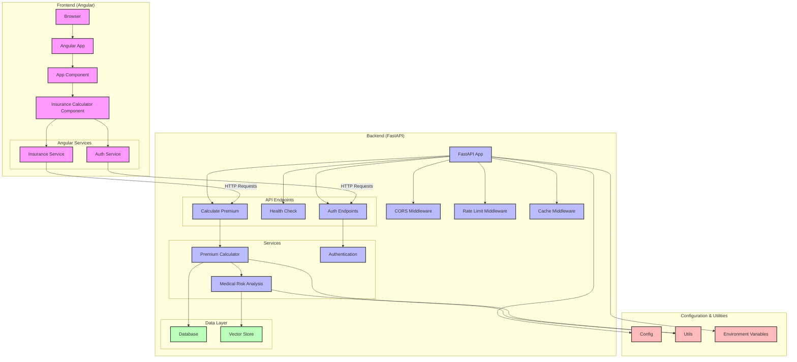

# Insurance Calculator Architecture Diagram

## How to Generate a High-Definition PNG

You can generate a high-definition PNG of this diagram using one of the following methods:

### Method 1: Using Mermaid Live Editor

1. Go to [Mermaid Live Editor](https://mermaid.live/)
2. Copy and paste the mermaid code above into the editor
3. Customize the theme if desired
4. Click on "Download PNG" in the menu

### Method 2: Using VS Code with Mermaid Extension

1. Install the "Markdown Preview Mermaid Support" extension in VS Code
2. Open this markdown file in VS Code
3. Click the "Open Preview" button
4. Right-click on the rendered diagram and select "Save image as..."

### Method 3: Using GitHub

GitHub natively supports mermaid diagrams in markdown files. Simply commit this file to a GitHub repository, and the diagram will be rendered automatically.

## Architecture Overview

This diagram illustrates the complete architecture of the Insurance Calculator application:

1. **Frontend Layer**:
   - Angular application with components and services
   - Communication with backend via HTTP requests

2. **Backend Layer**:
   - FastAPI application with middleware
   - API endpoints for calculating premiums and authentication
   - Business logic services for premium calculation and risk analysis

3. **Data Layer**:
   - Database for storing user and application data
   - Vector store for medical risk analysis

4. **Configuration & Utilities**:
   - Configuration settings
   - Utility functions
   - Environment variables 