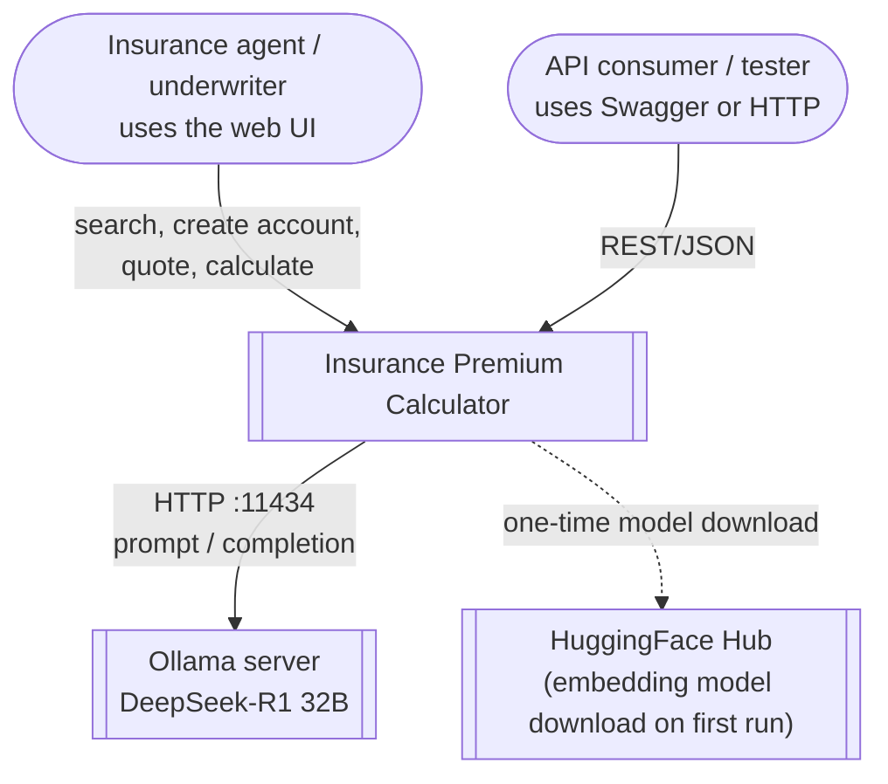
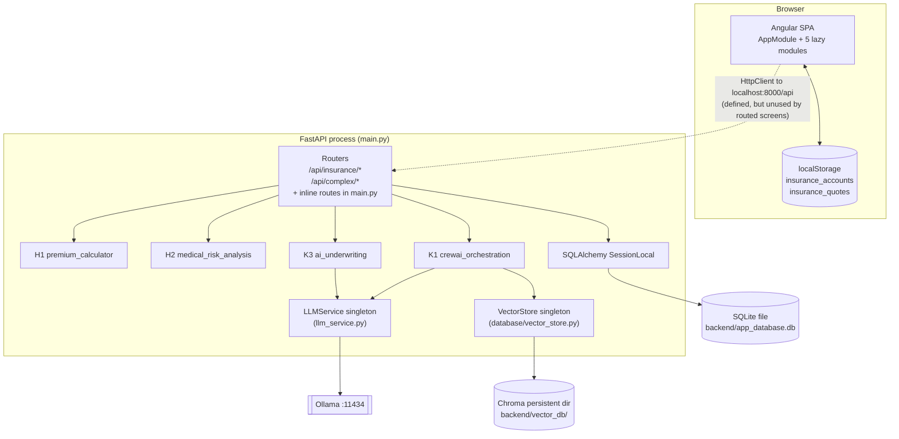
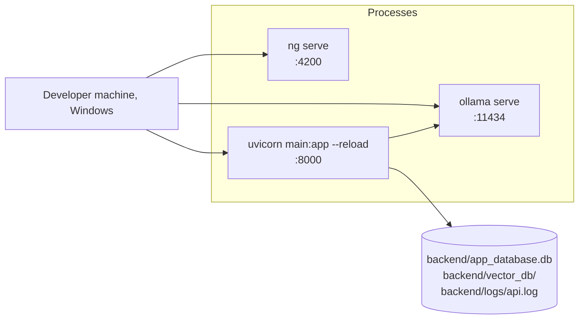
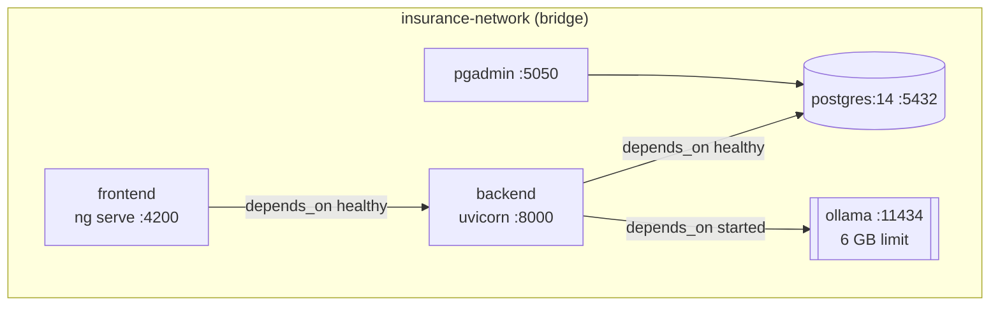

# 01. System Overview

## 1.1 Purpose

The Insurance Premium Calculator is a prototype life-insurance quoting tool
with an "Agentic AI" backend. It has two halves that were built in parallel
and never joined:

1. **An agent-facing Angular app** for finding or creating a customer account,
   filling in a detailed health and lifestyle questionnaire, producing a quote
   and reviewing its risk factors. All of its data stays in the browser.
2. **A FastAPI service** that accepts insurance applications, prices them and
   makes underwriting decisions using four AI components:

| Code | Component | Source file | Technique |
|------|-----------|-------------|-----------|
| H1 | Premium Calculator | `backend/app/services/premium_calculator.py` | Described as LLM-based; actually a rule-based "simulated LLM" |
| H2 | Medical Risk Analysis | `backend/app/services/medical_risk_analysis.py` | Described as vector search; actually keyword matching over a 10-entry dictionary |
| K1 | CrewAI Orchestration | `backend/app/services/crewai_orchestration.py` | Hand-rolled multi-agent crew (not the `crewai` library) over Ollama + ChromaDB |
| K3 | AI Underwriting Logic | `backend/app/services/ai_underwriting.py` | Six lambda rules, then a DeepSeek-R1 review via LangChain |

## 1.2 Technology stack

| Layer | Technology | Version (from manifests) |
|-------|------------|--------------------------|
| Frontend framework | Angular (NgModule style, lazy-loaded feature modules) | ^17.2 |
| UI kit | Angular Material | ^17.2 |
| Reactive | RxJS | ~7.8 |
| Frontend tests | Karma + Jasmine | 6.4 / 5.1 |
| Backend framework | FastAPI on Uvicorn | 0.103.1 / 0.23.2 |
| Validation | Pydantic v2 (with v1-style `@validator`) | 2.3.0 |
| ORM | SQLAlchemy | 2.0.21 |
| Database | SQLite, hard-coded `sqlite:///./app_database.db` | n/a |
| LLM runtime | Ollama, model `deepseek-r1:32b` by default | n/a |
| LLM client | `langchain-ollama` (`OllamaLLM`) + `LLMChain` | langchain >= 0.1 |
| Embeddings | HuggingFace `all-MiniLM-L6-v2` (CPU) | sentence-transformers >= 2.2.2 |
| Vector DB | ChromaDB via `langchain_chroma`, persisted to `./vector_db` | chromadb >= 0.4.22 |
| Retry | `tenacity` (3 attempts, exponential backoff 1 to 10 s) | >= 8.2.3 |
| Backend tests | pytest + FastAPI `TestClient` | 7.4.2 |
| Containers | Docker Compose: postgres, pgadmin, ollama, backend, frontend | compose 3.8 |

> None of the three requirements files (`backend/requirements.txt`,
> `backend/requirements.fixed.txt`, `GenAI/requirements.txt`) lists
> `langchain-chroma` or `langchain-huggingface`, which `vector_store.py`
> imports. After a clean install, the app fails at import time. See
> [09-gap-analysis.md](09-gap-analysis.md).

## 1.3 System context (C4 level 1)



## 1.4 Containers (C4 level 2)



Things to notice:

- **H1 and H2 do not use** the shared `LLMService` or `VectorStore`. Each
  defines its own local stand-in class with the same name.
- **Both singletons are built at import time.** Importing `main.py` loads the
  HuggingFace embedding model and opens ChromaDB before the first request is
  served, which slows startup and makes the tests heavy.

## 1.5 Repository layout

```text
Insurance-Calculator/
├── README.md                       # top-level readme (partly aspirational)
├── docs/                           # ← this documentation set
└── GenAI/
    ├── backend/
    │   ├── main.py                 # FastAPI app, CORS, inline endpoints, startup hook
    │   ├── app/
    │   │   ├── api/endpoints/
    │   │   │   ├── insurance.py     # /api/insurance/* (H1, H2, CRUD)
    │   │   │   └── complex_cases.py # /api/complex/*   (K1, K3 rules)
    │   │   ├── database/
    │   │   │   ├── database.py      # engine, SessionLocal, get_db, db_session
    │   │   │   └── vector_store.py  # ChromaDB + HF embeddings singleton
    │   │   ├── middleware/rate_limiter.py  # token bucket (disabled)
    │   │   ├── models/insurance.py  # SQLAlchemy: User, InsuranceApplication, RiskScore, MedicalCondition
    │   │   ├── schemas/insurance.py # Pydantic request/response models
    │   │   └── services/
    │   │       ├── llm_service.py           # OllamaLLM wrapper + structured_generation
    │   │       ├── premium_calculator.py    # H1
    │   │       ├── medical_risk_analysis.py # H2
    │   │       ├── crewai_orchestration.py  # K1
    │   │       └── ai_underwriting.py       # K3
    │   ├── tests/                  # pytest suite (API, DB, LLM, vector store)
    │   ├── seed_vector_db.py       # loads 8 underwriting guideline docs into Chroma
    │   ├── check_db.py, test_*.py  # ad-hoc diagnostics
    │   ├── alembic/                # env.py + ini only, no migration versions
    │   ├── app_database.db, insurance.db, vector_db/   # committed data files
    │   └── Dockerfile, requirements*.txt, .env.example
    ├── frontend/insurance-calculator/
    │   └── src/app/
    │       ├── app.module.ts, app-routing.module.ts, app.component.*
    │       ├── insurance-search/      # /search
    │       ├── create-account/        # /create-account
    │       ├── application-detail/    # /application/:id (+ quote-overview-dialog)
    │       ├── quote/                 # /quote?applicationId=
    │       ├── insurance-calculator/  # /calculator
    │       ├── services/              # insurance.service, quote.service, account.service
    │       ├── models/insurance.model.ts
    │       ├── account/               # dead: AccountModule is never routed
    │       └── components/insurance-calculator/  # dead: older calculator, never declared
    ├── docker-compose.yml
    ├── run_backend.ps1, test_ollama_integration.ps1
    ├── *.mmd, *.png, *.html        # earlier diagrams (see 09 for accuracy notes)
    └── .venv/                      # Windows virtualenv, committed by mistake
```

## 1.6 Deployment views

### Local development (how it was actually run)



`run_backend.ps1` activates `GenAI/.venv`, runs `check_db.py`, then starts
Uvicorn. `main.py` constructs a `FileHandler("logs/api.log")`, so the `logs/`
folder must exist or the import fails with `FileNotFoundError`. Because
`database.py` already called `logging.basicConfig()` during import, the
file handler is never attached and `api.log` stays empty.

### Docker Compose (declared, not consistent with the code)



Compose passes `DATABASE_URL=postgresql://...`, but `database.py` ignores it
and always uses SQLite. The Postgres and pgAdmin containers therefore start
and sit idle. The frontend's API base URL is hard-coded to
`http://localhost:8000/api`, which only works in a container setup because
the browser runs on the host. Compose sets `CORS_ALLOW_ORIGINS`, but the code
reads `FRONTEND_URL`. The 6 GB memory limit on Ollama is too small for
`deepseek-r1:32b` (about 20 GB).

## 1.7 Cross-cutting concerns

| Concern | Implementation | Notes |
|---------|----------------|-------|
| Logging | `logging.basicConfig` in every module; the first call (in `database.py`) wins | `main.py`'s file handler is never attached; `logs/api.log` stays empty |
| Error handling | Global `@app.exception_handler(Exception)` returns `500 {error, detail, error_id}` | `detail` leaks `str(exc)` to clients |
| CORS | `CORSMiddleware`, single origin from `FRONTEND_URL` (default `http://localhost:4200`) | |
| Rate limiting | `RateLimiter` class exists; registration is commented out | Its `__call__(request, call_next)` signature does not fit `add_middleware` |
| Retries | `@retry` on `LLMService.generate_text` and `structured_generation` | Every LLM failure costs up to 3 attempts before the caller's fallback runs |
| Fallbacks | Every AI path has a deterministic fallback | See [04](04-ai-components.md) |
| Configuration | `load_dotenv()` in `main.py` | Runs **after** the service imports, so `OLLAMA_HOST` / `OLLAMA_MODEL` in `.env` are ignored; only real environment variables work |
| Auth | None | `User`, `UserCreate`, `Token` schemas exist but nothing uses them |
| Health | `GET /health` (DB ping), `GET /api/system-status` | `system-status` always reports "available" |
