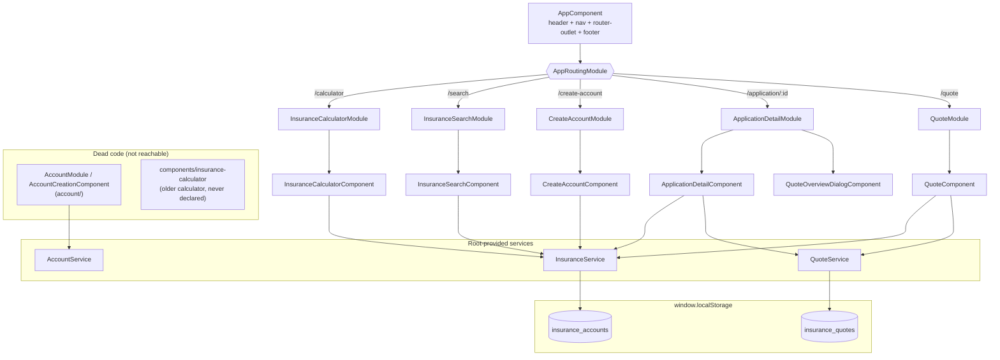

# 02. Frontend (Angular)

Location: `GenAI/frontend/insurance-calculator/src/app`

## 2.0 Structure

### Bootstrap and routing

`main.ts` bootstraps `AppModule` (NgModule style; `app.routes.ts` is an empty
leftover from the standalone template). `AppModule` imports
`BrowserAnimationsModule`, `HttpClientModule`, `ReactiveFormsModule`, 14
Material modules and `AppRoutingModule`. Every feature is a **lazy-loaded
module** with a single `''` child route.

| URL | Lazy module | Component | Entry points |
|-----|-------------|-----------|--------------|
| `/` | n/a | redirect → `/calculator` | App load |
| `/calculator` | `InsuranceCalculatorModule` | `InsuranceCalculatorComponent` | Default route; "Calculator" nav tab |
| `/search` | `InsuranceSearchModule` | `InsuranceSearchComponent` | "Search Applications" nav tab; Back buttons |
| `/create-account` | `CreateAccountModule` | `CreateAccountComponent` | Search → "Create New Account"; Calculator → "Apply for Insurance" |
| `/application/:id` | `ApplicationDetailModule` | `ApplicationDetailComponent` (+ `QuoteOverviewDialogComponent`) | Search result row; after account creation; after quote submit |
| `/quote?applicationId=<id>` | `QuoteModule` | `QuoteComponent` | Application Detail → "Create Quote" |
| `**` | n/a | redirect → `/calculator` | Unknown URLs |



### Navigation shell (`AppComponent`)

- The header shows "Search Applications" all the time, and "Calculator" only
  once `showCalculator` is true.
- `showCalculator` turns on after any `NavigationEnd` whose URL contains
  `/calculator` or `?`. Because `/` redirects to `/calculator`, the tab is
  visible from the first page load in practice.
- The footer shows `© {currentYear} Insurance Premium Calculator`.

### Services

| Service | Backed by | Methods used by routed screens | Methods defined but unused |
|---------|-----------|--------------------------------|----------------------------|
| `InsuranceService` | `localStorage['insurance_accounts']` + `HttpClient` to `http://localhost:8000/api` | `searchAccounts`, `createAccount`, `getApplication` / `getApplicationById`, `updateApplication`, `calculatePremium` (pure TS) | `getApplications` (GET `/insurance/applications/`), `getCompleteApplicationById` (GET `/insurance/applications/{id}/complete`, no such endpoint), `createApplication` (POST `/insurance/applications/`), `saveApplication` (POST `/insurance/applications/save`, no such endpoint), `processComplexApplication` (POST `/complex/complex-application/`), `applyUnderwritingRules` (POST `/complex/apply-underwriting-rules/`) |
| `QuoteService` | `localStorage['insurance_quotes']` | `getQuotesByApplicationId`, `createQuote` | `getQuoteById`, `updateQuoteStatus` |
| `AccountService` | In-memory array with 2 mock accounts | none | all (used only by the dead `AccountModule`) |

Every HTTP method has a backend counterpart only if it is listed in
[03-backend-api.md](03-backend-api.md); none of them is called from a
routed screen.

---

## 2.1 Search Applications (`/search`)

**Purpose:** find an existing customer account before quoting, or start a new
one if nothing matches.

**Form fields** (`searchForm`): `firstName`*, `lastName`*, `phoneNumber`*,
`email`, `addressLine1`*, `addressLine2`, `city`*, `state`*, `zipCode`*.
Fields marked * have `Validators.required`, but submission only checks
`atLeastOneFieldFilled()`, so the required markers are cosmetic.

**Step by step**

1. The user fills one or more fields and presses **Search**.
2. `searchApplications()` checks that at least one field is non-blank. If none
   is, it shows the snackbar "Please fill at least one search field".
3. It sets `loading`, `searchPerformed`, clears `showCreateButton`.
4. It calls `InsuranceService.searchAccounts(form.value)`, which:
   - reads `insurance_accounts` from `localStorage`;
   - keeps an account only if **all** of these substring checks pass
     (case-insensitive except phone and zip): first name, last name, phone,
     email (only if provided), address line 1 (only if provided), city, state,
     zip. An empty string matches everything, so blank fields act as wildcards;
   - returns `of(results)`.
5. Results appear in a Material table with columns Account # (`accountNumber`),
   Name, Email, Phone, City, State, and a "View" action.
6. If there are no results, **Create New Account** appears.
7. **View** → `viewDetails(id)` → `/application/:id`.
8. **Create New Account** → `/create-account` with
   `history.state.accountData = form.value`, so the new form is pre-filled.
9. **Reset** → `searchForm.reset()`, which sets every control to **`null`**.

> **Bug:** after **Reset**, any field left empty is `null`, and
> `searchAccounts` calls `.toLowerCase()` / `.includes()` on it. This throws a
> `TypeError` synchronously, outside the observable, so the error callback
> never runs and the spinner keeps spinning. Repro: create one account, press
> Reset, type a first name, press Search.

## 2.2 Create Account (`/create-account`)

**Form fields and validators** (`accountForm`)

| Field | Validators |
|-------|-----------|
| `firstName`, `lastName` | required, minLength 2 |
| `phoneNumber` | required, pattern `^\d{10,15}$` (digits only) |
| `email` | email (optional) |
| `addressLine1` | required, minLength 5 |
| `addressLine2` | none |
| `city`, `state` | required |
| `zipCode` | required, pattern `^\d{5}(-\d{4})?$` |

**Step by step**

1. The constructor reads `router.getCurrentNavigation().extras.state.accountData`
   and patches the form, which pre-fills it from Search.
2. `ngOnInit` sets a provisional `accountNumber = 'ACC' + Date.now().substring(3)`.
3. **Submit** → `submitForm()`:
   - if the form is invalid, marks every control touched and shows a snackbar;
   - otherwise calls `InsuranceService.createAccount({...form, accountNumber, createdAt})`.
4. `createAccount` adds `id = Date.now()` and overwrites `accountNumber` with
   a fresh random `ACC-XXXXX-XX`, pushes the record to `insurance_accounts`
   and returns it. (Older records saved before this change show the
   `ACC<digits>` format, as in `Application-Screenshots.png`.)
5. The page shows a "created" snackbar, then after 1 s navigates to
   `/application/<id>`.
6. **Cancel** → `/search`.

> The calculator's "Apply for Insurance" button navigates here with
> `state.premiumData`, but this component only reads `state.accountData`.
> The calculated premium is silently dropped.

## 2.3 Application Detail (`/application/:id`)

**Purpose:** a single customer's record: contact details, address, quotes, and
the entry point for new quotes.

**Step by step**

1. `ngOnInit` subscribes to `route.params`, stores `applicationId`, and calls
   `loadApplication()`.
2. `loadApplication()` runs a `forkJoin` of:
   - `InsuranceService.getApplicationById(id)`: finds the account in
     `localStorage` by `id === Number(id)`, or errors with "Account not found";
   - `QuoteService.getQuotesByApplicationId(id)`: filters `insurance_quotes`.
3. On success it attaches `quotes` to the application and patches `editForm`.
   On error it shows the snackbar "Failed to load application details".
4. The template shows: account number + an "Active" chip (hard-coded),
   Personal Information, Address Information, and a Quotes table
   (Quote #, Premium, Coverage, Status, Date). Clicking a row opens the
   Quote Overview dialog.
5. **Edit Details** → `toggleEditMode()` shows an edit form for email, phone
   (pattern `^\d{10}$`, which is stricter than the 10 to 15 digits allowed at
   creation), address lines, city, state, zip.
6. **Save** → `saveChanges()` → `InsuranceService.updateApplication()`
   overwrites only those contact fields in `localStorage` and returns the
   updated record. **Cancel** restores the form.
7. **Create Quote** → `/quote?applicationId=<id>`.
8. **Quote Overview** opens the dialog for `application.quotes[0]`, the
   oldest quote, not the newest.

## 2.4 Create Quote (`/quote?applicationId=<n>`)

**Purpose:** collect a full underwriting questionnaire and save a quote.

**Step by step**

1. `ngOnInit` reads `applicationId` from the query string. If it is missing,
   the page shows a snackbar and redirects to `/search`.
2. `loadApplicantData(id)` → `InsuranceService.getApplication(id)`. On error
   it redirects to `/search`.
3. `populateApplicantInfo()` pre-fills first and last name and generates a
   display-only application number `QAP-XXXXX-XXX`.
4. The user completes 12 cards of questions:

| Card | Controls (required in **bold**) |
|------|---------------------------------|
| Applicant Information | **firstName**, **lastName**, **applicationNumber** |
| Health Assessment | **generalHealth** (Excellent/Good/Fair/Poor), **height**, **weight** (2 to 3 digits, up to 2 decimals) |
| Pre-existing Conditions | **preExistingConditions** (None, Heart Disease, Diabetes, Cancer, Asthma, Hypertension, Stroke, COPD, Arthritis, Depression, Anxiety, Other), diagnosisDate, currentTreatment |
| Medical History | **hospitalizedLast5Years**, hospitalizationDetails, **surgeryLast10Years**, surgeryDetails |
| Family Medical History | **familyHeartDisease**, **familyCancer**, **familyDiabetes**, otherFamilyConditions |
| Travel History | **travelOutsideCountry**, travelRegions (multi), travelPurpose |
| Lifestyle | **smokingStatus**, smokingFrequency, smokingYears, **alcoholConsumption**, alcoholFrequency, **drugUse**, **exerciseFrequency** |
| Occupation | **occupation**, **occupationRiskLevel** (Low/Medium/High Risk), **workHoursPerWeek** |
| Mental Health | **stressLevel** (1 to 10), **mentalHealthDiagnosis**, mentalHealthDetails |
| Medications | **currentMedications**, medicationDetails |
| Dependents | **numberOfDependents** (0 to 5+) |
| Additional Information | additionalInformation |

5. Selecting "No" / "None" on a gating question calls
   `updateConditionalFields()`, which clears the dependent detail fields.
6. **Submit** → `submitForm()`:
   - if invalid: touches every control and shows a snackbar;
   - `calculatePremium()` (see formula below);
   - `determineCoverageAmount()` always returns **100 000**;
   - `QuoteService.createQuote({applicationId, premium, coverageAmount, quoteDetails: form.value})`
     saves `{id: Date.now(), quoteNumber: 'QT-XXXXXX-XX', status: 'Pending', createdAt, ...}`;
   - shows a snackbar with the quote number and navigates back to `/application/<id>`.

**Quote premium formula** (`QuoteComponent.calculatePremium`)

```text
premium = 500                                   (base)
        + 300 if generalHealth = Poor
        + 150 if generalHealth = Fair
        +  50 if generalHealth = Good           (Excellent adds 0)
        + 200 if preExistingConditions ≠ None
        + 250 if smokingStatus = Yes
        + 100 for each "Yes" in familyHeartDisease, familyCancer, familyDiabetes
```

Range: $500 to $1 550. Age, coverage, occupation, alcohol, drugs, BMI and
mental health are collected but **do not affect** the price.

## 2.5 Quote Overview dialog

Opened from the Application Detail page with `{quote, application}`.
`analyzeQuote()` reads `quote.quoteDetails` and builds two lists:

**Premium risk factors**

| Trigger | Factor | Impact |
|---------|--------|--------|
| generalHealth = Poor / Fair | General Health | High / Medium |
| smokingStatus = Yes | Smoking | High |
| preExistingConditions ≠ None | Pre-existing Condition | High |
| ≥1 family history "Yes" | Family Medical History | Medium (1) / High (2+) |
| hospitalizedLast5Years = Yes | Recent Hospitalization | Medium |
| travel to Africa, Asia or South America | Travel History | Low to Medium |

**Underwriting considerations**

| Trigger | Concern | Level |
|---------|---------|-------|
| occupationRiskLevel = High Risk | High-Risk Occupation | High |
| mentalHealthDiagnosis = Yes | Mental Health | Medium |
| stressLevel ≥ 8 | High Stress Level | Medium |
| surgeryLast10Years = Yes | Recent Surgery | Medium |
| alcohol = Yes **and** frequency = Frequently | Alcohol Consumption | Medium to High |
| drugUse = Yes | Drug Use | High |

**Premium breakdown chart:** base $500, then one bar per risk factor
valued at `(total − 500) × pct(impact)`, with High 40%, Medium-High 30%,
Medium 20%, Low-Medium 15%, Low 10%.

> The percentages are not normalized, so the bars do not add up to the total.
> Three "High" factors claim 120% of the extra premium. The dialog's factors
> also do not match the quote formula: travel and hospitalization appear as
> factors but cost nothing, and "Good" health costs $50 but is not listed.

## 2.6 Quick Premium Calculator (`/calculator`)

**Form:** `age` (required, 18 to 99), `smoker` (checkbox), `coverage`
(default "250000"), `medicalConditions` (free text, comma-separated).

**Step by step**

1. **Calculate** → `calculatePremium()` → `InsuranceService.calculatePremium(form.value)`.
   This runs entirely in the browser; no HTTP call is made.
2. The result card shows **Monthly Premium**, Risk Assessment and
   Recommendation, both rendered with `[innerHTML]`.
3. **Apply for Insurance** → `/create-account` with `state.premiumData`
   (dropped on arrival; see 2.2).
4. **Reset** restores the defaults.

**Calculator formula** (`InsuranceService.calculatePremium`)

```text
premium = coverage / 1000 × 0.50
        × age factor   (<30: 0.7 | 30–44: 1.0 | 45–59: 1.5 | ≥60: 2.2)
        × 1.5 if smoker
        × 1.7 if any condition contains cancer | heart disease | stroke   (applied once)
        × 1.3 if any condition contains diabetes | hypertension | asthma  (applied once)
rounded to cents

rate = premium / (coverage / 1000)
risk = rate < 0.8 → "Low Risk"   | rate < 1.5 → "Standard Risk"   | else "Elevated Risk"
recommendation = "Quitting smoking could … reduce your premium by up to 33%" if smoker
```

This formula is a third pricing model. It differs from the backend's H1
(base $500 × age × coverage/100k × …) and from the quote form's additive
model. See [04](04-ai-components.md#45-pricing-models-side-by-side).

## 2.7 Dead and unused frontend code

| Path | What it is | Why it is dead |
|------|-----------|----------------|
| `account/` (`AccountModule`, `AccountCreationComponent`) | Older account form using `AccountService` mocks | Never referenced by `AppRoutingModule` |
| `components/insurance-calculator/` | Older, larger calculator wired to `getCompleteApplicationById` and `saveApplication` | Not declared in any module |
| `services/account.service.ts` | Mock accounts (John Smith, Jane Doe) | Only used by dead `AccountModule` |
| `app.routes.ts` | Empty `Routes` array | Leftover from the standalone template |
| `models/insurance.model.ts` | `InsuranceRequest`, `PremiumResult`, `AccountData`, `SavedApplicationData` | Only used by the dead calculator; routed screens use `any` |
| `*.component.spec.ts` | Default CLI specs | Reference the dead component; no meaningful assertions |
| `CUSTOM_ELEMENTS_SCHEMA` on every module | Silences unknown-element errors | Hides template mistakes at compile time |
