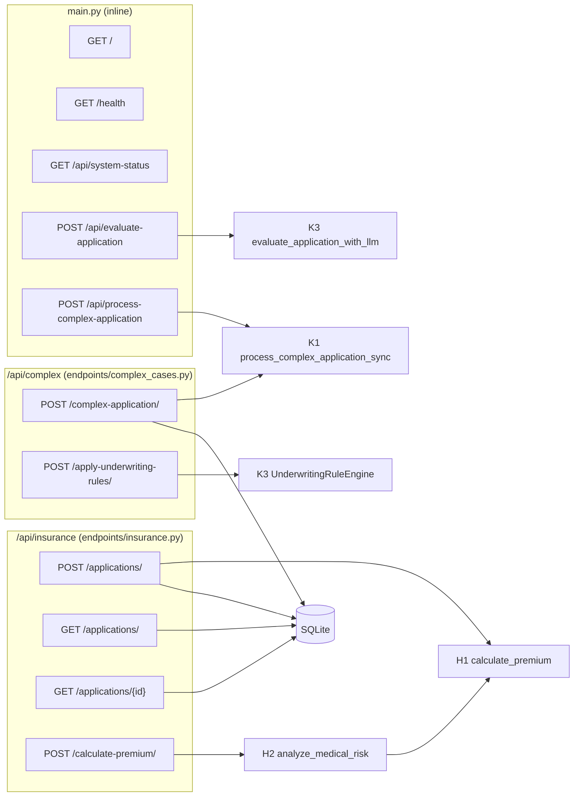

# 03. Backend API Reference

Base URL: `http://localhost:8000`. Interactive docs are served at `/docs`
(Swagger) and `/redoc`.

## 3.0 Endpoint map



| Method | Path | Handler | AI | Persists | Request model | Response model |
|--------|------|---------|----|----------|---------------|----------------|
| GET | `/` | `read_root` | none | no | n/a | `{message}` |
| GET | `/health` | `health_check` | none | no | n/a | `{status, database, api_version}` |
| GET | `/api/system-status` | `system_status` | none | no | n/a | `{llm_service, vector_store}` |
| POST | `/api/insurance/applications/` | `create_application` | H1 | yes | `InsuranceApplicationCreate` | `InsuranceApplicationResponse` (201) |
| GET | `/api/insurance/applications/` | `get_applications` | none | n/a | `?skip=0&limit=100` | `List[InsuranceApplicationResponse]` |
| GET | `/api/insurance/applications/{id}` | `get_application` | none | n/a | path `id:int` | `InsuranceApplicationResponse` / 404 |
| POST | `/api/insurance/calculate-premium/` | `premium_calculation` | H2 → H1 | no | `PremiumCalculationRequest` | `PremiumCalculationResponse` |
| POST | `/api/evaluate-application` | `evaluate_application` | K3 rules + LLM | no | untyped `dict` | `{success, data}` |
| POST | `/api/process-complex-application` | `process_complex_app` | K1 | no | untyped `dict` | `{success, data}` |
| POST | `/api/complex/complex-application/` | `process_complex_case` | K1 | yes | `InsuranceApplicationCreate` | `Dict` (201) |
| POST | `/api/complex/apply-underwriting-rules/` | `apply_underwriting_rules` | K3 rules only | no | untyped `Dict` | `{decision, reasons, rules_fired}` |

No endpoint requires authentication. No endpoint updates or deletes an
application, and nothing ever writes `RiskScore`, `User` or
`MedicalCondition` rows.

---

## 3.1 Request payload: `InsuranceApplicationCreate`

```json
{
  "applicant_name": "Jane Doe",
  "applicant_age": 42,
  "email": "jane@example.com",
  "phone": "(614) 555-0100",
  "medical_history": {
    "conditions": ["hypertension"],
    "medications": ["lisinopril"],
    "surgeries": [],
    "allergies": []
  },
  "risk_factors": {
    "smoking": false,
    "alcohol_consumption": true,
    "dangerous_activities": ["scuba diving"],
    "occupation_risk": "medium"
  },
  "coverage_amount": 500000,
  "user_id": null,
  "notes": null
}
```

| Field | Rule | Error when violated |
|-------|------|---------------------|
| `applicant_name` | 2 to 100 chars, regex `^[a-zA-Z\s\-'\.]+$` | "Name contains invalid characters" |
| `applicant_age` | `18 ≤ age ≤ 119` (`gt=17, lt=120`) | Pydantic range error |
| `email` | `EmailStr` | Pydantic email error |
| `phone` | after stripping spaces, `-`, `(`, `)`, `.`: digits only, length ≥ 7 | "Invalid phone number format" |
| `medical_history.*` | lists of non-empty strings | "All items must be non-empty strings" |
| `risk_factors.occupation_risk` | `low` / `medium` / `high` (case-insensitive, stored lower-case) | "Occupation risk must be one of: ..." |
| `risk_factors.dangerous_activities` | list of non-empty strings | "All activities must be non-empty strings" |
| `coverage_amount` | `0 < x ≤ 10 000 000` | Pydantic range error |
| `user_id`, `notes` | optional | Accepted but **never saved** by any handler |

Validation failures return FastAPI's standard **422** body.

## 3.2 POST `/api/insurance/applications/`

**Flow:** validate → `calculate_premium()` (H1) → insert
`InsuranceApplication` with `premium_amount` and `ai_recommendation` →
commit → refresh → 201.

**Response (as it behaves today):**

```json
{
  "id": 7,
  "applicant_name": "Jane Doe",
  "applicant_age": 42,
  "email": "jane@example.com",
  "phone": "(614) 555-0100",
  "medical_history": { "conditions": ["hypertension"], "medications": ["lisinopril"], "surgeries": [], "allergies": [] },
  "risk_factors": { "smoking": false, "alcohol_consumption": true, "dangerous_activities": ["scuba diving"], "occupation_risk": "medium" },
  "coverage_amount": 500000.0,
  "premium_amount": 25000.0,
  "is_approved": false,
  "ai_recommendation": "Error in AI calculation. Manual review recommended.",
  "status": "pending",
  "notes": null,
  "user_id": null,
  "risk_score": null,
  "created_at": "2026-10-03T12:00:00Z",
  "updated_at": null
}
```

`premium_amount` is always `coverage_amount × 0.05` because H1 raises a
`NameError` internally and falls back. See [04 §4.1](04-ai-components.md#41-h1-premium-calculator).

## 3.3 GET `/api/insurance/applications/` and `/{id}`

- The list endpoint pages with `offset(skip).limit(limit)` and has no ordering
  or filters.
- `/{id}` returns **404** `{"detail": "Application not found"}` when the ID is
  missing.
- The frontend's `getCompleteApplicationById` calls
  `/applications/{id}/complete`, which **does not exist**.

## 3.4 POST `/api/insurance/calculate-premium/`

**Request:** `PremiumCalculationRequest`, which has the same age, coverage,
`medical_history` and `risk_factors` rules as above, plus
`calculation_mode` (`"standard"` by default; never read).

**Flow:** `analyze_medical_risk(medical_history)` (H2) →
`calculate_premium({... , risk_analysis})` (H1) → response. H1 ignores
`risk_analysis`.

**Response**

```json
{
  "premium_amount": 12500.0,
  "risk_assessment": "medium",
  "ai_recommendation": "Error in AI calculation. Manual review recommended.",
  "factors": {}
}
```

## 3.5 POST `/api/evaluate-application`

**Request:** any JSON object. The keys read are `id`, `applicant_age`,
`coverage_amount`, `risk_score` (0 to 1, supplied by the caller),
`medical_history.conditions` and `risk_factors`.

```json
{
  "id": "APP-1",
  "applicant_age": 68,
  "coverage_amount": 750000,
  "risk_score": 0.4,
  "medical_history": { "conditions": ["hypertension"] },
  "risk_factors": { "smoking": false }
}
```

**Flow:** rule engine → LLM (DeepSeek-R1) with the rule result, rule list and
applicant data → merge. If anything in the LLM step raises, the rule decision
and a formula premium are returned with `error` set.

> **As built, the response always comes from the fallback path.**
> `LLMChain.ainvoke()` returns `{<input vars>..., "text": {<parsed JSON>}}`,
> but the code reads `llm_evaluation["decision"]` at the top level, which raises
> `KeyError('decision')`. On top of that, DeepSeek-R1 prefixes its answer with a
> `<think>…</think>` block that `JsonOutputParser` rejects, which triggers 3
> retries first. Both were reproduced with LangChain 0.3 and a fake LLM. See
> [04 §4.4](04-ai-components.md#44-k3-ai-underwriting).

**Response (intended LLM path, currently unreachable)**

```json
{
  "success": true,
  "data": {
    "application_id": "APP-1",
    "decision": "refer",
    "premium_amount": null,
    "decision_factors": "<LLM reasoning>",
    "rule_engine_decision": "refer",
    "rule_engine_factors": ["Senior applicant with high coverage amount"],
    "special_conditions": [],
    "requires_review": true
  }
}
```

**Response (actual behaviour)**

```json
{
  "success": true,
  "data": {
    "application_id": "APP-1",
    "decision": "refer",
    "premium_amount": 15120.0,
    "decision_factors": ["Senior applicant with high coverage amount"],
    "rule_engine_decision": "refer",
    "rule_engine_factors": ["Senior applicant with high coverage amount"],
    "special_conditions": [],
    "requires_review": true,
    "error": "LLM evaluation failed: 'decision'"
  }
}
```

Fallback premium: `coverage × 0.01 × (1 + age/100) × (1 + risk_score × 2)`
= 750 000 × 0.01 × 1.68 × 1.8 = **15 120.00**.

`decision_factors` is a string on the LLM path and a list on the fallback
path, so clients must handle both types.

## 3.6 POST `/api/complex/apply-underwriting-rules/`

Runs only `UnderwritingRuleEngine.evaluate_application(dict)`; no LLM is
involved, so it is deterministic and fast.

```json
// request
{ "applicant_age": 82, "coverage_amount": 1200000, "risk_score": 0.7,
  "medical_history": { "conditions": ["Stage 4 lung cancer"] } }
// response
{
  "decision": "decline",
  "reasons": [
    "Applicant exceeds maximum age limit",
    "Terminal illness present"
  ],
  "rules_fired": ["max_age_limit", "high_coverage_medical_review", "medium_risk_refer",
                  "terminal_illness_decline", "senior_high_coverage"]
}
```

Once a decline has fired, later *refer* rules still appear in `rules_fired`
but their reasons are **not** added to `reasons`. See the rule loop in
[04 §4.4](04-ai-components.md#44-k3-ai-underwriting).

## 3.7 POST `/api/complex/complex-application/` and `/api/process-complex-application`

Both call `process_complex_application_sync()` (K1). The `/api/complex/...`
version validates with `InsuranceApplicationCreate` and **also saves** the
application; the `main.py` version takes any dict and saves nothing.

Because of the task-routing bug described in
[04 §4.3](04-ai-components.md#43-k1-crewai-orchestration), the crew returns
`{}`. The observable responses are therefore:

```json
// POST /api/complex/complex-application/  (201)
{ "application_id": 8 }

// POST /api/process-complex-application
{ "success": true, "data": {} }
```

The saved row has `premium_amount = null`, `is_approved = false`,
`ai_recommendation = ""`.

## 3.8 Health and status

```json
// GET /health
{ "status": "healthy", "database": "connected", "api_version": "1.0.0" }

// GET /api/system-status
{
  "llm_service":  { "status": "available", "model": "deepseek-r1:32b" },
  "vector_store": { "status": "available", "collection": "insurance_data" }
}
```

`/health` reports `"healthy"` even when `database` is `"disconnected"`.
`/api/system-status` never probes anything: both `try` blocks only assign a
string literal, so the status is always "available".

## 3.9 Errors

| Situation | Status | Body |
|-----------|--------|------|
| Schema validation fails | 422 | FastAPI `{"detail": [ {loc, msg, type}, ... ]}` |
| Application not found | 404 | `{"detail": "Application not found"}` |
| Exception inside `/api/evaluate-application` or `/api/process-complex-application` | 500 | `{"detail": "Application processing error: <msg>"}` |
| Any other unhandled exception | 500 | `{"error": "Internal server error", "detail": "<str(exc)>", "error_id": "error-<id>"}` |
| Rate limited | 429 | `{"detail": "Rate limit exceeded..."}`, **never returned** because the middleware is disabled |
