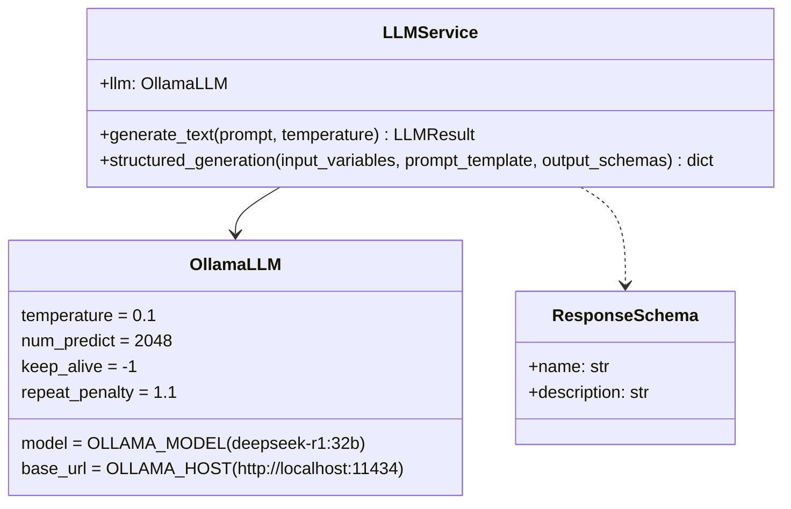
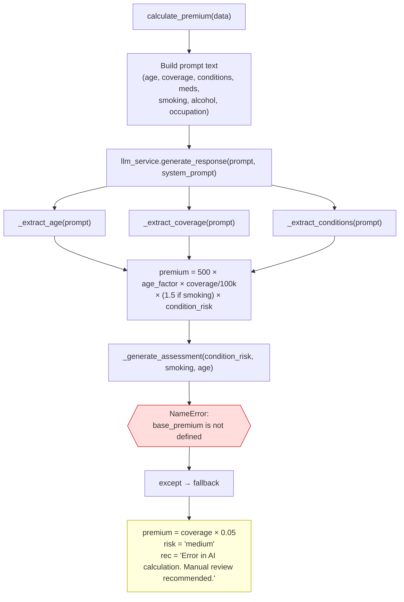
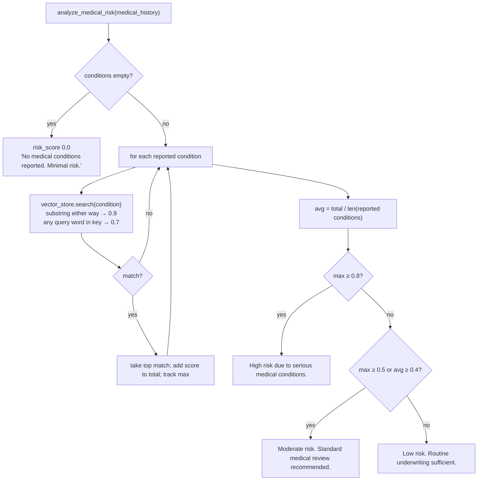
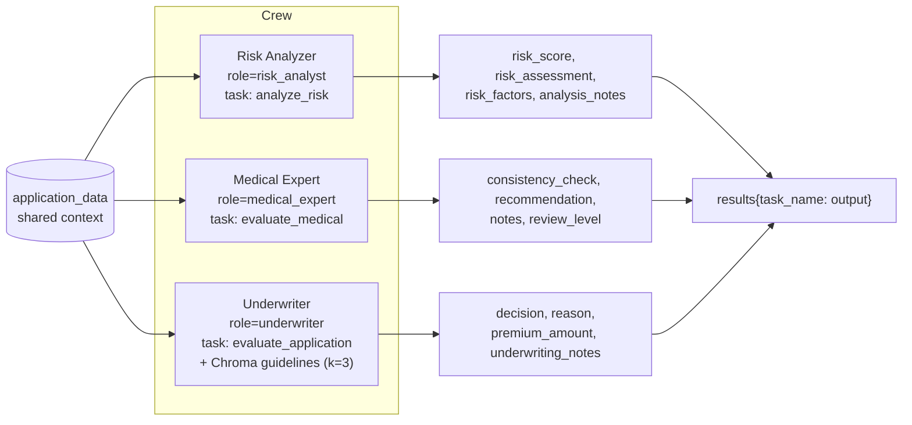
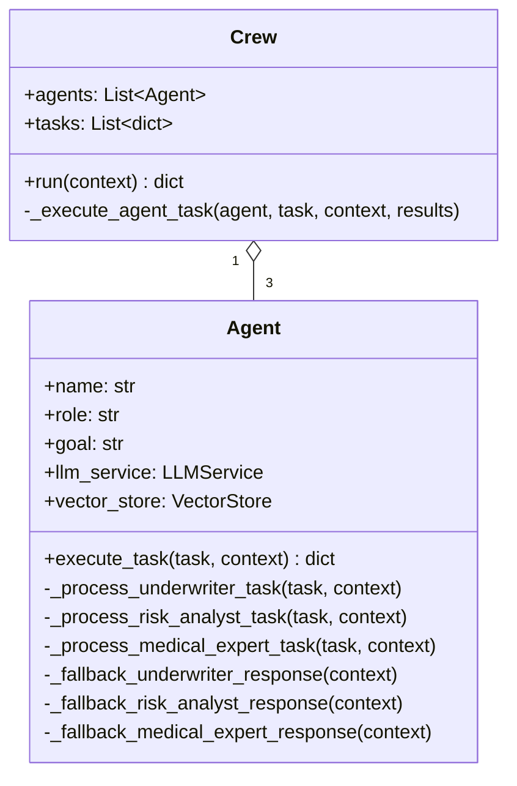
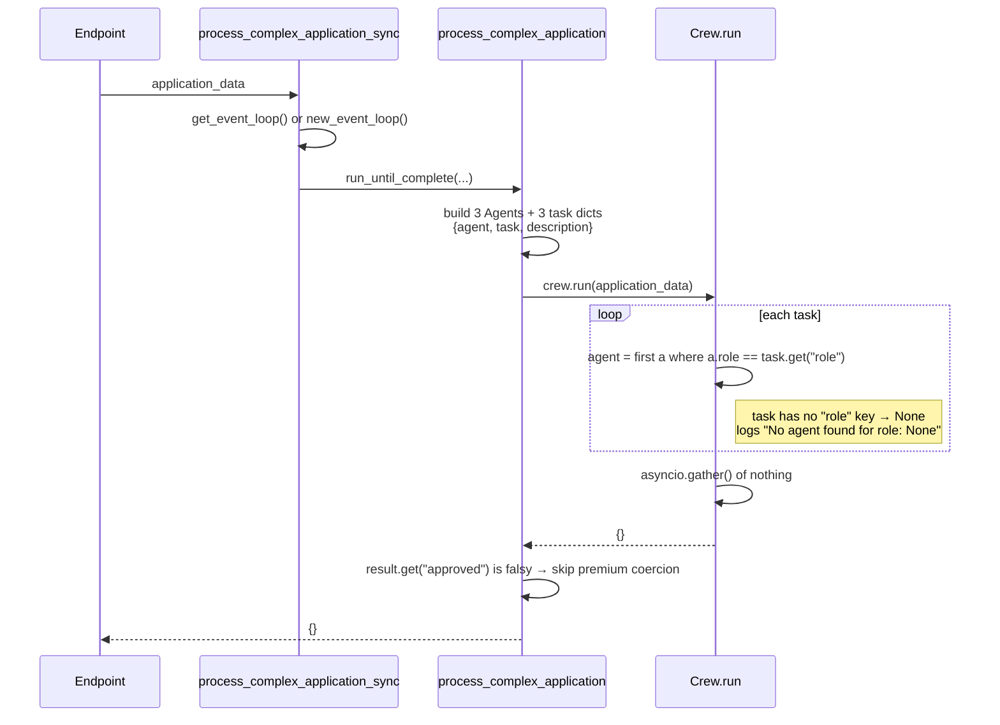
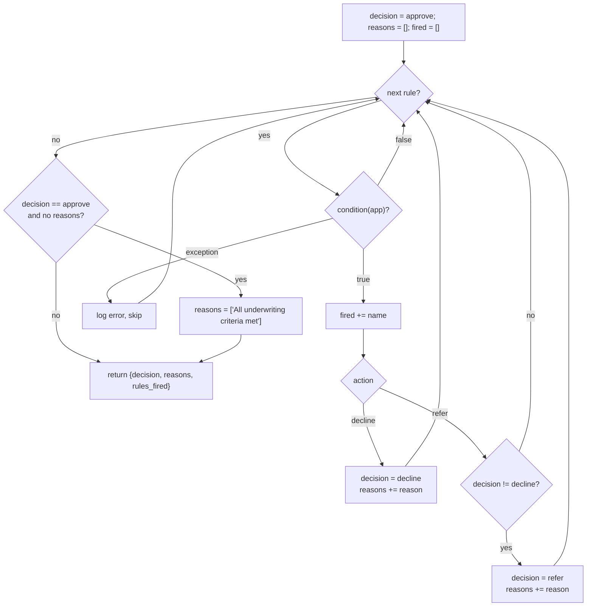
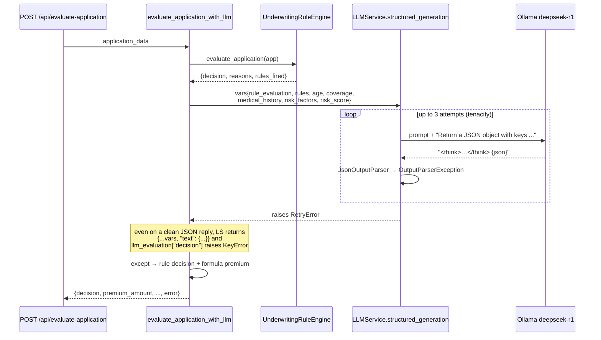

# 04. AI Components

The backend advertises four "Agentic AI" components. This chapter covers each
one: what it is meant to do, what the code does step by step, the exact
formulas, the fallbacks, and the defects that stop it working.

> **Bottom line (verified by running the code):** none of the four
> components currently returns model-generated output.
>
> - **H1** always throws `NameError` and returns `coverage × 5%`.
> - **H2** works, but only as keyword matching, and its result is discarded.
> - **K1** never dispatches a task to an agent and returns `{}`.
> - **K3** always ends in its rule-based fallback, even when Ollama answers
>   correctly.
>
> Details and reproductions are below and in [09-gap-analysis.md](09-gap-analysis.md).

## 4.0 Shared infrastructure

### `LLMService` (`app/services/llm_service.py`)



- A module-level singleton, `llm_service = LLMService()`, is created at import
  time and returned by `get_llm_service()`.
- Both methods are wrapped in
  `@retry(stop_after_attempt(3), wait_exponential(1, 1..10s))`.
- `structured_generation()`:
  1. builds `format_instructions` = "Return a JSON object with the following
     keys: decision, reasoning, ..." (only the `name`s are used; the
     `description`s are ignored);
  2. builds `PromptTemplate(template + "\n{format_instructions}\n", input_variables=keys(input_variables))`;
  3. runs `LLMChain(llm, prompt, output_parser=JsonOutputParser()).ainvoke(input_variables)`;
  4. returns the **whole chain output dict**, which has the shape
     `{**input_variables, "text": <parsed JSON>}`.
- `generate_text()` returns `LLMResult`, not `str` as its type hint says.
  Nothing calls it.

### `VectorStore` (`app/database/vector_store.py`)

- `Chroma(collection_name="insurance_data", embedding_function=HuggingFaceEmbeddings("all-MiniLM-L6-v2", cpu), persist_directory="./vector_db")`.
- `add_documents(texts, metadatas)`, `similarity_search(query, k)` returning
  `[{content, metadata, similarity}]`, and `delete_collection()`.
- `similarity_search_with_score` returns a **distance** (lower means closer),
  but the code labels it `similarity`.
- It is filled by `seed_vector_db.py` with 8 guideline documents: age bands,
  medical risk factors, premium methodology, occupation risk, decision
  categories, special considerations, medical requirements, terminal illness.
  `seed_vector_db.py` reads `VECTOR_DB_PATH`; `.env.example` defines
  `VECTOR_PERSIST_DIR`; `vector_store.py` reads neither.
- Only the K1 underwriter agent queries it.

---

## 4.1 H1 Premium Calculator

**File:** `app/services/premium_calculator.py`
**Called by:** `POST /api/insurance/applications/`, `POST /api/insurance/calculate-premium/`

### Intended design

Format the applicant data into a prompt, send it with a system prompt to an
LLM, and get back `{premium_amount, risk_assessment, ai_recommendation}`.

### What the code does

The "LLM" is a local class, also named `LLMService`, that simulates a
response by parsing the prompt text back into numbers and applying rules.



### Intended formula (unreachable today)

```text
age_factor      = 1.0 (<30) | 1.5 (30–44) | 2.0 (45–59) | 3.0 (≥60)
coverage_factor = coverage / 100 000
risk_multiplier = 1.5 if smoking else 1.0
condition_risk  = Π over conditions: 1.3 if high-risk (diabetes, heart disease, cancer, stroke, hypertension)
                                     1.1 if medium-risk (asthma, depression, anxiety, obesity)
premium = 500 × age_factor × coverage_factor × risk_multiplier × condition_risk

risk = high   if condition_risk > 1.5 or (smoking and age > 50)
     = medium if condition_risk > 1.2 or smoking or age > 60
     = low    otherwise
```

### Defects (all reproduced)

| # | Defect | Effect |
|---|--------|--------|
| H1-1 | `_generate_assessment` references `base_premium`, `age_factor`, `coverage_factor`, `risk_multiplier` from another method's scope | `NameError` on every call, so the fallback always runs |
| H1-2 | `_generate_assessment` returns a 3-key dict, but the caller unpacks it as `risk, recommendation = ...` | Would raise `ValueError` even after H1-1 is fixed |
| H1-3 | Prompt parsing is case-sensitive and naive: `"age"` first matches inside "Cover**age**", `"coverage"` and `"conditions"` never match the capitalized labels | For age 35 / $250k / [diabetes, asthma] it parses **age = 250000, coverage = 100000, conditions = []** |
| H1-4 | `risk_analysis` from H2 is passed in but never read | H2 has no effect on price |
| H1-5 | `system_prompt` is built but only logged | n/a |
| H1-6 | Alcohol, occupation and dangerous activities are in the prompt but not in any rule | n/a |

**Effective behaviour:** `premium_amount = coverage_amount × 0.05`,
`risk_assessment = "medium"`, the same recommendation text every time.

---

## 4.2 H2 Medical Risk Analysis

**File:** `app/services/medical_risk_analysis.py`
**Called by:** `POST /api/insurance/calculate-premium/` only.

### What the code does

A local `VectorStore` class (not ChromaDB) holds 10 conditions with fixed
scores:

| Condition | Risk score | Complications listed |
|-----------|-----------:|----------------------|
| cancer | 0.90 | organ failure, metastasis |
| heart disease | 0.85 | heart attack, heart failure |
| diabetes | 0.75 | kidney disease, heart disease, vision problems |
| hypertension | 0.65 | heart attack, stroke, kidney failure |
| obesity | 0.60 | diabetes, heart disease, sleep apnea |
| asthma | 0.45 | respiratory failure, pneumonia |
| arthritis | 0.40 | mobility issues, chronic pain |
| depression | 0.30 | anxiety, substance abuse |
| anxiety | 0.25 | depression, insomnia |
| allergies | 0.20 | anaphylaxis, asthma |



**Worked example:** `["Type 2 diabetes", "high blood pressure"]` →
"Type 2 diabetes" matches `diabetes` (0.75); "high blood pressure" matches
nothing. avg = 0.75 / **2** = 0.375, max = 0.75 → **Moderate**. Unmatched
conditions still count in the denominator, which lowers the average.

**Defects:** synonyms are not handled ("high blood pressure" ≠ hypertension);
the result is passed to H1 and ignored, so it never reaches the API response.

---

## 4.3 K1 CrewAI Orchestration

**File:** `app/services/crewai_orchestration.py`
**Called by:** `POST /api/complex/complex-application/`, `POST /api/process-complex-application`

Despite the name, this does not use the `crewai` package. It implements its
own `Agent` and `Crew` classes.

### Intended design



All three tasks run concurrently with `asyncio.gather`. The underwriter does
**not** see the risk analyst's `risk_score`, because there is no sequencing
or context passing.

### Class model



### What actually happens



### Defects (reproduced with stubbed LLM and vector store)

| # | Defect | Effect |
|---|--------|--------|
| K1-1 | Task dicts use the keys `agent`/`task`/`description`; `Crew.run` looks up `task.get("role")` | No agent matches, so the crew returns `{}` |
| K1-2 | `_execute_agent_task` passes `task["description"]` ("Analyze the risk profile...") but handlers check for the keywords `analyze_risk` / `evaluate_medical` / `evaluate_application` | Even with K1-1 fixed, each agent returns `{"status": "error", "message": "Unknown task for ..."}` |
| K1-3 | Results are stored under `task.get("name")`, which is missing | All results would overwrite one another under the key `None` |
| K1-4 | Agent prompts are f-strings containing `json.dumps(...)`, then passed to `PromptTemplate` as a template | The `{`/`}` characters are read as template variables, which raises `KeyError('\n  "conditions"')`; after 3 retries the agent uses its fallback |
| K1-5 | `process_complex_application` reads `result["approved"]`, `result["premium_amount"]` at the top level; there is no aggregation step | No final decision is ever produced |
| K1-6 | Concurrent execution | The underwriter cannot use the analyst's risk score; its fallback defaults to `risk_score = 0.5` |

### Agent fallbacks (what you would get once K1-1..3 are fixed)

**Risk Analyzer fallback**

```text
condition_risk = Σ 0.2 per high (diabetes, heart disease, cancer, stroke)
               + Σ 0.1 per medium (hypertension, asthma, depression, obesity)
lifestyle_risk = 0.3 smoking + 0.2 alcohol + 0.1 × len(dangerous_activities)
risk_score     = min(0.95, condition_risk + lifestyle_risk)
assessment     = High (>0.7) | Moderate (>0.4) | Low
```

**Medical Expert fallback:** flags `age_appropriate = False` when age > 60
and hypertension is **absent** ("unusual", needs verification). It flags
`medication_match = False` when diabetes is reported without insulin,
metformin or glipizide, or vice versa. Any flag → `review_level = "detailed"`.

**Underwriter fallback**

```text
decision = decline (risk > 0.8) | refer (risk > 0.6) | approve
premium  = coverage × 0.01 × (1 + age/100) × (1 + risk_score)
```

Example: age 55, $500k, diabetes, smoker. Analyst = 0.2 + 0.3 = **0.5**
(Moderate); Medical = medication mismatch → **detailed** review; Underwriter
(risk defaults to 0.5) = approve, premium = 5000 × 1.55 × 1.5 = **$11 625**.

---

## 4.4 K3 AI Underwriting

**File:** `app/services/ai_underwriting.py`
**Called by:** `POST /api/evaluate-application` (rules + LLM),
`POST /api/complex/apply-underwriting-rules/` (rules only)

### Rule set (`UNDERWRITING_RULES`)

| Order | Name | Condition | Action | Reason |
|------:|------|-----------|--------|--------|
| 1 | `max_age_limit` | age > 80 | decline | Applicant exceeds maximum age limit |
| 2 | `high_coverage_medical_review` | coverage > 1 000 000 | refer | High coverage amount requires additional review |
| 3 | `high_risk_decline` | risk_score > 0.85 | decline | Risk score exceeds acceptable threshold |
| 4 | `medium_risk_refer` | risk_score > 0.65 | refer | Elevated risk requires manual review |
| 5 | `terminal_illness_decline` | any condition contains "terminal" or "stage 4" | decline | Terminal illness present |
| 6 | `senior_high_coverage` | age > 65 **and** coverage > 500 000 | refer | Senior applicant with high coverage amount |

`risk_score` is not computed anywhere; the caller must supply it. When it is
missing it defaults to 0, so rules 3 and 4 can never fire.

### Rule evaluation algorithm



Precedence: **decline > refer > approve**. Refer reasons that fire after a
decline are recorded in `rules_fired` only.

### LLM review (`evaluate_application_with_llm`)



**Fallback premium** (if not declined):
`coverage × 0.01 × (1 + age/100) × (1 + 2 × risk_score)`, rounded to cents.

### Defects

| # | Defect | Effect |
|---|--------|--------|
| K3-1 | Reads `llm_evaluation["decision"]` instead of `llm_evaluation["text"]["decision"]` | Always falls back, even on a valid LLM answer (reproduced) |
| K3-2 | DeepSeek-R1 emits `<think>` blocks; nothing strips them before `JsonOutputParser` | `OutputParserException` → 3 attempts (a few seconds of backoff plus 3 full generations of a 32B model) before the fallback |
| K3-3 | `risk_score` is caller-supplied | Rules 3 and 4 are inert unless the client computes a score |
| K3-4 | `decision_factors` is a `str` (LLM) or a `list` (fallback) | Clients must handle both |

---

## 4.5 Pricing models side by side

The system has **five** separate premium formulas, and none of them agree:

| # | Where | Formula | $250k, age 35, non-smoker, no conditions |
|---|-------|---------|------------------------------------------:|
| 1 | Frontend calculator (`InsuranceService.calculatePremium`) | `cov/1000 × 0.5 × age × smoker × conditions` | **$125.00** "monthly" |
| 2 | Frontend quote form (`QuoteComponent.calculatePremium`) | `500 + additive loadings`; coverage fixed at $100k | **$500–$550** (Excellent/Good health) |
| 3 | H1 intended | `500 × age × cov/100k × smoker × conditions` | $1 875.00 (unreachable) |
| 4 | H1 actual fallback | `cov × 0.05` | **$12 500.00** |
| 5 | K3 / K1 underwriter fallback | `cov × 0.01 × (1 + age/100) × (1 + k × risk)` (k = 2 in K3, 1 in K1) | $3 375.00 (K3, risk 0) |

None of them states a period (monthly or annual) except the calculator's
"Monthly Premium" label. A single pricing service with a documented rate
table is the top recommendation in [09](09-gap-analysis.md).
