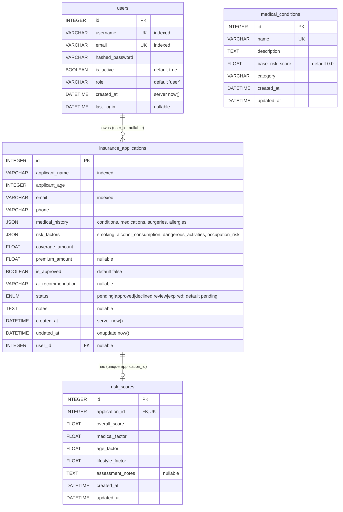
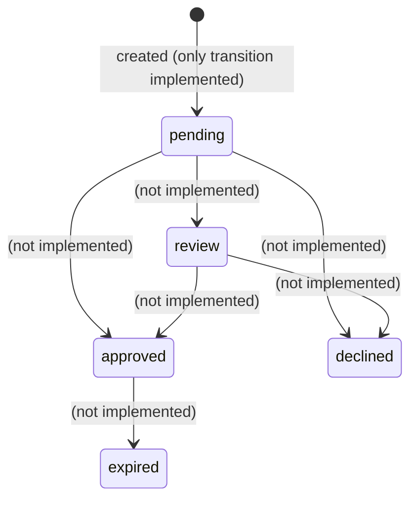
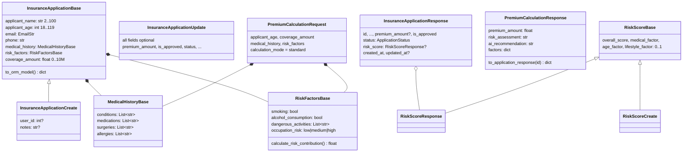
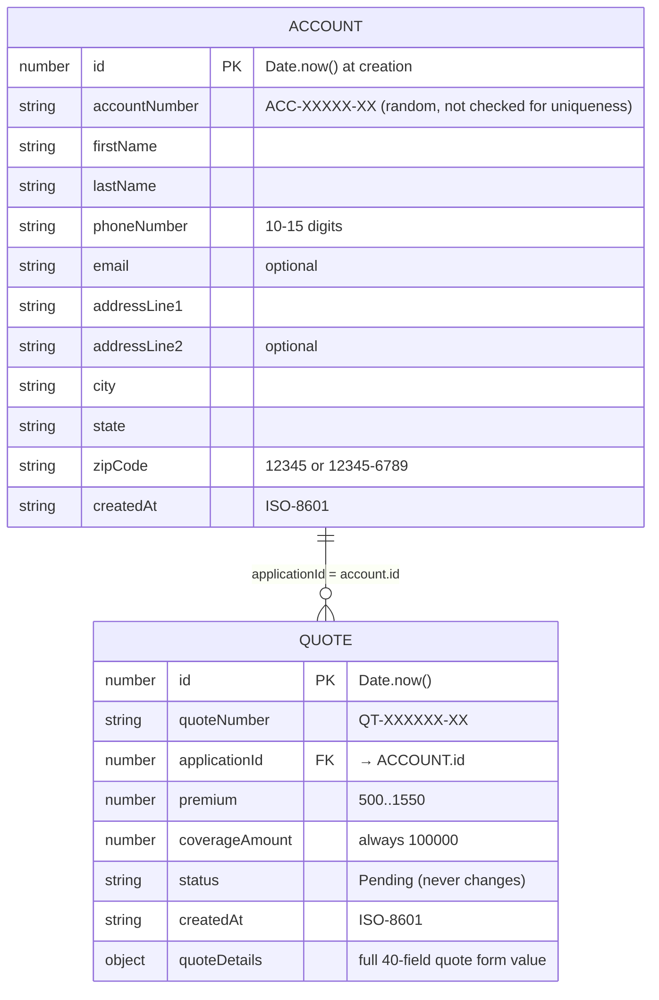

# 05. Data Model

The system stores data in three unconnected places:

| Store | Technology | Written by | Contents |
|-------|-----------|------------|----------|
| Relational | SQLite `backend/app_database.db` (hard-coded) | Backend endpoints | Insurance applications |
| Vector | ChromaDB `backend/vector_db/`, collection `insurance_data` | `seed_vector_db.py` | 8 underwriting guideline documents |
| Browser | `window.localStorage` | Angular services | Customer accounts and quotes |

Nothing synchronizes them: an account created in the UI never reaches SQLite,
and an application POSTed to the API never appears in the UI.

## 5.1 Relational schema (SQLAlchemy, `app/models/insurance.py`)

Tables are created at startup by `Base.metadata.create_all()`. There are no
Alembic migrations: `alembic/` holds only `env.py` and `alembic.ini`.

**Usage by table**

| Table | Inserted by | Read by | Notes |
|-------|-------------|---------|-------|
| `insurance_applications` | `POST /api/insurance/applications/`, `POST /api/complex/complex-application/` | `GET /api/insurance/applications/[id]` | `status` is never changed from `pending`; `notes`, `user_id` never set |
| `risk_scores` | nobody | eager on response via relationship | Always `null` in responses |
| `users` | nobody | nobody | No auth endpoints exist |
| `medical_conditions` | nobody | nobody | Duplicates H2's in-code dictionary, unpopulated |

**Status enum** (`ApplicationStatus`), defined twice with the same values,
once in `models` and once in `schemas`:

### Session management (`app/database/database.py`)

- `engine = create_engine("sqlite:///./app_database.db", check_same_thread=False)`.
  The path is relative to the **current working directory**, so starting
  Uvicorn from another folder creates a new empty database there.
- `SessionLocal = scoped_session(sessionmaker(autocommit=False, autoflush=False))`.
- `get_db()` is a FastAPI dependency: it yields a session and closes it.
- `db_session()` is a context manager that commits, or rolls back on error.
  Nothing uses it.
- `check_database_connection()` returns `(bool, msg)` and is used by `check_db.py`.
- Debug event listeners log on connect, checkout and checkin.

Two other SQLite files are committed: `backend/insurance.db` (the
`.env.example` default) and the `app_database.db` that is actually used.

## 5.2 API schemas (Pydantic, `app/schemas/insurance.py`)

Defined but unused: `InsuranceApplicationUpdate`, `RiskScoreCreate`,
`UserBase` / `UserCreate` (password rules: at least 8 characters, a digit and
an uppercase letter) / `UserUpdate` / `UserResponse`, `Token`, `TokenData`,
`RiskFactorsBase.calculate_risk_contribution()` (smoking 0.30, alcohol 0.15,
activities 0.10 each up to 0.40, occupation 0 / 0.15 / 0.25, capped at 1.0;
this would be a natural source for K3's missing `risk_score`), and
`PremiumCalculationResponse.to_application_response()`.

The schemas use Pydantic v1-style `@validator` (deprecated in v2) and
override `from_orm` on `InsuranceApplicationResponse`, which FastAPI does
not call (it uses `model_validate`).

## 5.3 Vector store collection

| Property | Value |
|----------|-------|
| Collection | `insurance_data` (`VECTOR_COLLECTION_NAME`) |
| Embedding | `all-MiniLM-L6-v2`, 384 dims, CPU |
| Persist dir | `./vector_db` (relative to CWD) |
| Documents | 8, from `seed_vector_db.py` |
| Metadata | `{category: "underwriting", subcategory: <topic>}` |

| # | subcategory | Summary |
|---|-------------|---------|
| 1 | `age_guidelines` | Age bands 18–30 … 81+ and screening level |
| 2 | `medical_risk` | Cardiovascular, respiratory, metabolic, cancer, autoimmune, neuro, mental health, substances |
| 3 | `premium_calculation` | Base premium = coverage × base rate, modified by age, health, lifestyle and term |
| 4 | `occupation_risk` | High-risk occupations with premium loadings (e.g. mining 150–200%, firefighters 125–150%) |
| 5 | `decision_categories` | Approve standard/preferred/substandard, refer, postpone, decline, plus decline reasons |
| 6 | `special_considerations` | Hazardous hobbies, foreign travel, aviation, military, waiting periods, hereditary conditions |
| 7 | `medical_requirements` | Exam requirements by coverage band (<$100k … >$1M) |
| 8 | `terminal_illness` | Decline if life expectancy < 24 months; offer guaranteed-issue alternatives |

Running the seed script twice inserts duplicates; it does not upsert.

## 5.4 Browser storage (`localStorage`)

### `insurance_accounts`: array of Account

Terminology warning: the UI calls the same record an *account* (Search,
Create Account) and an *application* (route `/application/:id`,
`getApplication`). The backend's "application" is a different entity with
different fields: `applicant_name`, `applicant_age`, `medical_history`.

### Field mapping between the UI and the backend

| Concept | UI record | Backend `InsuranceApplication` |
|---------|-----------|--------------------------------|
| Name | `firstName`, `lastName` | `applicant_name` |
| Age | not captured anywhere in the account or quote | `applicant_age` (required) |
| Phone | `phoneNumber` | `phone` |
| Address | `addressLine1/2`, `city`, `state`, `zipCode` | none |
| Conditions | `quoteDetails.preExistingConditions` (single value) | `medical_history.conditions` (list) |
| Medications | `quoteDetails.currentMedications` (Yes/No) + `medicationDetails` | `medical_history.medications` (list) |
| Surgeries | `surgeryLast10Years` + `surgeryDetails` | `medical_history.surgeries` |
| Smoking | `smokingStatus` Yes/No | `risk_factors.smoking` bool |
| Alcohol | `alcoholConsumption` Yes/No | `risk_factors.alcohol_consumption` bool |
| Occupation | `occupationRiskLevel` "Low Risk"… | `risk_factors.occupation_risk` "low"… |
| Coverage | fixed 100 000 | `coverage_amount` |
| Premium | `quote.premium` | `premium_amount` |
| Family history, travel, mental health, BMI, dependents | `quoteDetails.*` | none |

This table is the starting point for wiring the quote form to
`POST /api/insurance/applications/` (see [09](09-gap-analysis.md)).
