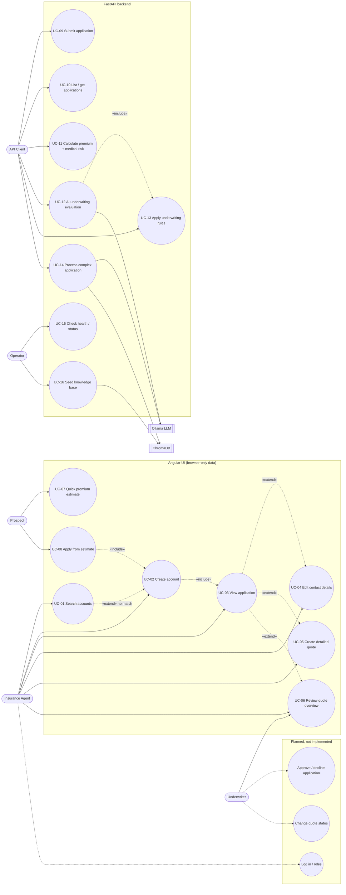

# 06. Use Cases and User Scenarios

## 6.1 Actors

| Actor | Type | Description | Interface |
|-------|------|-------------|-----------|
| **Insurance Agent** | Primary, human | Front-office user who looks up or creates a customer, fills the questionnaire and produces a quote | Angular UI |
| **Prospect** | Primary, human | Member of the public who wants a quick price estimate | Angular UI `/calculator` |
| **Underwriter** | Primary, human | Reviews quotes and AI decisions. Intended role, not implemented in the UI; today they can only read the Quote Overview dialog or call the API | UI (read-only) / Swagger |
| **API Client** | Primary, system | Swagger user, test script or a future frontend that calls the REST API | HTTP/JSON |
| **Operator** | Supporting, human | Starts services, seeds the vector DB, checks health | Shell, `/health` |
| **Ollama LLM** | Secondary, system | Generates underwriting reasoning (DeepSeek-R1) | HTTP :11434 |
| **ChromaDB** | Secondary, system | Supplies underwriting guidelines to the K1 underwriter agent | In-process |

## 6.2 Use-case diagram



## 6.3 Use-case specifications

### UC-01 Search accounts

| | |
|---|---|
| **Actor** | Insurance Agent |
| **Trigger** | Agent opens **Search Applications** |
| **Pre-conditions** | None |
| **Main flow** | 1. Agent enters any combination of name, phone, email, address, city, state, zip. 2. Presses **Search**. 3. System filters `localStorage.insurance_accounts`, treating blank fields as wildcards and matching case-insensitive substrings. 4. System lists matches (Account #, Name, Email, Phone, City, State). 5. Agent clicks **View** → UC-03. |
| **Alternate flows** | 2a. All fields blank → "Please fill at least one search field". 4a. No matches → **Create New Account** button → UC-02 pre-filled. |
| **Exceptions** | E1. After **Reset**, blank fields are `null` and the search throws `TypeError`; the spinner never stops (bug). |
| **Post-conditions** | None (read-only) |
| **Implemented in** | `InsuranceSearchComponent.searchApplications` → `InsuranceService.searchAccounts` |

### UC-02 Create account

| | |
|---|---|
| **Actor** | Insurance Agent (or Prospect via UC-08) |
| **Pre-conditions** | None; optionally pre-filled from UC-01 |
| **Main flow** | 1. Agent completes first/last name, phone (10–15 digits), optional email, address, city, state, zip. 2. Presses **Create**. 3. System assigns `id = Date.now()` and `accountNumber = ACC-XXXXX-XX`, appends to `insurance_accounts`. 4. Snackbar "Account created successfully!". 5. After 1 s navigates to UC-03. |
| **Alternate flows** | 2a. Invalid fields → all marked touched, snackbar. 2b. **Cancel** → UC-01. |
| **Business rules** | No duplicate check. Account number is random and not checked for uniqueness. |
| **Post-conditions** | Account exists in this browser only |

### UC-03 View application

| | |
|---|---|
| **Actor** | Insurance Agent, Underwriter |
| **Main flow** | 1. System loads the account by `id` and its quotes in parallel. 2. Shows account number, "Active" chip, personal info, address, quotes table. |
| **Exceptions** | Account not in this browser → "Failed to load application details". |

### UC-04 Edit contact details

| | |
|---|---|
| **Main flow** | 1. **Edit Details**. 2. Agent edits email, phone, address, city, state, zip. 3. **Save** → record overwritten in `localStorage` → snackbar. |
| **Business rules** | Phone must be exactly 10 digits here (creation allows 10–15). Name cannot be edited. |

### UC-05 Create detailed quote

| | |
|---|---|
| **Actor** | Insurance Agent |
| **Pre-conditions** | An account exists (`?applicationId=` in the URL) |
| **Main flow** | 1. System pre-fills name and generates a `QAP-XXXXX-XXX` reference. 2. Agent answers 12 sections (health, conditions, history, family, travel, lifestyle, occupation, mental health, medications, dependents, notes). 3. **Submit**. 4. System computes premium = 500 + loadings, coverage = 100 000. 5. Saves the quote `QT-XXXXXX-XX` with status Pending. 6. Returns to UC-03. |
| **Alternate flows** | 1a. No `applicationId` / unknown id → redirect to UC-01. 2a. Answering No/None clears the dependent detail fields. 3a. Invalid → snackbar. |
| **Business rules** | See the quote formula in [02 §2.4](02-frontend.md#24-create-quote-quoteapplicationidn). |

### UC-06 Review quote overview

| | |
|---|---|
| **Actor** | Insurance Agent, Underwriter |
| **Main flow** | 1. Click a quote row (or **Quote Overview**, which opens the oldest quote). 2. Dialog shows premium, coverage, status, premium risk factors, underwriting considerations and a breakdown chart. |
| **Business rules** | See [02 §2.5](02-frontend.md#25-quote-overview-dialog). |

### UC-07 Quick premium estimate

| | |
|---|---|
| **Actor** | Prospect |
| **Main flow** | 1. Enter age (18–99), smoker flag, coverage, free-text conditions. 2. **Calculate**. 3. System shows monthly premium, risk tier and a smoking tip. |
| **Implemented in** | `InsuranceService.calculatePremium` (pure TypeScript) |

### UC-08 Apply from estimate

| | |
|---|---|
| **Main flow** | 1. From a UC-07 result press **Apply for Insurance**. 2. System opens UC-02. |
| **Defect** | The premium and inputs are passed as `state.premiumData`, which UC-02 ignores. |

### UC-09 Submit application (API)

| | |
|---|---|
| **Actor** | API Client |
| **Main flow** | 1. `POST /api/insurance/applications/` with `InsuranceApplicationCreate`. 2. System validates, calls H1, stores the row with status `pending`. 3. Returns 201 with the record. |
| **Alternate flows** | 1a. Validation failure → 422. |
| **Defect** | Premium is always 5% of coverage (H1 fallback). |

### UC-10 List / get applications (API)

`GET /api/insurance/applications/?skip&limit` and `GET /api/insurance/applications/{id}`
(404 if missing).

### UC-11 Calculate premium with medical risk (API)

`POST /api/insurance/calculate-premium/`: H2 analyses conditions, H1 prices.
Nothing is persisted. H2's output is discarded.

### UC-12 AI underwriting evaluation (API)

| | |
|---|---|
| **Actor** | API Client (on behalf of an Underwriter) |
| **Main flow** | 1. `POST /api/evaluate-application` with age, coverage, risk_score, history, factors. 2. Rules evaluated (UC-13). 3. LLM asked for decision, reasoning, premium, special conditions. 4. Merged response returned. |
| **Alternate flows** | 3a. LLM error, parse error or (today) always → rule decision + formula premium + `error`. |

### UC-13 Apply underwriting rules (API)

`POST /api/complex/apply-underwriting-rules/`: deterministic six-rule engine,
which returns `decision`, `reasons`, `rules_fired`.

### UC-14 Process complex application (API)

`POST /api/complex/complex-application/` (persists) or
`POST /api/process-complex-application` (does not). Intended: three agents in
parallel. Actual: `{}` (see [04 §4.3](04-ai-components.md#43-k1-crewai-orchestration)).

### UC-15 Check health / status

`GET /health` pings SQLite. `GET /api/system-status` returns static strings.

### UC-16 Seed knowledge base

`python seed_vector_db.py` embeds 8 guideline texts into Chroma. Not
idempotent.

---

## 6.4 User scenarios (worked examples)

Each scenario names the persona and goal, lists the steps, and gives the
system's actual output, calculated from the code.

### Scenario A: "Priya, 28, wants a ballpark price" (UC-07)

1. Priya opens the app, which lands on `/calculator`.
2. She enters age **28**, non-smoker, coverage **$250 000**, no conditions.
3. **Calculate** → `250 000 / 1000 × 0.5 = 125 × 0.7 (age < 30) =` **$87.50 / month**.
4. Rate = 87.5 / 250 = 0.35 < 0.8 → **"Low Risk: You have qualified for our preferred rate…"**.
5. No recommendation (non-smoker).

### Scenario B: "Mark, 52, smoker with diabetes and heart disease" (UC-07 → UC-08)

1. Age **52**, smoker, coverage **$500 000**, conditions `diabetes, heart disease`.
2. 500 × 0.5 = 250 → × 1.5 (45–59) = 375 → × 1.5 (smoker) = 562.50 →
   × 1.7 (heart disease) = 956.25 → × 1.3 (diabetes) = **$1 243.13 / month**.
3. Rate = 2.49 ≥ 1.5 → **"Elevated Risk"**, plus "Quitting smoking could
   significantly reduce your premium by up to 33%."
4. He clicks **Apply for Insurance** → an empty Create Account form. The
   $1 243.13 figure is lost (UC-08 defect).

### Scenario C: "Agent onboards a new customer and quotes" (UC-01 → UC-02 → UC-03 → UC-05 → UC-06)

1. Agent searches *Sachin / Singh / 6148819005 / Grove City / OH / 43123*.
   No results → **Create New Account**.
2. Form arrives pre-filled; agent adds `1887 Autumn Wind Dr`, presses
   **Create** → account `ACC-7K2QD-9M` (random), `id = 1745000000000`.
3. Application Detail shows the record with an empty quotes table.
4. **Create Quote** → answers: health **Good**, pre-existing **Hypertension**,
   smoker **Yes**, family heart disease **Yes**, everything else No /
   Low Risk / stress 4.
5. Premium = 500 + 50 (Good) + 200 (condition) + 250 (smoker) + 100 (family)
   = **$1 100**, coverage **$100 000**, status **Pending**.
6. **Quote Overview** dialog:
   - Risk factors: Smoking (High), Pre-existing Condition (High), Family
     Medical History (Medium; only one "Yes").
   - Underwriting considerations: none.
   - Breakdown: base $500; extra $600 split as 40% / 40% / 20% = $240 / $240 / $120.
     This adds up only by coincidence; with three High factors the bars would
     total 120% of the extra.

### Scenario D: "Returning customer changed phone number" (UC-01 → UC-03 → UC-04)

1. Agent searches last name "Singh" (other fields blank) → one result → **View**.
2. **Edit Details** → enters `614-555-0100`. **Save** is disabled: the edit
   form demands exactly 10 digits with no separators. Agent re-enters
   `6145550100` → saved.

### Scenario E: "Agent clears the search form" (UC-01 exception)

1. After a search, the agent presses **Reset**, types only "Sachin" in
   First Name and presses **Search**.
2. `lastName` is `null`, so `null.toLowerCase()` throws. The spinner keeps
   spinning and the console shows `TypeError`. Workaround: reload the page.

### Scenario F: "Integration test submits an application" (UC-09)

```bash
curl -X POST localhost:8000/api/insurance/applications/ -H 'Content-Type: application/json' -d '{
  "applicant_name":"Jane Doe","applicant_age":42,"email":"jane@example.com","phone":"6145550100",
  "medical_history":{"conditions":["hypertension"]},"risk_factors":{"smoking":false},
  "coverage_amount":500000}'
```

→ 201, `premium_amount: 25000.0`,
`ai_recommendation: "Error in AI calculation. Manual review recommended."`,
`status: "pending"`. The row is in SQLite but does not appear in the UI.

### Scenario G: "Underwriter evaluates a senior, high-coverage case" (UC-12)

Request: age **68**, coverage **$750 000**, risk_score **0.4**, hypertension.

1. Rules: only `senior_high_coverage` fires → **refer**.
2. LLM step: falls back (see K3-1).
3. Response: decision **refer**, `requires_review: true`, premium
   `750 000 × 0.01 × 1.68 × 1.8 =` **$15 120.00**,
   `error: "LLM evaluation failed: 'decision'"`.

### Scenario H: "Terminal illness is auto-declined" (UC-13)

Request: age 82, coverage $1.2M, risk 0.7, conditions `["Stage 4 lung cancer"]`.
→ **decline**; reasons: "Applicant exceeds maximum age limit", "Terminal
illness present"; `rules_fired` lists all five rules that matched.

### Scenario I: "Complex case through the crew" (UC-14)

Request: a valid `InsuranceApplicationCreate` for a 55-year-old diabetic
smoker, $500k.

- **Today:** 201 `{"application_id": 9}`; the row is saved with
  `premium_amount = null`, `is_approved = false`.
- **After fixing K1-1..K1-3** (fallbacks, Ollama down): Risk Analyzer 0.50
  "Moderate"; Medical Expert "detailed" review (diabetes without
  medication); Underwriter **approve**, $11 625.

### Scenario J: "Ollama is down" (UC-12, UC-14)

Every AI endpoint still answers with HTTP 200/201, with the same decision and
premium as Scenarios G to I. For UC-12 the only differences are the `error`
text (a `RetryError` wrapping the connection error instead of `'decision'`)
and the extra latency of 3 attempts with backoff. UC-14 is unaffected today
because the crew never calls the LLM. `/api/system-status` still reports the
LLM as "available".
