# 07. System Flows

Sequence diagrams for the AI internals (K1 crew, K3 LLM review) are in
[04-ai-components.md](04-ai-components.md). This chapter covers the
end-to-end flows around them.

## 7.1 End-to-end user journey (UI)

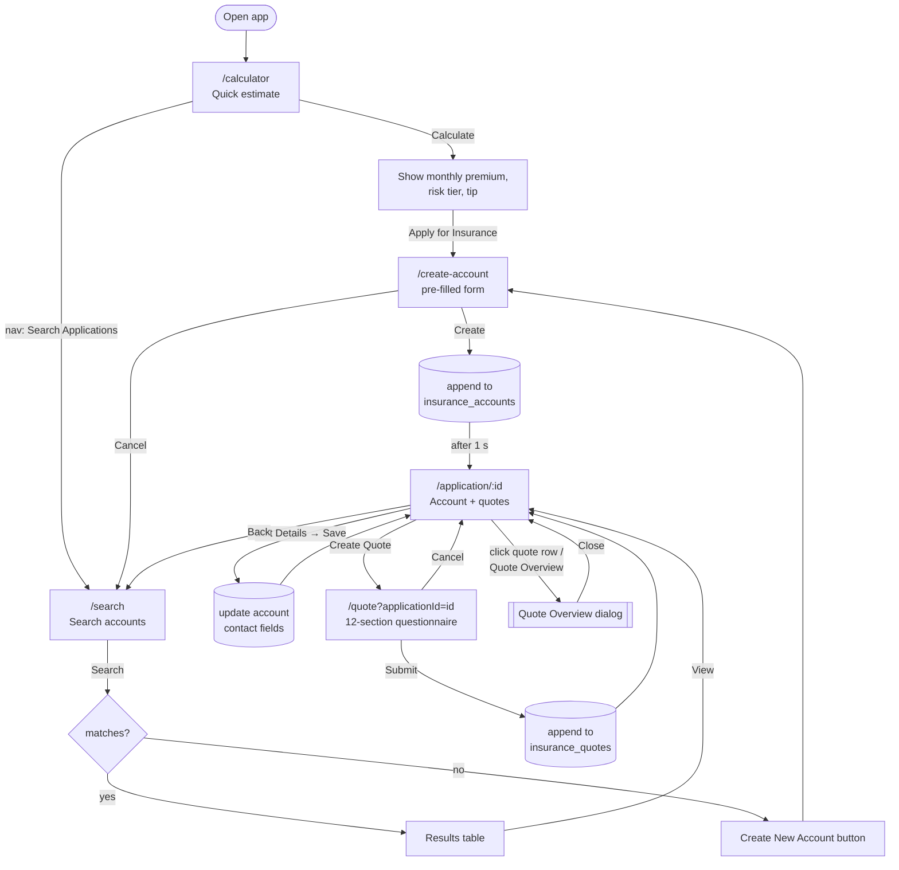

## 7.2 Navigation state machine

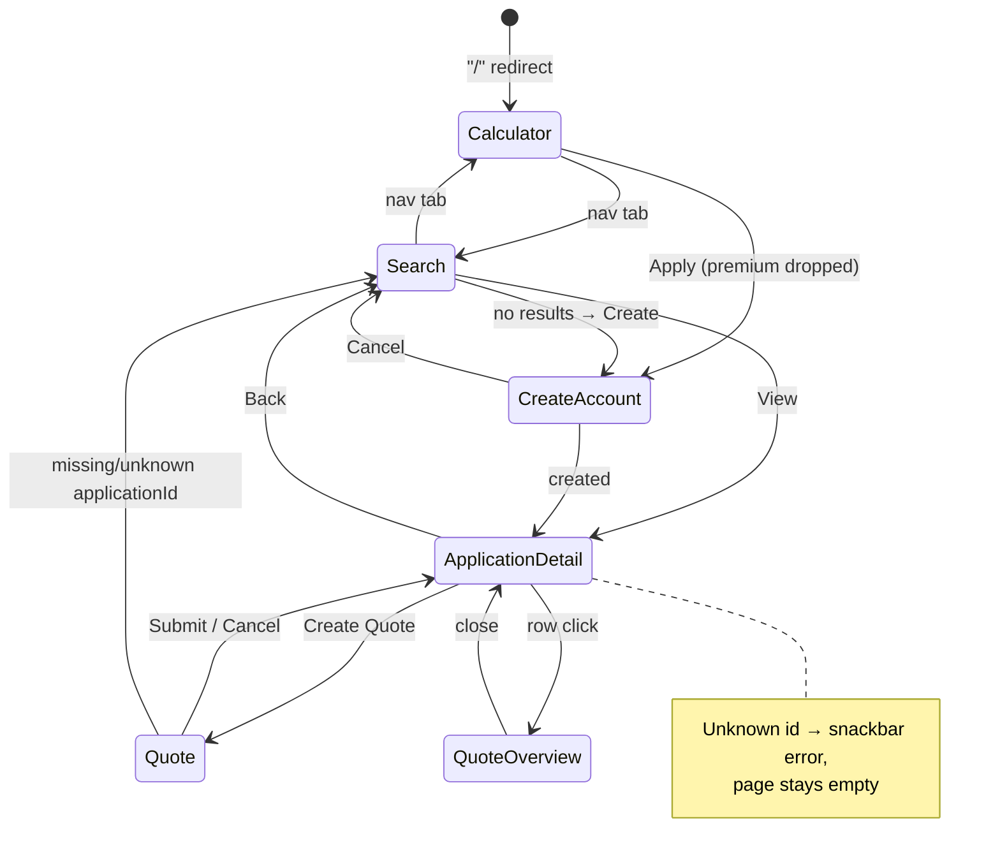

## 7.3 Sequence: search → create account → detail

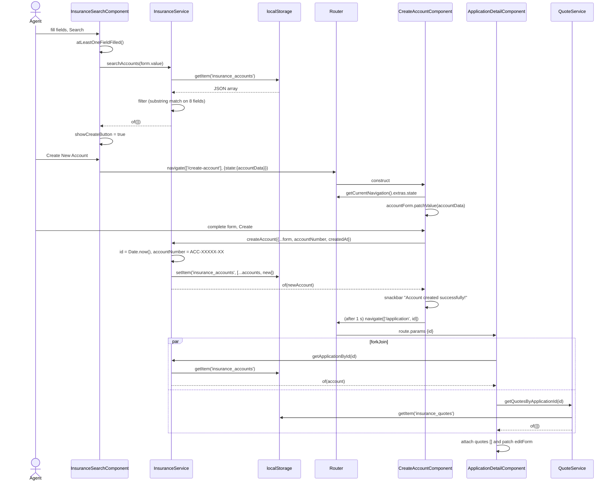

## 7.4 Sequence: create quote → overview

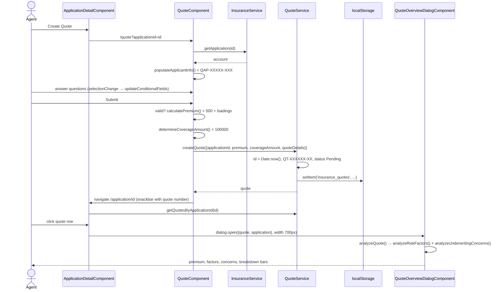

## 7.5 Sequence: quick calculator

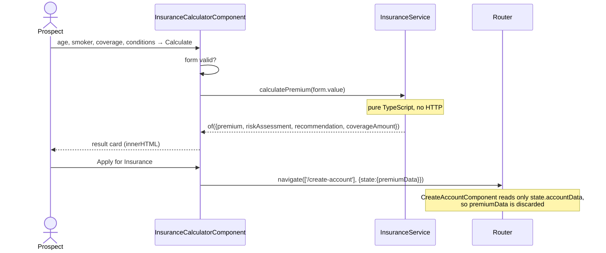

## 7.6 Backend request lifecycle

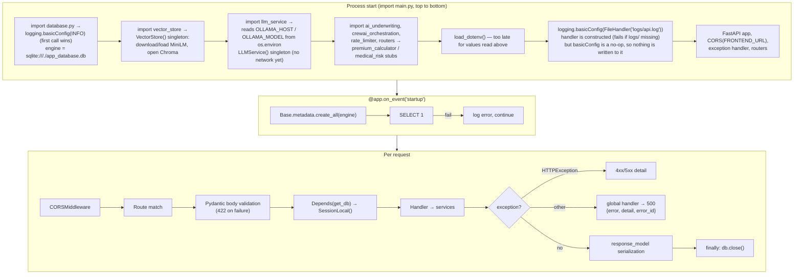

## 7.7 Sequence: submit application via API (H1)

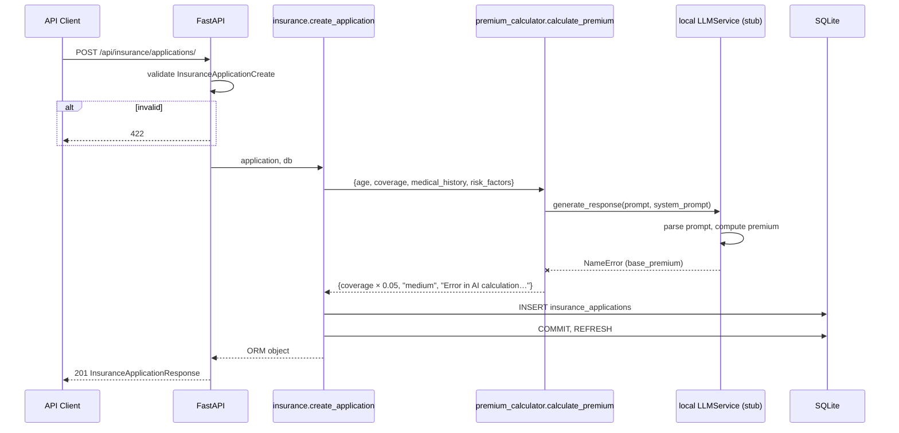

## 7.8 Sequence: calculate premium with medical risk (H2 → H1)

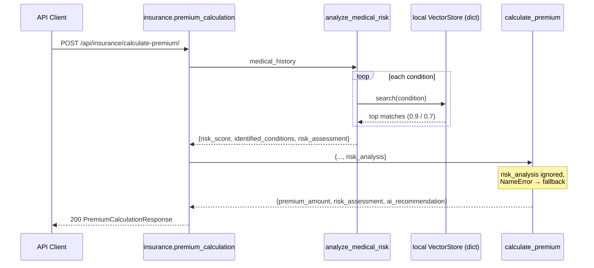

## 7.9 Sequence: complex application with persistence (K1)

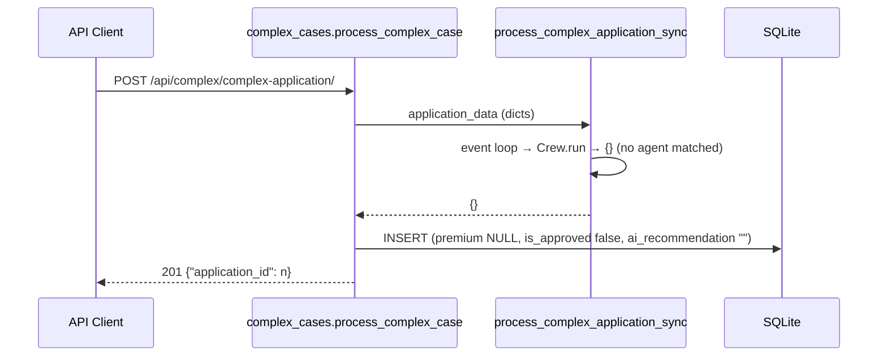

## 7.10 AI fallback decision flow (all components)

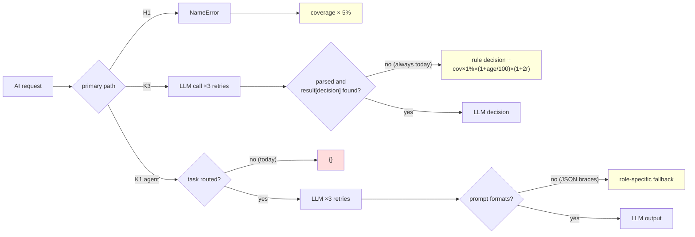

## 7.11 Quote and application lifecycles

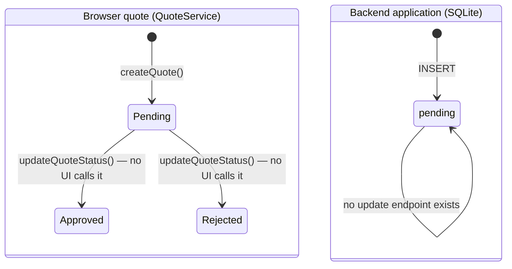
