# 08. Function Call Graphs

Notation: solid arrows are calls that happen at runtime. Dashed arrows are
calls that exist in code but never execute, or are unreachable. Grey nodes
are dead code.

## 8.1 Backend module dependency graph

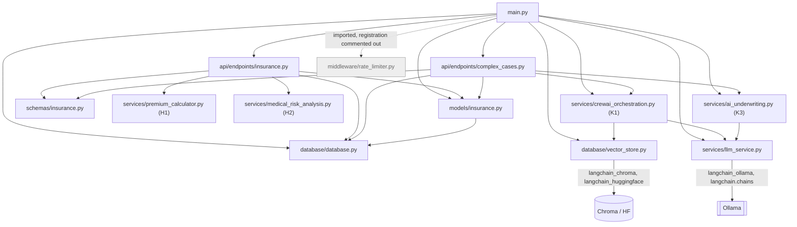

H1 and H2 import nothing from `llm_service` or `vector_store`. Each defines
its own same-named stub class.

## 8.2 Backend call tree per endpoint

### `POST /api/insurance/applications/`

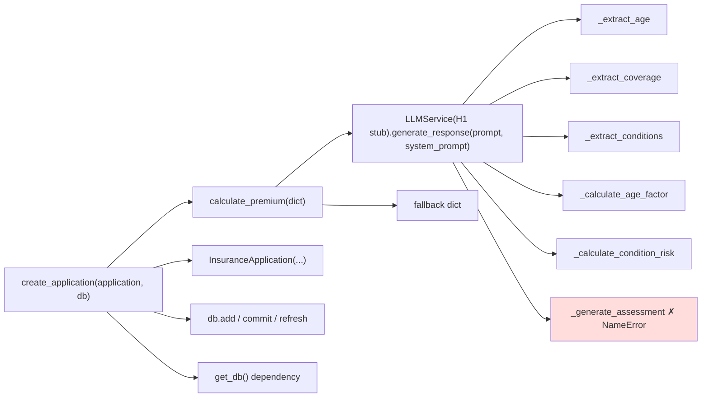

### `POST /api/insurance/calculate-premium/`

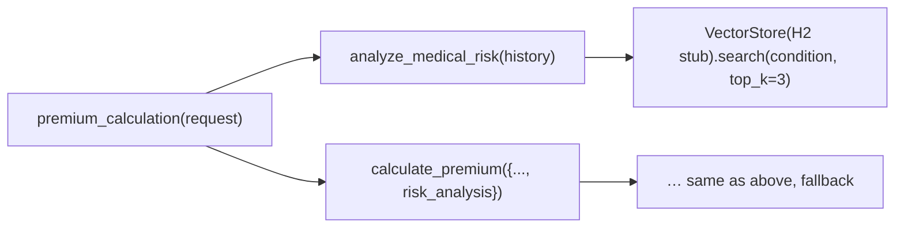

### `GET /api/insurance/applications/` and `/{id}`

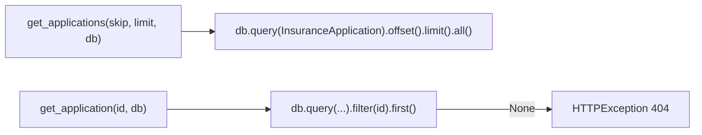

### `POST /api/evaluate-application`

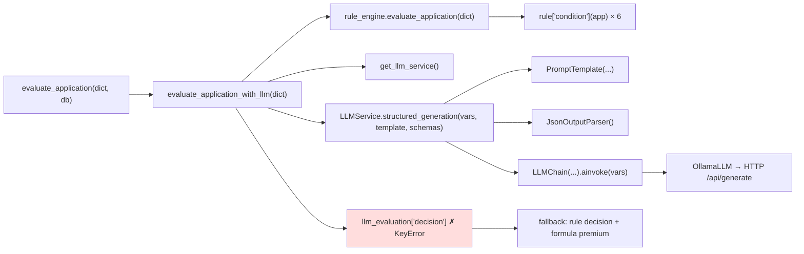

### `POST /api/complex/apply-underwriting-rules/`

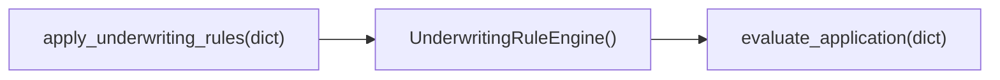

### `POST /api/complex/complex-application/` and `POST /api/process-complex-application`

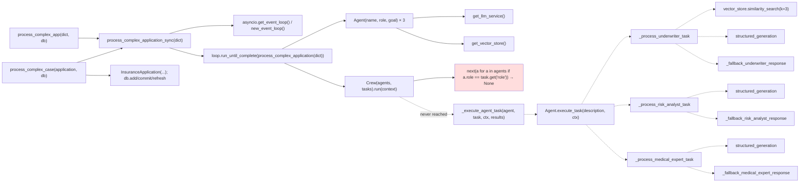

### `GET /health`, `GET /api/system-status`, startup

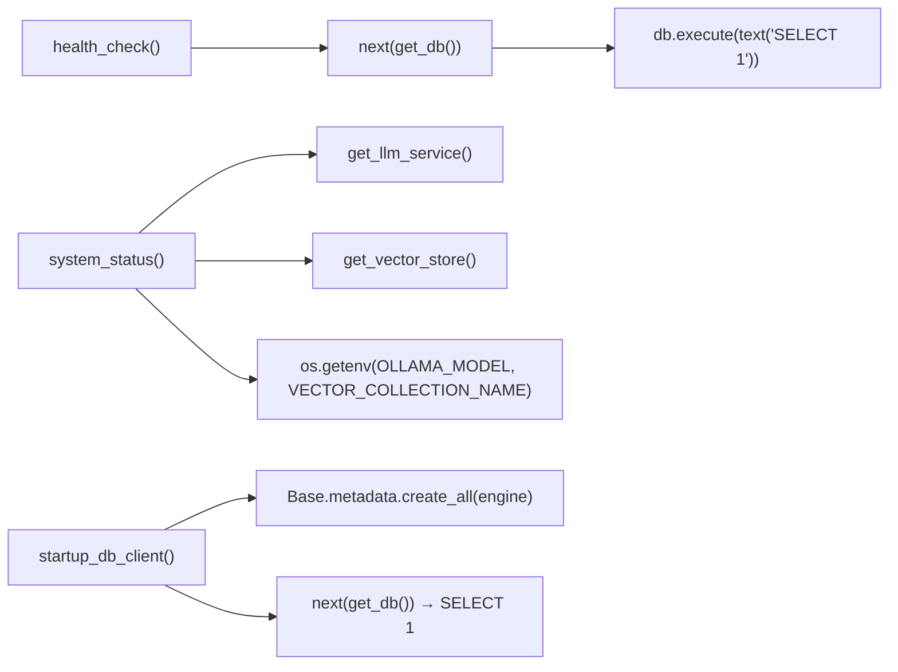

## 8.3 Backend function index

| Function / method | File | Called by | Calls | Status |
|-------------------|------|-----------|-------|--------|
| `startup_db_client` | main.py | FastAPI startup | `create_all`, `get_db` | live |
| `global_exception_handler` | main.py | FastAPI on unhandled error | `JSONResponse` | live |
| `read_root`, `health_check`, `system_status` | main.py | HTTP | see 8.2 | live |
| `evaluate_application` | main.py | HTTP | `evaluate_application_with_llm` | live |
| `process_complex_app` | main.py | HTTP | `process_complex_application_sync` | live |
| `create_application`, `get_applications`, `get_application`, `premium_calculation` | endpoints/insurance.py | HTTP | see 8.2 | live |
| `process_complex_case`, `apply_underwriting_rules` | endpoints/complex_cases.py | HTTP | see 8.2 | live |
| `get_db` | database.py | every DB endpoint, startup, health | `SessionLocal` | live |
| `db_session` | database.py | nobody | | dead |
| `check_database_connection` | database.py | `check_db.py` script | `engine.connect` | script only |
| `VectorStore.__init__` | vector_store.py | module import, `seed_vector_db.py` | `HuggingFaceEmbeddings`, `Chroma` | live |
| `VectorStore.add_documents` | vector_store.py | `seed_vector_db.py`, tests | `Chroma.add_texts` | script only |
| `VectorStore.similarity_search` | vector_store.py | K1 underwriter (unreachable), tests | `similarity_search_with_score` | unreachable at runtime |
| `VectorStore.delete_collection` | vector_store.py | nobody | | dead |
| `LLMService.generate_text` | llm_service.py | tests only | `llm.agenerate` | dead at runtime |
| `LLMService.structured_generation` | llm_service.py | K3, K1 agents | `LLMChain.ainvoke` | live (K3) |
| `calculate_premium` | premium_calculator.py | `create_application`, `premium_calculation` | stub `generate_response` | live (always falls back) |
| `analyze_medical_risk` | medical_risk_analysis.py | `premium_calculation` | stub `search` | live (output unused) |
| `UnderwritingRuleEngine.evaluate_application` | ai_underwriting.py | K3, `apply_underwriting_rules` | 6 lambdas | live |
| `evaluate_application_with_llm` | ai_underwriting.py | `/api/evaluate-application` | rules, `structured_generation` | live (always falls back) |
| `process_complex_application_sync` | crewai_orchestration.py | 2 endpoints | `process_complex_application` | live |
| `process_complex_application` | crewai_orchestration.py | the sync wrapper | `Crew.run` | live (returns `{}`) |
| `Crew.run` | crewai_orchestration.py | above | `_execute_agent_task` (never) | live |
| `Agent.*` handlers and fallbacks | crewai_orchestration.py | `Crew._execute_agent_task` | LLM, vector store | unreachable |
| `RateLimiter.*` | rate_limiter.py | nobody | | dead |
| `RiskFactorsBase.calculate_risk_contribution` | schemas | nobody | | dead |
| `InsuranceApplicationResponse.from_orm` | schemas | nobody (FastAPI uses `model_validate`) | | dead |
| `PremiumCalculationResponse.to_application_response` | schemas | nobody | | dead |

## 8.4 Frontend component → service → storage graph

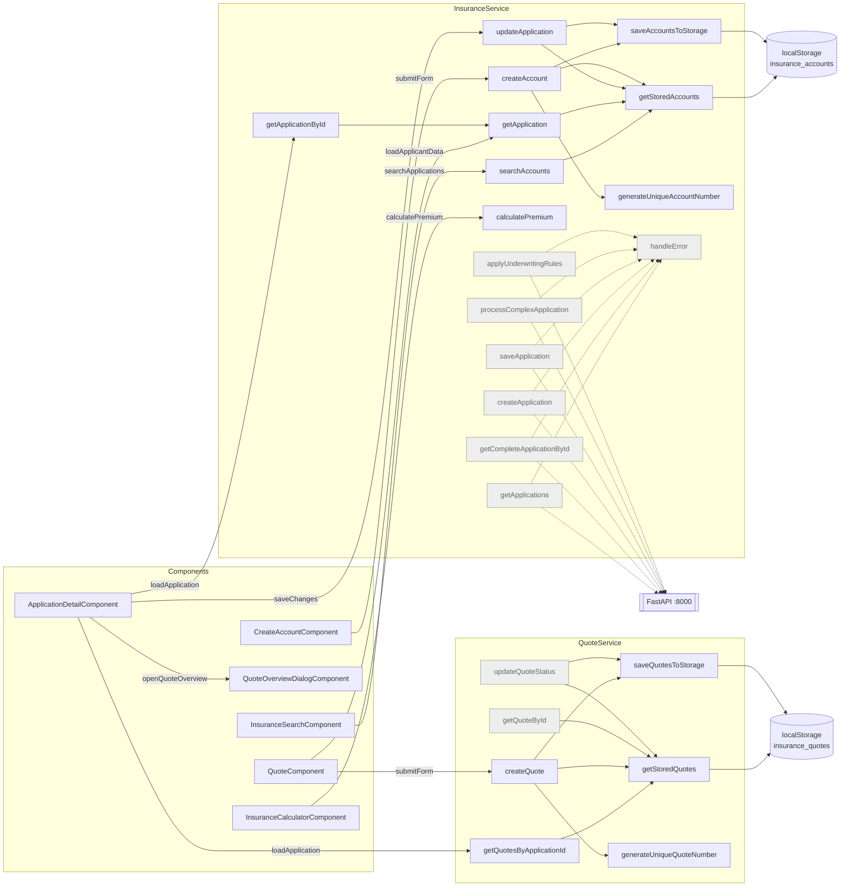

## 8.5 Frontend component method maps

### `InsuranceSearchComponent`

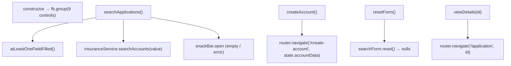

### `CreateAccountComponent`

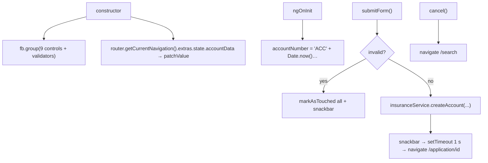

### `ApplicationDetailComponent`

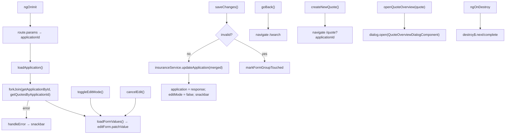

(`createNewQuote()` is defined, but the template uses a `routerLink` for
the same navigation.)

### `QuoteComponent`

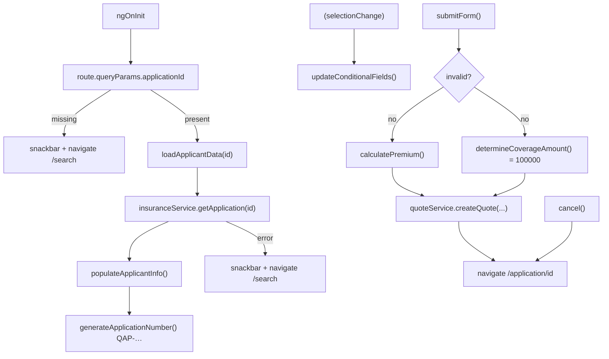

### `QuoteOverviewDialogComponent`

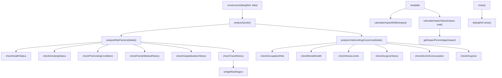

### `InsuranceCalculatorComponent` and `AppComponent`

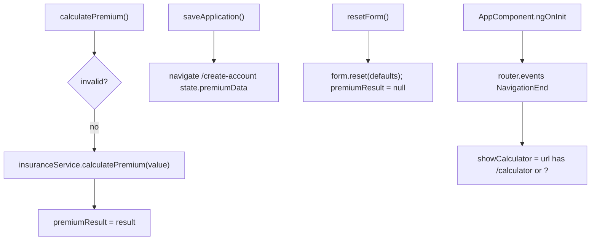
