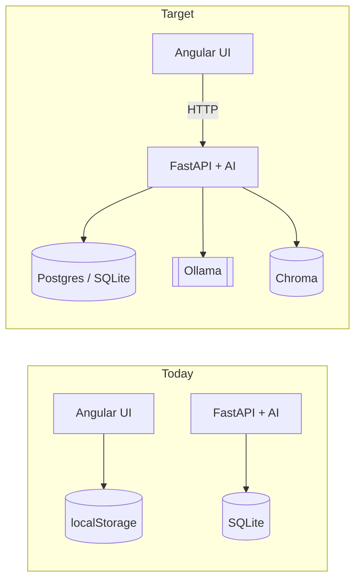
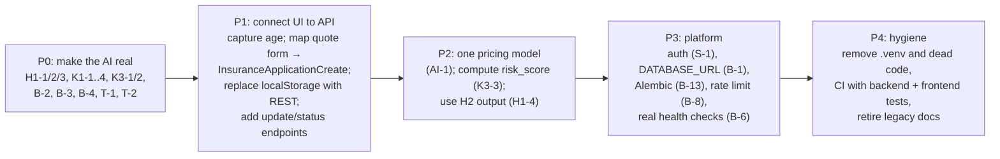

# 09. Gap Analysis

This chapter lists every defect, missing feature and documentation mismatch
found while writing these docs. **Verified** means the behaviour was
reproduced by running the code (with stubbed LLM/vector dependencies where
needed). **Read** means it was established by reading the code only.

Severity: 🔴 breaks a headline feature · 🟠 wrong results or a security
issue · 🟡 maintainability or quality.

## 1. The frontend and backend are not connected

🔴 **Read.** Every routed Angular screen reads and writes
`localStorage`, or computes prices in TypeScript. The six `HttpClient`
methods in `InsuranceService` are never called from a reachable component,
and two of them target endpoints that do not exist
(`/insurance/applications/{id}/complete`, `/insurance/applications/save`).

Consequences:

- The AI components are invisible to UI users.
- Data is per-browser: clearing site data deletes every account and quote,
  and two agents never see each other's customers.
- There are two unrelated "application" concepts (see the
  [field mapping table](05-data-model.md#field-mapping-between-the-ui-and-the-backend)).
- The UI never captures **age**, which every backend pricing path requires.

## 2. AI component defects

Full explanations are in [04-ai-components.md](04-ai-components.md).

| ID | Sev | Status | Defect | Fix |
|----|-----|--------|--------|-----|
| H1-1 | 🔴 | Verified | `_generate_assessment` uses undefined `base_premium` etc., so every call raises `NameError` and returns `coverage × 5%` | Compute the premium in `generate_response` only; make `_generate_assessment(condition_risk, smoking, age)` return `(risk, recommendation)` |
| H1-2 | 🔴 | Read | Caller unpacks a 3-key dict into 2 variables | Same as above |
| H1-3 | 🟠 | Verified | Prompt re-parsing extracts age = 250000, coverage = 100000, conditions = [] | Do not round-trip through text; pass the dict directly, or call the real `LLMService` |
| H1-4 | 🟠 | Read | H2's `risk_analysis` ignored | Feed `risk_score` into pricing |
| H2-1 | 🟡 | Verified | Keyword matching only, no synonyms; unmatched conditions dilute the average | Use the real Chroma store with a condition collection, or a synonym map |
| K1-1 | 🔴 | Verified | Tasks lack a `role` key, so `Crew.run` finds no agent and returns `{}` | Add `"role"` and `"name"` to each task dict |
| K1-2 | 🔴 | Verified | `description` passed instead of the task keyword | Pass `task["task"]` |
| K1-3 | 🟠 | Read | Results keyed by missing `name` | Same as K1-1 |
| K1-4 | 🔴 | Verified | f-string prompts containing JSON are parsed as templates, raising `KeyError` | Pass data as template variables (as K3 does), or escape braces |
| K1-5 | 🟠 | Read | No aggregation into `approved` / `premium_amount` / `recommendation` | Add a final merge step; run the analyst before the underwriter |
| K1-6 | 🟡 | Read | Agents run concurrently, so the underwriter cannot see `risk_score` | Run sequentially, or as two stages |
| K3-1 | 🔴 | Verified | Reads `result["decision"]` instead of `result["text"]["decision"]`, so it always falls back | Return `result["text"]` from `structured_generation`; better, use `prompt \| llm \| parser` (LCEL) |
| K3-2 | 🟠 | Verified | DeepSeek-R1 `<think>` blocks break `JsonOutputParser` | Strip `<think>…</think>` before parsing; or use `format="json"` on `OllamaLLM` |
| K3-3 | 🟠 | Read | `risk_score` must come from the caller, so rules 3 and 4 are inert | Compute it with `RiskFactorsBase.calculate_risk_contribution()` + H2 |
| AI-1 | 🟠 | Read | Five inconsistent pricing formulas (see [04 §4.5](04-ai-components.md#45-pricing-models-side-by-side)) | One pricing service with a documented rate table, used by UI and API |
| AI-2 | 🟡 | Read | `LLMChain` is deprecated in LangChain 0.3 | Migrate to LCEL |
| AI-3 | 🟡 | Read | Chroma "similarity" is actually a distance | Rename the field or convert it |

## 3. Backend platform issues

| ID | Sev | Status | Issue | Location |
|----|-----|--------|-------|----------|
| B-1 | 🟠 | Read | `DATABASE_URL` hard-coded to SQLite; the env var and Compose Postgres are ignored | `database/database.py` |
| B-2 | 🟠 | Read | `load_dotenv()` runs after modules read `OLLAMA_HOST` / `OLLAMA_MODEL`, so `.env` values are ignored | `main.py` |
| B-3 | 🟠 | Read | `logs/` must exist or import fails; the file handler is never attached anyway | `main.py` |
| B-4 | 🟠 | Read | `langchain-chroma`, `langchain-huggingface` missing from every requirements file | `requirements*.txt` |
| B-5 | 🟡 | Read | Heavy singletons (embedding model, Chroma) load at import, which makes startup and tests slow and needs network on first run | `vector_store.py` |
| B-6 | 🟡 | Read | `/api/system-status` never probes Ollama or Chroma; `/health` says "healthy" with the DB down | `main.py` |
| B-7 | 🟠 | Read | Global handler returns `str(exc)` to clients | `main.py` |
| B-8 | 🟡 | Read | Rate limiter disabled; its `__call__(request, call_next)` does not match `add_middleware`'s ASGI contract (wrap with `BaseHTTPMiddleware`), and in-memory buckets do not work across workers | `middleware/rate_limiter.py` |
| B-9 | 🟡 | Read | `user_id`, `notes` accepted but not saved; `status` never leaves `pending`; no update or delete endpoints | endpoints |
| B-10 | 🟡 | Read | Untyped `dict` bodies on 3 endpoints (no validation) | `main.py`, `complex_cases.py` |
| B-11 | 🟡 | Read | Duplicate complex endpoints (`/api/process-complex-application` and `/api/complex/complex-application/`) with different persistence | |
| B-12 | 🟡 | Read | Sync endpoints drive an event loop manually (`run_until_complete`) | `crewai_orchestration.py` |
| B-13 | 🟡 | Read | No Alembic revisions, so schema changes need manual DB deletion | `alembic/` |
| B-14 | 🟡 | Read | Pydantic v1 `@validator`, `@app.on_event` deprecated | schemas, `main.py` |
| B-15 | 🟡 | Read | Relative paths for SQLite and Chroma depend on CWD | `database.py`, `vector_store.py` |
| B-16 | 🟡 | Read | Compose: `CORS_ALLOW_ORIGINS` vs code `FRONTEND_URL`; Ollama 6 GB limit vs ~20 GB model; model never pulled | `docker-compose.yml` |
| B-17 | 🟡 | Read | `seed_vector_db.py` reads `VECTOR_DB_PATH`, `.env.example` defines `VECTOR_PERSIST_DIR`, `vector_store.py` reads neither; seeding is not idempotent | |

## 4. Frontend defects

| ID | Sev | Status | Issue | Location |
|----|-----|--------|-------|----------|
| F-1 | 🟠 | Read | Search after **Reset** throws `TypeError` on `null` fields; the spinner never stops | `InsuranceService.searchAccounts` |
| F-2 | 🟠 | Read | "Apply for Insurance" passes `state.premiumData`; Create Account reads only `accountData` | `insurance-calculator` → `create-account` |
| F-3 | 🟠 | Read | Quote coverage is always $100 000; price ignores age, occupation, alcohol, drugs, BMI | `QuoteComponent` |
| F-4 | 🟡 | Read | Overview breakdown percentages not normalized; factor list differs from pricing rules | `QuoteOverviewDialogComponent` |
| F-5 | 🟡 | Read | "Quote Overview" button opens `quotes[0]` (oldest) | `application-detail.component.html` |
| F-6 | 🟡 | Read | Phone rule differs: 10–15 digits at creation, exactly 10 on edit | create vs detail forms |
| F-7 | 🟡 | Read | Search form marks fields required but they are not enforced | `InsuranceSearchComponent` |
| F-8 | 🟡 | Read | `[innerHTML]` with service-generated HTML; safe today, but a pattern to avoid | calculator template |
| F-9 | 🟡 | Read | `id = Date.now()` and random account/quote numbers are not checked for collisions | services |
| F-10 | 🟡 | Read | API URL hard-coded (`http://localhost:8000/api`), no `environment.ts` | services |
| F-11 | 🟡 | Read | `CUSTOM_ELEMENTS_SCHEMA` on every module hides template errors | all modules |
| F-12 | 🟡 | Read | Dead code: `account/`, `components/insurance-calculator/`, `AccountService`, `app.routes.ts`, most of `insurance.model.ts` | |
| F-13 | 🟡 | Read | Quote status can never change from Pending in the UI | `QuoteService.updateQuoteStatus` unused |
| F-14 | 🟡 | Read | "Active" status chip is hard-coded | application detail |
| F-15 | 🟡 | Read | `angular-eslint` 19 and `eslint` 9 dev-deps alongside Angular 17 | `package.json` |

## 5. Security and compliance

| ID | Sev | Issue |
|----|-----|-------|
| S-1 | 🟠 | No authentication or authorization on any endpoint or route. `User` and `Token` schemas exist but are unused. |
| S-2 | 🟠 | Health and medical data (PHI-like) stored unencrypted in browser `localStorage` and in SQLite JSON columns; no retention policy. |
| S-3 | 🟠 | `str(exc)` returned in 500 responses. |
| S-4 | 🟡 | No rate limiting (B-8). |
| S-5 | 🟡 | Default credentials in `docker-compose.yml` (postgres/postgres, admin/admin). |
| S-6 | 🟡 | Committed data files (`app_database.db`, `insurance.db`, `vector_db/`) may contain test PII; the screenshots show a real-looking name, address and phone. |
| S-7 | 🟡 | Applicant data and LLM prompts logged at INFO (`logger.info(f"LLM Prompt: {prompt}")`). |

## 6. Testing gaps

| ID | Status | Issue |
|----|--------|-------|
| T-1 | Read | `test_insurance_calculate_premium` monkeypatches `app.services.premium_calculation` (no such module; it is `premium_calculator`) and asserts keys (`premium`, `factors`, `explanation`) the API never returns. |
| T-2 | Read | `mock_llm_service` is `scope="module"` but takes the function-scoped `monkeypatch` fixture, so pytest raises `ScopeMismatch` for every test that uses it. |
| T-3 | Read | `test_system_status` patches `app.services.llm_service.get_llm_service`, but `main.py` imported the name directly, so the patch has no effect (the test still passes because the endpoint is static). |
| T-4 | Read | Importing `main` in `conftest.py` loads the real embedding model and Chroma, so tests need network and disk. |
| T-5 | Read | No tests for H1, H2, K1, K3, the rule engine, or any complex endpoint, which are exactly where the bugs above are. |
| T-6 | Read | Frontend specs are CLI defaults that target the dead calculator component. |
| T-7 | Read | No CI configuration. |

## 7. Repository hygiene

- `GenAI/.venv/` (74 tracked files, Windows binaries) is committed even
  though `.gitignore` excludes `venv/` (the pattern does not match `.venv`).
- Three requirements files with conflicting pins: `GenAI/requirements.txt`
  pins `langchain==0.1.5` and includes `crewai`, while
  `backend/requirements.fixed.txt` wants `langchain>=0.3`.
- Several near-duplicate diagram sources (`clean-diagram.mmd`,
  `clean-architecture.mmd`, `enhanced-architecture.mmd`,
  `final-architecture.mmd`, `architecture.json`, two `generate-diagram*.py`,
  three `*.html` renders) with no single source of truth.
- Ad-hoc scripts in `backend/` (`check_db.py`, `test_ollama.py`,
  `test_basic_ollama.py`, `test_vector_db.py`) are not part of the pytest
  suite but use `test_` names.

## 8. Documentation drift (old docs vs. code)

| Claim (source) | Reality |
|----------------|---------|
| "Premium Calculator (H1): LLM-powered" (README, main.py) | Rule stub that always errors; no LLM call |
| "Medical Risk Analysis (H2): Vector store-based" | In-code dict + substring match; Chroma not used |
| "CrewAI Orchestration (K1)" | Not the `crewai` library; never invokes an agent |
| "Rate Limiting: 60 per minute per client" (main.py description, README) | Disabled |
| "SQLite Fallback for database operations" (README) | SQLite is the *only* database; there is nothing to fall back from |
| "Comprehensive tests" (README) | Several tests cannot run (T-1, T-2) |
| "Performance tracking: timing metrics for AI operations" (README) | No timing code exists |
| JWT/RBAC middleware, Kubernetes manifests, caching, batch processing, real-time updates (TECHNICAL_DESIGN_DOCUMENT.md §9–§11, §5.3.2) | None implemented |
| `RiskService` frontend service (TDD §4.3.2) | Does not exist |
| Angular `ApplicationFormComponent` with risk display (TDD §3.4) | Actual components differ (see [02](02-frontend.md)) |
| PostgreSQL data architecture (DATABASE_ARCHITECTURE.md) | SQLite, 4 tables, 1 used |
| Architecture diagrams show UI → API → AI flow | UI never calls the API |

Recommendation: add a banner to the top of each legacy document pointing to
`docs/`, or move them to `GenAI/legacy-docs/`.

## 9. Prioritized remediation plan

| Phase | Outcome | Rough size |
|-------|---------|-----------|
| P0 | Each AI endpoint returns real model output when Ollama is up, and a documented fallback when it is not; tests exist for each component | Small: about 10 targeted code fixes plus unit tests |
| P1 | An agent's quote flows into SQLite and gets an AI premium and underwriting decision shown in the UI | Medium |
| P2 | Consistent prices across calculator, quote and API | Small to medium |
| P3 | Deployable beyond a single laptop | Medium |
| P4 | Clean repo, green CI | Small |
