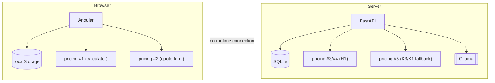
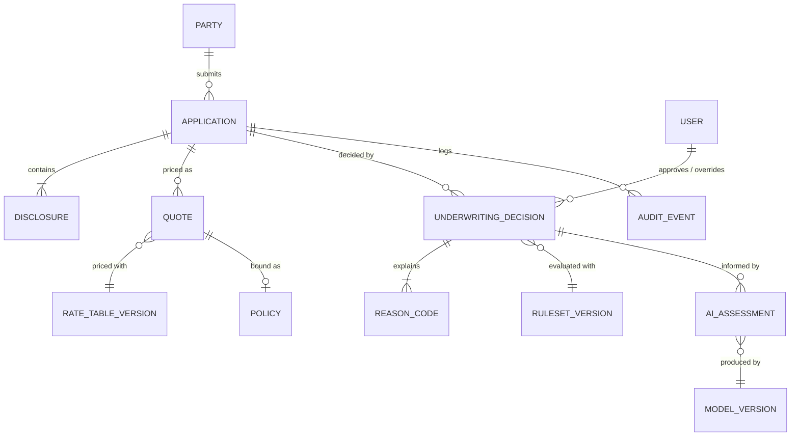
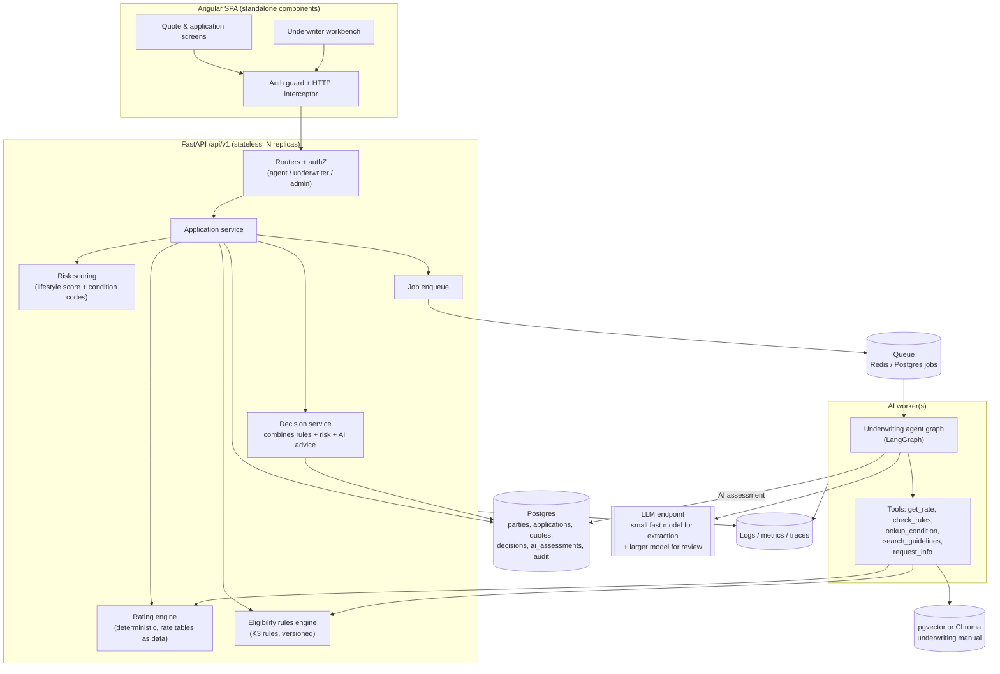
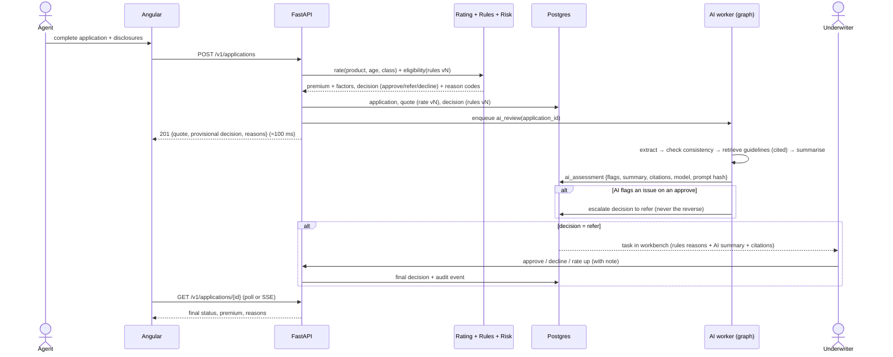
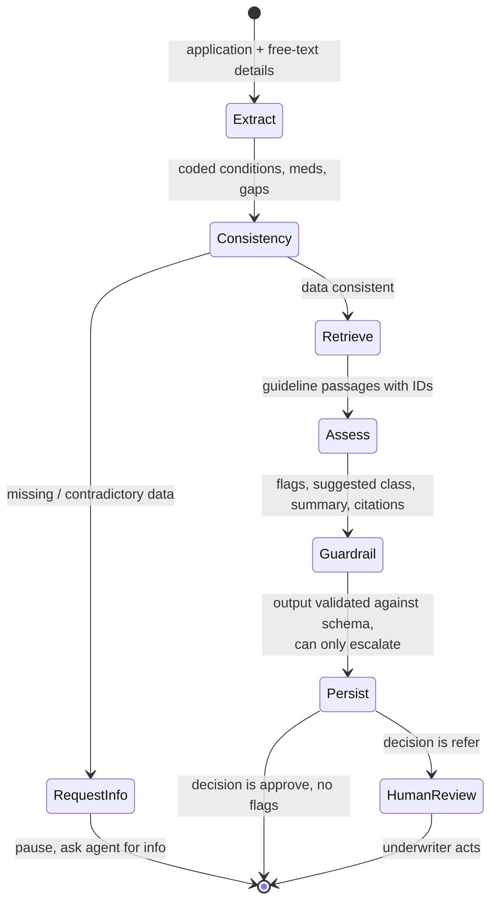
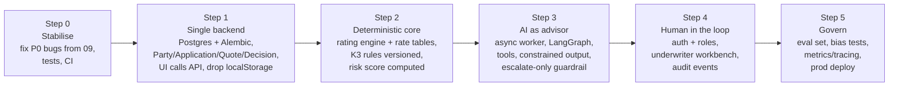

# 11. Architecture Audit

**Question:** is this the right architecture for an AI-assisted life-insurance
quoting and underwriting system?

**Short answer: no.** The parts (Angular, FastAPI, SQLAlchemy, Ollama,
Chroma, an agent layer) are reasonable choices. The way they are put together
has three structural faults that no amount of bug fixing will cure:

1. **The system has two disconnected brains.** The UI is a self-contained
   browser app with its own data store and three pricing formulas. The API is
   a separate system with its own data and two more formulas. Neither one is
   the source of truth.
2. **The LLM sits on the decision path for price and eligibility.** In
   insurance that is the wrong place for a generative model. Price and
   accept/decline must be deterministic, versioned, explainable and
   reproducible. The LLM's natural roles are extraction, triage, explanation
   and underwriter assistance.
3. **The "agentic" layer is ornamental.** It runs three fixed prompts in
   parallel with no tools, no shared state, no feedback loop, no human
   checkpoint and no aggregation. It is a fan-out, not an agent system. The
   RAG step uses one fixed query over 8 short documents, so it is retrieval in
   name only.

This chapter scores the current design, explains each verdict, and proposes a
target architecture with a migration path that reuses most of the existing
code.

Inputs: the full source read in chapters 01 to 10, plus the defects
reproduced in [09](09-gap-analysis.md).

---

## 11.1 What the system needs to do (fitness criteria)

The audit measures the design against the requirements of the domain, not
against its own documentation.

| # | Requirement | Why it matters in insurance |
|---|-------------|-----------------------------|
| R1 | **Single source of truth** for customers, applications, quotes and decisions | Agents, underwriters and auditors must see the same record |
| R2 | **Deterministic, versioned pricing**: same inputs + same rate-table version ⇒ same premium | Rates are filed with regulators; a quote must be reproducible years later |
| R3 | **Explainable decisions** with reason codes | Adverse-action notices; NAIC Model Bulletin on AI (2023) and state rules (e.g. Colorado SB21-169) require that AI-influenced decisions be explainable and tested for unfair discrimination |
| R4 | **Human in the loop** for refer/decline | Underwriting authority is a regulated, licensed function |
| R5 | **Audit trail**: inputs, rule versions, model name/version, prompts, outputs, who acted | Market-conduct exams, disputes, model risk management |
| R6 | **Protection of health data** (encryption, access control, retention, minimal logging) | Medical information is sensitive personal data under HIPAA-adjacent, GLBA and state privacy law |
| R7 | **Graceful degradation**: the system still quotes when the LLM is down | LLMs are slow, costly and fallible; quoting cannot depend on them |
| R8 | **Operability**: config, health, metrics, tests, CI, reproducible deploys | Basic production hygiene |
| R9 | **Clear demonstration of agentic AI** (if this is a portfolio or prototype) | The architecture should show *real* agent behaviour: tools, planning, state and HITL |

## 11.2 Scorecard

Scores: 1 = absent or wrong, 2 = present but unsound, 3 = adequate for a
prototype, 4 = good, 5 = production-grade.

| Dimension | Score | Verdict |
|-----------|:-----:|---------|
| A. System decomposition and boundaries | **1** | UI and API are two separate systems; the UI never calls the API |
| B. Domain model | **2** | Two incompatible "application" concepts; quote, policy, decision and rate version are not modelled server-side |
| C. Data architecture | **1** | `localStorage` as the system of record; SQLite hard-coded; JSON blobs; no migrations |
| D. Pricing architecture | **1** | Five formulas in three places; none versioned; the API's is broken |
| E. Decision and underwriting architecture | **2** | A sensible rule-engine seed (K3) wrapped in an LLM override with no guardrails |
| F. AI / LLM integration | **2** | Wrong role for the LLM, wrong model for latency, fragile parsing, no evals |
| G. Agent orchestration (K1) | **1** | Static parallel fan-out, no tools/state/HITL, never executes |
| H. Retrieval (RAG) | **1** | Fixed query, 8 docs, results unused for citation; H2 "vector store" is a dict |
| I. API design | **2** | Untyped bodies, duplicate endpoints, no versioning, sync LLM calls in request path |
| J. Frontend architecture | **2** | Clean lazy modules, but no API layer, no env config, no auth, no state model |
| K. Security and compliance | **1** | No authN/authZ, PHI in `localStorage` and logs, error leakage |
| L. Reliability and performance | **2** | Fallbacks exist, but 32B reasoning model synchronous in the request path; retries triple latency |
| M. Observability | **1** | Logging misconfigured; no metrics, tracing or decision audit |
| N. Testing and quality gates | **1** | Broken tests, none on the AI logic, no CI |
| O. Deployment and configuration | **2** | Compose exists but contradicts code (Postgres unused, Node 16 vs Angular 17, 6 GB vs 20 GB model) |
| **Overall** | **1.5 / 5** | A useful collection of parts, but not yet an architecture |

---

## 11.3 Findings by dimension

### A. System decomposition and boundaries (1/5)

**Current**

- **Fault:** business logic (pricing, risk factors, underwriting concerns)
  lives in Angular components (`QuoteComponent.calculatePremium`,
  `QuoteOverviewDialogComponent.analyze*`, `InsuranceService.calculatePremium`).
  The browser cannot be trusted with pricing: a user can edit `localStorage`
  or the JS and change their own premium.
- **Fault:** the API has no concept of the UI's main entity (an account with an
  address) and the UI never captures age, which every API path requires. They
  were designed independently.
- **Right shape:** a thin client and one backend that owns all data and all
  business rules. The UI should render server decisions, not make them.

### B. Domain model (2/5)

The domain is missing the entities that make insurance work:

| Concept | Today | Needed |
|---------|-------|--------|
| Party / customer | Browser "account" only | Server entity with identity, contact, DOB |
| Application | Two incompatible versions | One, with status workflow |
| Disclosures (health, lifestyle) | JSON blob (API) / 40 free-form fields (UI) | Typed, coded (e.g. condition codes), queryable |
| Quote | Browser only, no rate version | Server entity tied to rate table + product + term |
| Underwriting decision | A string column + `is_approved` | Entity with decision, reason codes, ruleset version, decided-by, timestamps |
| AI assessment | Not stored | Stored separately as *advice*, with model, prompt hash, output, latency |
| Product / term / riders | Absent | At minimum: product, term length, face amount bands |
| Audit event | Absent | Append-only log |

`RiskScore`, `MedicalCondition` and `User` tables exist but nothing writes
them, which shows the right instincts with no wiring.

### C. Data architecture (1/5)

| Issue | Impact |
|-------|--------|
| `localStorage` as system of record | Data loss on cache clear; no sharing between agents; editable by the user; PHI on shared machines |
| SQLite path hard-coded and CWD-relative | Cannot scale beyond one process; the Compose Postgres is unused |
| Health data in JSON columns | No validation at DB level, no indexing, hard to report or audit |
| No migrations | Every schema change is a manual DB reset |
| Committed `.db` files and `vector_db/` | State in source control; possible PII exposure |

**Right shape:** Postgres as the single store (Compose already provisions
it), Alembic migrations, typed disclosure tables or a validated JSONB schema,
and column-level encryption for medical fields.

### D. Pricing architecture (1/5)

This is the most consequential finding. A premium is a regulated, contractual
number. Today the system has five formulas
([04 §4.5](04-ai-components.md#45-pricing-models-side-by-side)), and the
intended design asks an LLM to "provide the premium amount". An LLM-produced
premium cannot be:

- reproduced (sampling, model updates, prompt drift);
- filed with a regulator as a rate;
- explained factor by factor;
- tested for unfair discrimination in a stable way.

**Right shape:** a deterministic **rating engine**: base rate per
(product, term, age band, sex/gender where permitted, risk class) per $1 000,
multiplied by filed loadings (tobacco, flat extras, table ratings), plus a
policy fee. Rate tables are **data** (versioned CSV/DB rows), not code. The
engine returns every factor it applied, so the UI breakdown chart becomes
exact instead of the estimate in the Quote Overview dialog.

### E. Decision and underwriting architecture (2/5)

K3's rule engine is the best-designed part of the codebase: explicit rules,
named, ordered, with reasons and a clear precedence (decline > refer >
approve). Problems:

- Rules are Python lambdas, so business users cannot read, version or test
  them independently.
- `risk_score` is an input supplied by the caller rather than computed.
- The LLM is then asked for a "final underwriting decision" that **overrides**
  the rules. Nothing prevents it from approving an 85-year-old the rules
  declined.
- No human step: "refer" is just a string; nobody can act on it.

**Right shape:** rules decide eligibility and risk class (**authoritative**);
AI produces **advice** that can only *escalate* (approve → refer), never
*relax* (refer/decline → approve); a human underwriter resolves every refer
with an audit record.

### F. AI / LLM integration (2/5)

| Issue | Detail |
|-------|--------|
| Wrong job | The LLM is asked to price and decide (see D, E) instead of extracting, summarising, explaining and spotting inconsistencies, which LLMs are good at |
| Wrong model for the path | `deepseek-r1:32b` is a reasoning model: tens of seconds per call on a workstation GPU, ~20 GB RAM. It runs **synchronously inside HTTP requests**, × 3 on retry |
| Truncation risk | `num_predict=2048` with a reasoning model: the `<think>` block can consume the whole budget before any JSON |
| Fragile output contract | Free-text JSON + `JsonOutputParser`; no `format="json"` / schema-constrained decoding; `<think>` not stripped; result read from the wrong key |
| No evaluation | No golden set, no regression tests of prompts, no bias or consistency checks |
| No provenance | Model name/version, prompt and output are not stored with the decision |
| Duplicated stubs | H1 and H2 define fake `LLMService` / `VectorStore` classes that shadow the real ones, which makes it easy to believe the AI is wired when it is not |
| Import-time singletons | Model and embedding loading at import slows startup and tests and blocks graceful degradation |

### G. Agent orchestration, K1 (1/5)

Measured against what makes something *agentic*:

| Property of an agent system | K1 |
|-----------------------------|----|
| Agents choose actions / call tools | ✗ Fixed single prompt per role |
| Shared, evolving state | ✗ Same static context dict to all |
| Ordering / dependencies (analyst → underwriter) | ✗ `asyncio.gather`, all parallel |
| Aggregation / arbitration | ✗ None; results never combined |
| Iteration (ask for missing info, re-check) | ✗ None |
| Human-in-the-loop interrupt | ✗ None |
| Observability of steps | ✗ Logs only |
| Actually runs | ✗ Routing bug, returns `{}` |

Also, the name implies CrewAI, but it is a hand-rolled class.
`GenAI/requirements.txt` installs `crewai` without using it.

**Right shape:** a small **state graph** (LangGraph, or plain code with
explicit states) in which each node has a typed input/output, can call
**tools** (rating engine, rule engine, condition lookup, guideline search,
"request more info"), and the graph **pauses** for an underwriter on refer.
That is a real agentic pattern, and it is the one regulators will accept.

### H. Retrieval / RAG (1/5)

- H2 claims vector search but uses substring matching over a 10-item dict.
- K1's only retrieval uses a **constant** query ("insurance underwriting
  guidelines for determining premium and eligibility"), so every applicant
  gets the same 3 documents regardless of their conditions.
- 8 short documents fit in a single prompt; a vector DB adds a 90 MB embedding
  model and startup cost for no benefit at this size.
- Retrieved text is not cited back in the output, so it cannot support
  explainability.

**Right shape:** query by applicant facts (each condition, occupation, age
band, face amount band); return passages **with IDs** and require the model to
cite them; or, at this corpus size, skip the vector DB and use a keyed lookup
until the underwriting manual is large enough to need one.

### I. API design (2/5)

- Good: Pydantic request models with real validation on the typed endpoints;
  routers split by area; OpenAPI docs.
- Faults: three endpoints take untyped `dict`; two endpoints do the same K1
  work with different persistence; no `/v1` versioning; no resource for
  quotes, decisions or status transitions; long LLM work inside the request
  (should be an async job: `POST` → `202 Accepted` + job ID → poll or
  webhook/SSE); `async def` handlers that make blocking DB calls (`/health`);
  sync handlers that spin event loops (`run_until_complete`).

### J. Frontend architecture (2/5)

- Good: lazy-loaded feature modules, reactive forms with validators, Material
  UI, `takeUntil` teardown.
- Faults: no HTTP integration for its data; no `environment.ts` (hard-coded
  API URL); no auth guard or HTTP interceptor; business logic in components;
  `any` everywhere despite a model file; NgModule style where Angular 17
  defaults to standalone components; `CUSTOM_ELEMENTS_SCHEMA` everywhere;
  dead modules; the Dockerfile uses **Node 16**, which Angular 17 does not
  support (requires ≥ 18.13), so the frontend image cannot build.

### K. Security and compliance (1/5)

| Control | Status |
|---------|--------|
| Authentication | None (UI or API) |
| Authorization / roles (agent vs underwriter) | None |
| Encryption of health data at rest | None (`localStorage`, SQLite JSON) |
| Data minimisation in logs | Prompts with medical history logged at INFO |
| Error hygiene | `str(exc)` returned to clients |
| Rate limiting | Disabled |
| Secrets | Default passwords in Compose |
| Fairness / bias testing of AI outcomes | None |
| Consent / disclosures to applicant about AI use | None |

### L. Reliability and performance (2/5)

- Good: every AI path has a deterministic fallback, and tenacity retries.
- Faults: fallbacks hide failures (HTTP 200 with a fallback premium and only an
  `error` field); `/api/system-status` lies; worst-case latency of
  `/api/evaluate-application` = 3 × (32B reasoning generation) + backoff, so
  likely a minute or more; one SQLite file serialises writes; the LLM is
  `keep_alive=-1`, which pins ~20 GB of memory permanently.

### M. Observability (1/5)

Logging config is broken (first `basicConfig` wins, the file handler is never
attached); there are no request IDs, metrics (latency, fallback rate, LLM
token counts, decision distribution), tracing or decision audit log.

### N. Testing and quality gates (1/5)

See [09 §6](09-gap-analysis.md#6-testing-gaps): the tests that would catch the
critical defects do not exist, two existing tests cannot run, and there is no
CI. The pure parts (rules, pricing, H2) are trivially unit-testable, which is
another argument for moving logic out of LLM prompts and UI components.

### O. Deployment and configuration (2/5)

Compose is a good start but contradicts the code: Postgres unused,
`CORS_ALLOW_ORIGINS` ignored, `.env` loaded too late for Ollama settings,
Node 16 frontend image, Ollama capped at 6 GB for a ~20 GB model with no
model-pull step, and `--reload` / `ng serve` dev servers used as the "deploy".

---

## 11.4 What is worth keeping

The audit is not "start over". These pieces are sound and should survive:

| Keep | Why |
|------|-----|
| FastAPI + Pydantic schemas (`InsuranceApplicationCreate`, validators) | Good contract-first API foundation |
| SQLAlchemy models, with additions | The `RiskScore`, `User`, `MedicalCondition` tables are the right ideas |
| K3 `UnderwritingRuleEngine` | Clear, testable, explainable; becomes the authoritative eligibility layer |
| `RiskFactorsBase.calculate_risk_contribution()` | A ready-made, deterministic lifestyle score for the missing `risk_score` |
| H2's condition table | Seed data for a proper condition-code table |
| K1 agent roles and fallback logic | Good node definitions for a real graph |
| `seed_vector_db.py` guidelines | Starting corpus for cited retrieval |
| Angular feature modules and the 12-section questionnaire | Good UX and a good disclosure model; needs to post to the server |
| Quote Overview dialog | Becomes a view of server-provided factors and reason codes |
| Docker Compose service set | Right components; fix the wiring |

---

## 11.5 Recommended target architecture

### Principles

1. **One backend owns all data and every rule.** The UI is a client.
2. **Deterministic core, AI at the edges.** Rating and eligibility are code
   plus versioned data; AI extracts, summarises, flags and explains.
3. **AI can escalate, never relax.** An AI signal can turn approve into
   refer, never refer/decline into approve.
4. **Humans own refer and decline.** Every refer becomes an underwriter task.
5. **Everything is versioned and logged**: rate table, ruleset, model,
   prompt, inputs and outputs.
6. **Slow work is asynchronous.** Quotes return in milliseconds; AI review
   completes in the background.

### Component view

### Quote-to-decision flow

### Agent graph (replacing K1)

Each node is a function with a typed input and output (Pydantic). LLM nodes
use schema-constrained output (Ollama `format=<json schema>`) and a small, fast
model; the large reasoning model, if kept, is used only for the
underwriter-facing summary.

### Technology decisions

| Decision | Choice | Alternatives considered | Reason |
|----------|--------|-------------------------|--------|
| Source of truth | Postgres + Alembic | SQLite | Already in Compose; concurrency, JSONB, pgvector |
| Pricing | Deterministic engine + rate tables as data | LLM pricing | Regulatory reproducibility (R2, R3) |
| Eligibility | K3 rules, moved to declarative YAML/DB with versions | LLM decision | Explainable and testable |
| Agent orchestration | LangGraph (or explicit state machine) | Hand-rolled `Crew`, CrewAI | Typed state, tools, interrupts for HITL, checkpointing |
| LLM role | Extraction, consistency checks, cited summaries | Final decision and premium | Strengths of LLMs; safe failure mode |
| Model | Small instruct model for extraction (e.g. 7–8B) + optional larger model for summaries; constrained JSON output | `deepseek-r1:32b` everywhere | Latency, memory, parse reliability |
| Retrieval | Applicant-specific queries, cited passages; pgvector when the manual grows | Constant query, separate Chroma | Relevance, explainability, one less datastore |
| Async AI | Background worker + job table / Redis queue | AI inside HTTP request | p95 latency, resilience (R7) |
| Frontend data | HTTP services + interceptor; no business logic in components | `localStorage` | R1, R6 |
| Auth | OIDC / JWT with roles (agent, underwriter, admin) | None | R4, R6 |
| Observability | Structured JSON logs + request IDs, Prometheus metrics, OpenTelemetry traces, `audit_events` table | Logs only | R5, R8 |

---

## 11.6 Migration path (incremental, each step shippable)

| Step | Main changes | Reuses | Exit criteria |
|------|--------------|--------|---------------|
| 0 Stabilise | Fixes H1-1..3, K1-1..4, K3-1/2, B-2..4, T-1/2; add rule-engine and pricing unit tests; GitHub Actions running pytest + `ng build` | Everything | CI green; every AI endpoint returns real output with Ollama up |
| 1 Single backend | Postgres via `DATABASE_URL`; Alembic; new tables per 11.3-B; `/v1/applications`, `/v1/quotes`; Angular services switch to HTTP; capture DOB | Schemas, models, Angular forms | No business data in `localStorage` |
| 2 Deterministic core | `rating/` module with versioned tables; rules to YAML with version; `risk_score` from `calculate_risk_contribution` + condition table; delete the 4 other formulas | K3 rules, H2 table, `RiskFactorsBase` | One premium for the same inputs, everywhere; breakdown exact |
| 3 AI as advisor | Worker process; LangGraph graph per 11.5; tools wrap rating, rules and retrieval; `ai_assessments` table; escalate-only guard | K1 roles and fallbacks, LLMService, guidelines | AI never changes price; can only escalate; outputs cited and stored |
| 4 Human in the loop | OIDC/JWT; roles; underwriter workbench (queue, detail, actions); `audit_events` | Quote Overview dialog | Every refer resolved by a named user with a note |
| 5 Govern | Golden-set evals in CI; fairness checks across protected-class proxies; metrics dashboards; prod images (nginx for SPA, gunicorn/uvicorn workers) | n/a | Documented model risk controls; SLOs met |

## 11.7 If the goal is a portfolio or demo of agentic AI

The same target is also the strongest demo. A reviewer who knows the domain
will discount an LLM that "decides the premium". They will be impressed by:

- a **tool-using agent graph** with visible state transitions;
- a **human-in-the-loop interrupt** that an underwriter resumes from the UI;
- **cited retrieval** ("flagged because Guideline §7: ECG required over $500k");
- **guardrails** (schema-validated output, escalate-only policy) with tests;
- an **evaluation harness** showing accuracy, consistency and latency per model;
- a deterministic core that keeps working when the LLM is off.

Steps 0, 2 and 3 alone deliver that, and they mostly reuse existing code.
