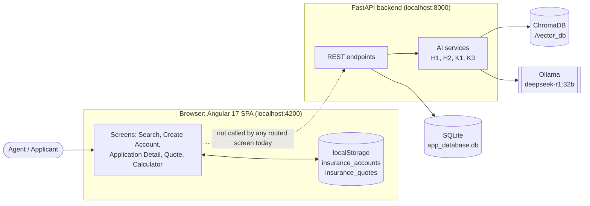

# Insurance Calculator: System Documentation

This folder documents the Insurance Premium Calculator **as it is built**, based
on a line-by-line reading of the source in `GenAI/backend` and
`GenAI/frontend/insurance-calculator`.

The older documents in `GenAI/` (`TECHNICAL_DESIGN_DOCUMENT.md`,
`ARCHITECTURE_IMPLEMENTATION_GUIDE.md`, `ARCHITECTURE_DIAGRAMS.md`,
`DATABASE_ARCHITECTURE.md` and others) were written early, with Cursor, and
mostly describe the *intended* design: JWT auth, Kubernetes, PostgreSQL, a risk
service, real-time updates. Much of that was never built. Where the two
disagree, these docs describe what the code does today, and
[09-gap-analysis.md](09-gap-analysis.md) lists every difference.

## Reading order

| # | Document | What it covers |
|---|----------|----------------|
| 01 | [System overview](01-system-overview.md) | Purpose, tech stack, context and container diagrams, repository layout, deployment views |
| 02 | [Frontend (Angular)](02-frontend.md) | Routes, modules, components, services, browser storage, each screen step by step |
| 03 | [Backend API reference](03-backend-api.md) | Every endpoint with request/response shapes, validation rules and error handling |
| 04 | [AI components](04-ai-components.md) | H1 premium calculator, H2 medical risk, K1 CrewAI orchestration, K3 underwriting rules: formulas, prompts, fallbacks |
| 05 | [Data model](05-data-model.md) | SQL schema (ER diagram), Pydantic schemas, ChromaDB collection, browser `localStorage` records |
| 06 | [Use cases and user scenarios](06-use-cases-and-scenarios.md) | Actors, use-case diagram, use-case specifications, worked scenarios with real numbers |
| 07 | [System flows](07-system-flows.md) | End-to-end flow, sequence diagrams per feature, state machines, error/fallback flows |
| 08 | [Function call graphs](08-function-call-graphs.md) | Who-calls-whom for every backend module and frontend component |
| 09 | [Gap analysis](09-gap-analysis.md) | Bugs, dead code, documentation drift, missing features, prioritized fix list |
| 10 | [Setup, configuration and testing](10-setup-and-operations.md) | Running locally, Docker Compose, environment variables, test suite, seeding the vector DB |
| 11 | [Architecture audit](11-architecture-audit.md) | Is this the right architecture? Scorecard, findings per dimension, what to keep, target architecture, migration path |

## GenAI rebuild

The current app is being replaced by a real GenAI insurance application. Planning documents live in [`rebuild/`](rebuild/):

| # | Document | What it covers |
|---|----------|----------------|
| R01 | [GenAI use-case catalog](rebuild/01-genai-use-case-catalog.md) | GenAI fit test, 60 use cases across the insurance value chain, scoring, shortlist, candidate product scopes, recorded decisions |
| R02 | [Claims Copilot scope](rebuild/02-claims-copilot-scope.md) | Product statement, line of business, lifecycle capability map, personas, journeys, functional and non-functional requirements, release plan, data strategy |

## The system in one picture

> **Most important finding.** The Angular screens a user can reach do **not**
> call the backend. Accounts and quotes live only in the browser's
> `localStorage`, and both premium figures the user sees are computed in
> TypeScript. The FastAPI backend, with its LLM, vector store and
> multi-agent code, works only through Swagger (`/docs`) or direct HTTP calls.
> See [09-gap-analysis.md](09-gap-analysis.md#1-the-frontend-and-backend-are-not-connected).

## Feature inventory

| Feature | Where it runs | Status | Doc |
|---------|---------------|--------|-----|
| Search accounts | Browser (`localStorage`) | Works; crashes on null fields after Reset | [02](02-frontend.md#21-search-applications-search) |
| Create account | Browser (`localStorage`) | Works | [02](02-frontend.md#22-create-account-create-account) |
| View / edit application (contact details) | Browser (`localStorage`) | Works | [02](02-frontend.md#23-application-detail-applicationid) |
| Create detailed quote (40-field questionnaire) | Browser (`localStorage`) | Works; fixed $100k coverage | [02](02-frontend.md#24-create-quote-quoteapplicationidn) |
| Quote overview dialog (risk factors, underwriting concerns) | Browser | Works | [02](02-frontend.md#25-quote-overview-dialog) |
| Quick premium calculator | Browser (TypeScript formula) | Works; "Apply" loses the premium | [02](02-frontend.md#26-quick-premium-calculator-calculator) |
| Create application + premium (H1) | Backend | Runs, but H1 always falls back to 5% of coverage (bug) | [04](04-ai-components.md#41-h1-premium-calculator) |
| Calculate premium + medical risk (H1 + H2) | Backend | Runs; H2 result is computed then discarded | [04](04-ai-components.md#42-h2-medical-risk-analysis) |
| Evaluate application (K3 rules + LLM) | Backend | Works when Ollama is up; falls back to rules otherwise | [04](04-ai-components.md#44-k3-ai-underwriting) |
| Complex application (K1 CrewAI) | Backend | Runs, but no agent is ever invoked (bug); returns `{}` | [04](04-ai-components.md#43-k1-crewai-orchestration) |
| Rate limiting | Backend | Disabled (commented out); also incompatible with Starlette | [09](09-gap-analysis.md) |
| Authentication | Neither | Schemas only; no endpoints or guards | [09](09-gap-analysis.md) |
