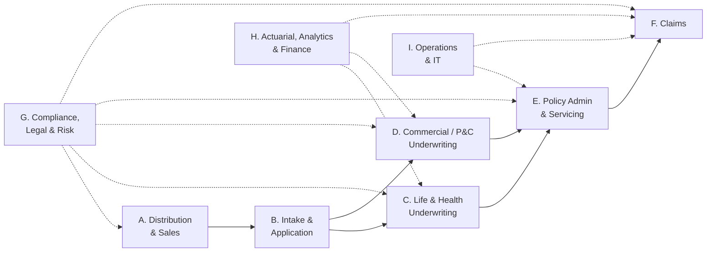
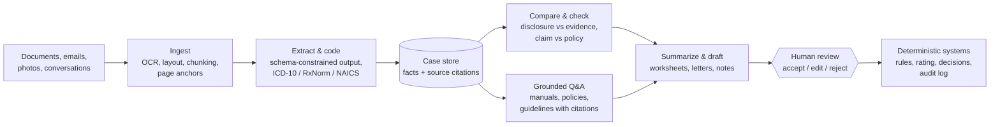

# GenAI Rebuild 01: Insurance Use-Case Catalog

**Purpose:** the starting point for tearing down the current Insurance
Calculator and building a real GenAI insurance application. This document
lists the GenAI use cases across the insurance value chain, applies a
consistent fit test, scores them, and proposes candidate product scopes.

**Context:** the [architecture audit](../11-architecture-audit.md) found that
the current app uses an LLM for jobs that need deterministic rules (pricing,
approve/decline), on inputs that are already structured. A real GenAI app has
to put the model where the work is **unstructured language, documents and
images**.

## 1. The fit test

A use case qualifies as GenAI when **all four** hold:

| # | Test | Question |
|---|------|----------|
| F1 | Unstructured input | Does a person today have to *read* text, documents, images, audio or a conversation to do the work? |
| F2 | Language or vision task | Is the core task extracting, summarizing, classifying, comparing, answering with citations, drafting, or conversing? |
| F3 | Verifiable output | Can the output be checked against a source (a cited page, a field, a rule) or reviewed by a person before it matters? |
| F4 | Safe failure | If the model is wrong, does a guardrail or human catch it before it harms a customer? |

### Anti-patterns: where GenAI must *not* be the decider

| Don't use GenAI to... | Use instead | GenAI's legitimate role nearby |
|-----------------------|-------------|--------------------------------|
| Set a premium or rate | Rating engine + filed rate tables | Explain the factors in plain language |
| Approve, decline or rate-up an applicant | Rules + licensed underwriter | Summarize evidence, flag issues, draft the rationale |
| Deny a claim or set reserves | Coverage rules + adjuster | Map claim facts to policy wording with citations |
| Accuse of fraud | SIU investigation + scoring models | Surface inconsistencies as *indicators* for review |
| Compute anything numeric that a formula can do | Code | Extract the numbers from documents |
| Give binding coverage advice to consumers | Licensed agent | Answer from the actual policy text, with citations and disclaimers |

Every use case below keeps a deterministic system or a human as the
decision-maker.

## 2. Value-chain map

GenAI technique legend used in the tables:

| Code | Technique |
|------|-----------|
| EXT | Extraction of fields from documents (incl. OCR, tables) |
| SUM | Summarization with citations |
| CLS | Classification / routing / coding (e.g. ICD-10, NAICS) |
| RAG | Question answering over a corpus, with citations |
| CMP | Comparison of two texts (disclosure vs evidence, policy vs claim) |
| GEN | Drafting (letters, notes, narratives) |
| CONV | Conversational intake or assistant (chat / voice) |
| VIS | Vision (photos, scanned forms, diagrams) |
| AGT | Multi-step agent with tools and human checkpoints |

Risk tier: **L** = internal productivity, human always reviews; **M** = feeds
a decision through a human; **H** = customer-facing or regulated output, needs
strict guardrails and compliance sign-off.

---

## 3. Catalog

### A. Distribution and sales

| ID | Use case | Primary user | Unstructured input | Technique | Output | Human in loop | Risk |
|----|----------|--------------|--------------------|-----------|--------|---------------|:----:|
| A1 | **Agent product copilot**: "Which term product fits a 45-year-old with a mortgage and two kids?" answered from product guides | Agent / broker | Product guides, rate manuals, FAQs | RAG | Cited answer | Agent decides | M |
| A2 | Needs-analysis conversation → coverage gap summary | Agent + customer | Conversation | CONV, SUM | Needs summary, suggested coverage ranges | Agent; suitability rules | H |
| A3 | Proposal / illustration narrative ("what this policy does for you") from illustration system numbers | Agent | Illustration output + product docs | GEN | Plain-language proposal | Agent + compliance-approved templates | H |
| A4 | Call and meeting summarization → CRM auto-fill | Agent | Call transcript | SUM, EXT | CRM notes, next steps, tasks | Agent edits | L |
| A5 | Pre-meeting client brief from CRM history and emails | Agent | CRM notes, emails | SUM | One-page brief | Agent | L |
| A6 | Marketing content drafting with compliance pre-check | Marketing | Briefs, approved claims library | GEN, CLS | Draft copy + flagged risky claims | Compliance approves | H |
| A7 | Agent training role-play coach (objection handling, product knowledge) | New agents | Product docs, scenarios | CONV | Practice sessions, feedback | Trainer | L |

### B. Intake and application

| ID | Use case | Primary user | Unstructured input | Technique | Output | Human in loop | Risk |
|----|----------|--------------|--------------------|-----------|--------|---------------|:----:|
| B1 | **Conversational application** (chat or voice) that fills the structured application | Applicant / agent | Conversation | CONV, EXT | Structured application JSON | Applicant confirms every answer | H |
| B2 | **Free-text disclosure coding**: "high BP since 2019, on lisinopril" → condition + ICD-10, onset, treatment, control status | Underwriting ops | Disclosure text | EXT, CLS | Coded conditions and medications (ICD-10, RxNorm) | Underwriter verifies | M |
| B3 | Identity and income document extraction (driver's licence, pay stubs, tax returns) | Ops | Images / PDFs | VIS, EXT | Verified fields | Ops reviews low-confidence fields | M |
| B4 | **Completeness checker** that generates targeted follow-up questions ("You mentioned surgery in 2021; what was it for?") | Agent / applicant | Draft application | CMP, GEN | Missing-info list + questions | Agent sends | M |
| B5 | Multilingual intake and translation of disclosures | Applicant | Non-English text / speech | CONV, GEN | Translated, structured answers | Applicant confirms | H |

### C. Life and health underwriting

| ID | Use case | Primary user | Unstructured input | Technique | Output | Human in loop | Risk |
|----|----------|--------------|--------------------|-----------|--------|---------------|:----:|
| C1 | **Medical record / APS summarization**: 50–500 pages → timeline of diagnoses, meds, labs, procedures with page citations | Underwriter | Attending physician statements, EHR exports, scanned records | EXT, SUM, VIS | Medical timeline + cited summary | Underwriter reads summary, clicks through to source | M |
| C2 | Lab, Rx history, MIB and MVR report narrative (interpreting already-structured third-party data in context) | Underwriter | Report PDFs / feeds | SUM | Narrative of notable findings | Underwriter | M |
| C3 | **Disclosure vs evidence inconsistency detection** ("no medications" vs metformin in Rx history) | Underwriter | Application + evidence | CMP | Flagged contradictions with sources | Underwriter decides relevance | M |
| C4 | **Underwriting manual copilot**: "Type 2 diabetes, A1C 7.8, age 52, $750k: what does the manual say?" | Underwriter | Underwriting manual, reinsurer guides | RAG | Cited guidance and likely class range | Underwriter | M |
| C5 | Evidence / requirement suggestion (which additional tests to order and why) | Underwriter | Application + guidelines | RAG, GEN | Suggested requirements with rule citations | Underwriter orders | M |
| C6 | **Case worksheet drafting**: pre-filled underwriter summary of all evidence | Underwriter | All case documents | SUM, GEN | Draft worksheet | Underwriter edits and signs | M |
| C7 | Decision rationale and adverse-action letter drafting (decision already made by rules + human) | Underwriter | Decision, reason codes, evidence | GEN | Draft letters in approved templates | Underwriter + compliance templates | H |
| C8 | Facultative reinsurance submission package | Underwriter | Case file | SUM, GEN | Reinsurer-ready summary | Underwriter | M |
| C9 | Underwriting agent workflow orchestrating C1–C6 with a human checkpoint | Underwriting team | Case file | AGT | Case ready for decision | Underwriter decides | M |

### D. Commercial and P&C underwriting

| ID | Use case | Primary user | Unstructured input | Technique | Output | Human in loop | Risk |
|----|----------|--------------|--------------------|-----------|--------|---------------|:----:|
| D1 | **Broker submission ingestion**: emails + ACORD forms + attachments → structured submission | Underwriting assistant | Emails, ACORD PDFs, spreadsheets | EXT, CLS, VIS | Structured submission record | Assistant reviews | M |
| D2 | Loss run extraction and normalization across carrier formats | Underwriter | Loss run PDFs | EXT | Normalized loss history table | Underwriter | M |
| D3 | Statement of values (SOV) cleanup: occupancy, construction, protection descriptions | Underwriter | SOV spreadsheets | EXT, CLS | Clean, coded SOV | Underwriter | M |
| D4 | **Appetite and clearance triage** against underwriting guidelines | Underwriting assistant | Submission + guidelines | RAG, CLS | In / out of appetite with cited reasons, priority | Underwriter | M |
| D5 | Business description and NAICS/SIC classification from web and submission text | Underwriter | Website text, submission | CLS, SUM | Business profile + class code | Underwriter | M |
| D6 | Inspection report and property photo description | Underwriter / risk engineer | Inspection PDFs, photos | VIS, SUM | Hazards and recommendations list | Risk engineer | M |
| D7 | Policy form and endorsement comparison (renewal vs expiring, broker manuscript wording) | Underwriter | Two policy documents | CMP | Redline of coverage differences | Underwriter | M |
| D8 | Quote / binder letter and subjectivities drafting | Underwriter | Quote terms | GEN | Draft letter | Underwriter | H |

### E. Policy administration and servicing

| ID | Use case | Primary user | Unstructured input | Technique | Output | Human in loop | Risk |
|----|----------|--------------|--------------------|-----------|--------|---------------|:----:|
| E1 | **Policyholder assistant** grounded in *their own* policy documents ("Am I covered for a rental car?") | Policyholder | Policy wording, declarations | RAG, CONV | Cited answer + escalation to a person | Escalation path; disclaimers | H |
| E2 | Service-agent copilot (same as E1, internal) | Contact-centre agent | Policy docs, procedures | RAG | Cited answer, next-best action | Agent | L |
| E3 | **Correspondence intake**: classify, extract and route incoming mail and email (address change, beneficiary change, cancellation) | Ops | Emails, letters, forms | CLS, EXT, VIS | Routed work item with extracted fields | Ops for low confidence | M |
| E4 | Endorsement request processing from free text ("add my daughter as a driver from 1 May") | Ops | Email / chat | EXT | Draft endorsement transaction | Ops approves | M |
| E5 | Plain-language policy explainer / summary of benefits | Policyholder | Policy wording | SUM, GEN | Readable summary with citations | Approved templates | H |
| E6 | Renewal and retention outreach personalization | Retention team | Policy + interaction history | GEN | Draft messages | Team reviews | M |
| E7 | Call-centre call summarization and QA scoring | Contact centre | Call transcripts | SUM, CLS | Notes, QA checklist results | Supervisor | L |

### F. Claims

| ID | Use case | Primary user | Unstructured input | Technique | Output | Human in loop | Risk |
|----|----------|--------------|--------------------|-----------|--------|---------------|:----:|
| F1 | **Conversational FNOL** (chat / voice) → structured first notice of loss | Claimant | Conversation, photos | CONV, EXT, VIS | Structured FNOL record | Claimant confirms; adjuster reviews | H |
| F2 | **Claim document extraction**: police reports, repair estimates, invoices, medical bills, death certificates | Claims ops | PDFs, scans | EXT, VIS | Structured fields | Ops for low confidence | M |
| F3 | Damage photo description (vehicle, property) to support, not replace, appraisal | Adjuster | Photos | VIS | Damage description, parts list draft | Appraiser | M |
| F4 | **Coverage analysis copilot**: claim facts vs policy wording, exclusions and endorsements with citations | Adjuster | Claim file + policy | CMP, RAG | Cited coverage considerations | Adjuster decides | M |
| F5 | **Claim file summarization** for handoffs, supervisors and litigation | Adjuster / supervisor | Notes, documents, emails | SUM | Timeline + summary | Adjuster | L |
| F6 | Adjuster diary and note drafting from calls and emails | Adjuster | Transcripts, emails | SUM, GEN | Draft notes | Adjuster | L |
| F7 | Fraud *indicator* surfacing from narratives (inconsistent statements, template-like text across claims) | SIU | Statements, notes | CMP, CLS | Indicators with evidence | SIU investigates | H |
| F8 | Subrogation opportunity detection from loss descriptions | Subrogation unit | Loss narratives, police reports | CLS | Flagged recovery opportunities | Subrogation specialist | M |
| F9 | Bodily-injury demand letter and medical-bill summarization | Adjuster | Demand packages | EXT, SUM | Specials, treatment timeline, gaps | Adjuster | M |
| F10 | Claimant status updates and empathetic communication drafting | Adjuster | Claim status | GEN | Draft messages | Adjuster sends | H |
| F11 | Life claim review: death certificate extraction, contestability-period document review | Claims examiner | Certificates, application, records | EXT, CMP | Facts + contestability flags | Examiner | M |
| F12 | Claims agent workflow orchestrating F1, F2, F4, F5 with human checkpoints | Claims team | Claim file | AGT | Claim ready for adjuster action | Adjuster | M |

### G. Compliance, legal and risk

| ID | Use case | Primary user | Unstructured input | Technique | Output | Human in loop | Risk |
|----|----------|--------------|--------------------|-----------|--------|---------------|:----:|
| G1 | Regulatory change monitoring and impact summaries (bulletins, circulars by state) | Compliance | Regulatory publications | SUM, CLS | Impact briefs mapped to products and processes | Compliance | L |
| G2 | Rate and form filing support: draft explanatory memoranda, answer objection letters | Product / compliance | Prior filings, objections | RAG, GEN | Draft responses | Compliance | M |
| G3 | Complaint classification and root-cause themes | Compliance | Complaints | CLS, SUM | Categories, themes, regulator-reportable flags | Compliance | M |
| G4 | Communication compliance review (agent emails, marketing) | Compliance | Messages | CLS | Flagged statements | Compliance | M |
| G5 | Reinsurance treaty and vendor contract review | Legal | Contracts | CMP, SUM | Clause comparison, obligations list | Legal | M |
| G6 | AI governance documentation: model cards, test reports, bias test narratives | Model risk | Eval results, configs | GEN | Draft governance documents | Model risk | L |

### H. Actuarial, analytics and finance

| ID | Use case | Primary user | Unstructured input | Technique | Output | Human in loop | Risk |
|----|----------|--------------|--------------------|-----------|--------|---------------|:----:|
| H1 | Natural-language analytics (text to SQL over claims / policy marts) | Business analyst | Questions | GEN (SQL) | Query + chart | Analyst checks SQL | L |
| H2 | Commentary drafting for experience studies, reserving and board packs | Actuarial / finance | Results tables, prior reports | GEN | Draft commentary | Actuary | L |
| H3 | Synthetic test data and documents (synthetic APS, FNOL, ACORD) | Data / QA | Schemas, examples | GEN | Realistic synthetic data | Data team | L |

### I. Operations and IT

| ID | Use case | Primary user | Unstructured input | Technique | Output | Human in loop | Risk |
|----|----------|--------------|--------------------|-----------|--------|---------------|:----:|
| I1 | Legacy policy-admin code explanation and migration (COBOL, rules tables) | IT | Source code | SUM, GEN | Documentation, migration drafts | Engineers | L |
| I2 | Employee knowledge assistant (procedures, product manuals, HR) | All staff | Intranet docs | RAG | Cited answers | User | L |
| I3 | Product spec → test cases and product configuration drafts | IT / product | Product spec documents | EXT, GEN | Test cases, config drafts | Engineers | L |

**Total: 60 use cases** across 9 domains.

---

## 4. Scoring and shortlist

Scores (1–5): **Value** (time and cost saved, quality and customer impact),
**GenAI fit** (how much the work is genuinely unstructured-language work),
**Buildability** (can we build and demo it *without a real insurer's data*,
using public documents and synthetic data), and **Risk** (lower is easier).

| ID | Use case | Value | GenAI fit | Buildability | Risk | Total (V+F+B) |
|----|----------|:-----:|:---------:|:------------:|:----:|:-------------:|
| C1 | Medical record / APS summarization | 5 | 5 | 4 | M | **14** |
| F4 | Coverage analysis copilot | 5 | 5 | 4 | M | **14** |
| D1 | Broker submission ingestion | 5 | 5 | 4 | M | **14** |
| C3 | Disclosure vs evidence inconsistencies | 5 | 5 | 4 | M | **14** |
| F2 | Claim document extraction | 5 | 4 | 5 | M | **14** |
| B2 | Free-text disclosure coding | 4 | 5 | 5 | M | **14** |
| C4 | Underwriting manual copilot | 4 | 5 | 4 | M | **13** |
| F5 | Claim file summarization | 4 | 5 | 4 | L | **13** |
| F1 | Conversational FNOL | 4 | 5 | 4 | H | **13** |
| E1 | Policyholder assistant on own policy | 4 | 5 | 4 | H | **13** |
| E3 | Correspondence intake and routing | 4 | 4 | 5 | M | **13** |
| C6 | Underwriter case worksheet drafting | 4 | 5 | 4 | M | **13** |
| B1 | Conversational application | 4 | 5 | 4 | H | **13** |
| D4 | Appetite / clearance triage | 4 | 4 | 4 | M | **12** |
| D2 | Loss run extraction | 4 | 4 | 4 | M | **12** |
| C9 / F12 | Agentic case workflow (underwriting / claims) | 5 | 4 | 3 | M | **12** |
| C7 | Decision rationale / adverse-action drafting | 4 | 4 | 4 | H | **12** |
| A1 | Agent product copilot | 3 | 5 | 4 | M | **12** |
| F3 | Damage photo description | 4 | 4 | 3 | M | **11** |
| G1 | Regulatory change monitoring | 3 | 5 | 3 | L | **11** |

All other use cases score 10 or below for a first build. They are still valid
later additions.

### What the top of the list has in common

The highest-scoring use cases share **one technical core**:

Build this **document-intelligence and grounded-reasoning core once**, and
each vertical (life underwriting, claims, commercial submissions) is mostly
schemas, prompts, corpora and screens on top.

---

## 5. Candidate product scopes for the rebuild

| | Option 1: Life Underwriting Workbench | Option 2: Claims Copilot (P&C) | Option 3: Commercial Submission Intake |
|---|---|---|---|
| **One-liner** | An underwriter uploads a case file; the app codes disclosures, summarizes medical records with citations, flags contradictions, answers manual questions and drafts the worksheet | A claimant reports a loss by chat; the app extracts documents and photos, checks the claim against the policy wording with citations and summarizes the file for the adjuster | A broker email with attachments arrives; the app builds a structured submission, normalizes loss runs, triages appetite with cited guidelines and drafts the quote letter |
| **Use cases** | B2, B4, C1, C3, C4, C6, C7, C9 | F1, F2, F3, F4, F5, F10, F12 | D1, D2, D3, D4, D5, D8 |
| **Continuity with current repo** | High: same domain, reuses the questionnaire, K3 rules and guideline corpus | Low | Low |
| **Demo appeal** | High: a 200-page record turned into a cited, one-page timeline | Very high: conversational FNOL + photos | Medium: business-to-business |
| **Data for a build** | Synthetic APS / medical records (generated), public ICD-10 / RxNorm, sample underwriting guidelines | Public sample policy wordings (e.g. ISO-style homeowners and auto forms), synthetic photos and estimates | Public ACORD form samples, synthetic loss runs and SOVs |
| **Regulatory sensitivity** | High (health data, unfair discrimination) | High (claims handling, consumer-facing) | Medium (commercial) |
| **Deterministic core needed** | Rules for class / eligibility, rating engine | Coverage rules, reserving stays manual | Appetite rules, rating stays out of scope |

**Recommendation:** build the **shared core** (section 4) with **Option 1:
Life Underwriting Workbench** as the first vertical. It continues the current
repo's domain, it has the strongest "this is genuinely GenAI" story (reading
hundreds of pages of medical evidence), and its pieces (B2, C1, C3, C4) are
also the building blocks for Options 2 and 3. Claims (Option 2) is the natural
second vertical on the same core.

## 6. Decisions needed before design

1. **First vertical:** Option 1, 2 or 3 (or a different focus).
2. **Primary goal:** portfolio / demo, internal prototype, or a path to
   production with a real carrier.
3. **Model hosting:** local open models (Ollama) only, a hosted API, or
   both behind one interface.
4. **Data:** synthetic and public data only, or access to real
   (de-identified) documents.
5. **Teardown scope:** archive the current `GenAI/` app in place, delete it,
   or reuse selected pieces (rules engine, questionnaire, guideline corpus).

The next document (`02-…`) will turn the chosen scope into personas,
end-to-end user journeys, functional requirements and an MVP cut.
