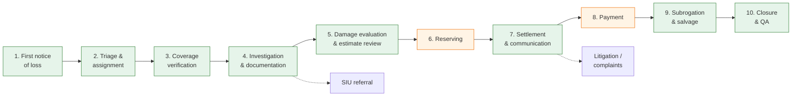
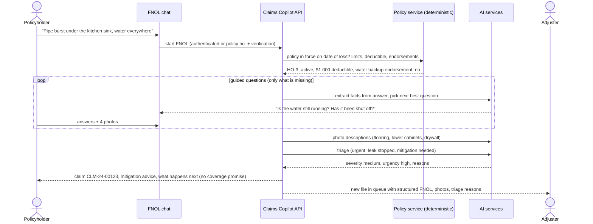
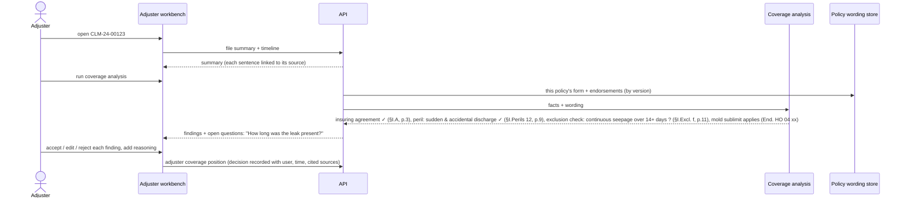
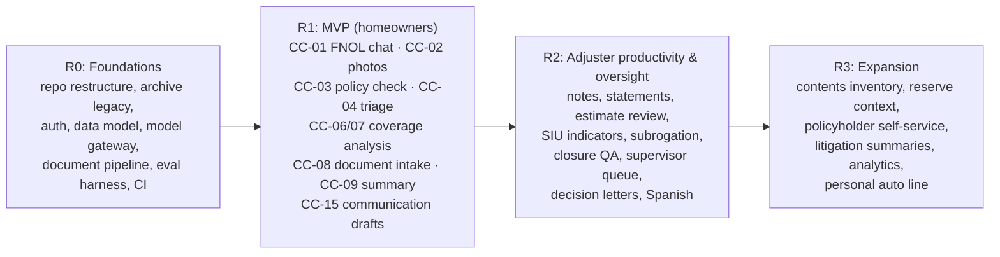

# GenAI Rebuild 02: Claims Copilot Scope, Personas, Journeys and Requirements

Builds on [01: use-case catalog](01-genai-use-case-catalog.md) and its
recorded decisions: **P&C Claims Copilot**, **path to production**, **local
and hosted models behind one interface**, **archive the old app and reuse
pieces**.

## 1. Product statement

> **Claims Copilot** helps a property-and-casualty carrier handle claims
> faster and more consistently. A policyholder reports a loss in a
> conversation. The system turns documents and photos into structured facts,
> checks those facts against the policy wording with citations, and keeps a
> live summary of the file. **Adjusters make every coverage, reserve and
> payment decision**; the copilot does the reading, organizing and drafting.

## 2. Line of business for the first release

| Option | Pros | Cons |
|--------|------|------|
| **Homeowners property (HO-3 style), recommended** | Coverage analysis is genuinely hard (perils, exclusions, endorsements, sublimits), which is where GenAI with citations adds the most; claim documents are varied (photos, contractor estimates, invoices, receipts); sample policy wordings are publicly available | Lower claim volume than auto |
| Personal auto | Highest volume; photo-heavy; police reports | Damage estimation is dominated by established estimating platforms; coverage questions are simpler, so less GenAI differentiation |
| Commercial property | High value per claim | Complex, bespoke wordings; fewer public samples |

**Recommendation:** homeowners property first. Auto is the second line on the
same core (it adds police-report extraction and an estimating-platform
integration).

## 3. Claims lifecycle and where the copilot helps

Green: stages with substantial GenAI assistance. Orange: stages where the
decision is a number set by a person or a deterministic system (the copilot
only supplies context).

### Capability map

| ID | Capability | Stage | Catalog ref | Technique | Release |
|----|-----------|-------|-------------|-----------|:-------:|
| CC-01 | Conversational FNOL (web chat) that fills a structured loss report | 1 | F1 | CONV, EXT | **R1** |
| CC-02 | Photo and video upload with damage description | 1, 5 | F3 | VIS | **R1** |
| CC-03 | Policy lookup and verification of active coverage at date of loss (deterministic) | 1, 3 | n/a | Rules | **R1** |
| CC-04 | Severity, complexity and urgency triage with reasons (emergency: unsafe home, active leak) | 2 | F12 | CLS + rules | **R1** |
| CC-05 | Assignment suggestion (desk vs field, skill, authority level) | 2 | n/a | Rules | R2 |
| CC-06 | **Coverage analysis**: map facts to insuring agreement, perils, exclusions, conditions, endorsements and limits, each with a citation | 3 | F4 | RAG, CMP | **R1** |
| CC-07 | Coverage questions list: facts the adjuster still needs to establish | 3, 4 | F4 | GEN | **R1** |
| CC-08 | **Document intake**: classify and extract contractor estimates, invoices, receipts, mitigation reports, police / fire reports | 4 | F2 | CLS, EXT, VIS | **R1** |
| CC-09 | **Claim file summary and timeline**, updated as new items arrive | 4 | F5 | SUM | **R1** |
| CC-10 | Adjuster note and diary drafting from calls, emails and chat | 4 | F6 | SUM, GEN | R2 |
| CC-11 | Recorded-statement transcript summary and inconsistency check against FNOL | 4 | F7 | SUM, CMP | R2 |
| CC-12 | Estimate review: line items vs photos and policy limits, missing or duplicate items | 5 | F2, F3 | CMP | R2 |
| CC-13 | Contents inventory extraction from receipts and photos | 5 | F2 | EXT, VIS | R3 |
| CC-14 | Reserve context pack (no number): facts, comparable payments, open questions | 6 | n/a | SUM | R3 |
| CC-15 | **Customer communication drafts**: acknowledgement, document requests, status updates | 7 | F10 | GEN | **R1** |
| CC-16 | Coverage position / reservation-of-rights / denial letter drafts **from a decision already made by the adjuster** | 7 | F10 | GEN | R2 |
| CC-17 | Policyholder self-service Q&A about their claim and policy, with escalation | 7 | E1 | RAG, CONV | R3 |
| CC-18 | Fraud indicator surfacing (narrative inconsistencies, prior-claim similarities) for SIU review | 4 | F7 | CMP, CLS | R2 |
| CC-19 | Subrogation opportunity detection (third-party cause, product failure, contractor fault) | 9 | F8 | CLS | R2 |
| CC-20 | Closure QA: checklist of required documents, notes and letters, and regulatory timelines | 10 | n/a | Rules + CLS | R2 |
| CC-21 | Complaint and litigation file summarization | 7 | F11 | SUM | R3 |
| CC-22 | Supervisor dashboard: files at risk (stale, timeline breaches, high severity) | all | n/a | Rules + SUM | R2 |
| CC-23 | Natural-language claims analytics for managers | all | H1 | GEN (SQL) | R3 |

## 4. Personas

| Persona | Goal | Pain today | What the copilot gives them | Can it decide? |
|---------|------|-----------|------------------------------|----------------|
| **Pat, policyholder** | Report a burst pipe at 11 pm and know what happens next | Long forms, call-centre waits, unclear next steps | Guided chat that asks only relevant questions, accepts photos, gives a claim number and next steps | No |
| **Alex, desk adjuster** (≈120 open files) | Reach a correct coverage position and pay fast | Reads every document, re-reads the policy for each claim, writes the same letters | File summary, cited coverage analysis, extracted documents, letter drafts | **Yes**: coverage, reserve, payment within authority |
| **Sam, field adjuster** | Inspect and document efficiently | Notes typed up after site visits | Photo descriptions, voice-note → structured notes (R2) | Yes, within authority |
| **Jordan, claims supervisor** | Keep files moving and compliant | No visibility into which files are at risk | At-risk queue, one-glance summaries, audit trail of AI suggestions | Approves above-authority items |
| **Riley, SIU investigator** | Investigate suspicious claims | Referrals arrive without context | Indicator list with evidence links | Decides referral outcome |
| **Morgan, compliance / model risk** | Prove the AI is controlled | No record of what the AI said or why | Full audit log, evaluation reports, prompt and model versions | Approves model and prompt releases |
| **Casey, platform admin** | Run the system | n/a | Config of providers, policies, corpora, users | n/a |

## 5. Key user journeys

### J1: Pat reports water damage (CC-01, 02, 03, 04, 15)

**Rules for J1:** the chat never says a loss is or is not covered; it states
next steps and that the adjuster will confirm coverage. Emergency phrases
(gas smell, structural collapse, injury) trigger immediate safety guidance and
a human hand-off.

### J2: Alex establishes coverage (CC-06, 07, 08, 09)

### J3: documents arrive (CC-08, 09, 12)

1. A contractor emails a mitigation invoice and a repair estimate (PDF).
2. Intake classifies both, extracts vendor, dates, line items and totals, and
   attaches them to the claim with confidence scores.
3. Low-confidence fields go to an intake specialist for verification.
4. The file summary and timeline update; the estimate is flagged where line
   items exceed photographed damage (R2).

### J4: Jordan reviews at-risk files (CC-20, 22)

The supervisor sees files approaching state-configurable deadlines (for
example acknowledgement, coverage decision or payment timelines from each
state's unfair-claims-practices rules), each with a one-paragraph AI summary
and the adjuster's last action.

## 6. Functional requirements (R1 unless marked)

### FNOL and intake

| ID | Requirement |
|----|-------------|
| FR-01 | Policyholders start an FNOL by authenticating or by policy number + identity verification |
| FR-02 | The chat asks only for facts not already known, stops when the required loss-report schema is complete, and shows a summary for the policyholder to confirm |
| FR-03 | Photos (JPEG/PNG/HEIC) and PDFs can be uploaded during the chat; each is virus-scanned and stored with a hash |
| FR-04 | The system verifies policy status, form, endorsements, limits and deductible deterministically from the policy service |
| FR-05 | Triage produces severity, complexity and urgency with stated reasons; emergency keywords route to a person immediately |
| FR-06 | The policyholder receives a claim number, next steps and an acknowledgement message generated from approved templates |

### Documents

| ID | Requirement |
|----|-------------|
| FR-10 | Incoming documents (upload, email-in) are classified into a configurable taxonomy |
| FR-11 | Each document type has a versioned extraction schema; every extracted value stores page and bounding-box provenance and a confidence score |
| FR-12 | Values below a configurable confidence threshold require human verification before use |
| FR-13 | Photos receive a damage description and tags; descriptions are advisory and labelled as AI-generated |

### Adjuster workbench

| ID | Requirement |
|----|-------------|
| FR-20 | A claim file summary and chronological timeline are generated and refreshed when items are added; every statement links to its source |
| FR-21 | Coverage analysis maps facts to the specific policy form version and endorsements; every finding cites section and page |
| FR-22 | Each AI finding can be accepted, edited or rejected with a reason; the adjuster's coverage position is a separate, human-authored record |
| FR-23 | The system lists open coverage questions and missing documents |
| FR-24 | Letter and message drafts use approved templates; nothing is sent without an adjuster action |
| FR-25 | (R2) Notes and diary drafts from call transcripts and emails |
| FR-26 | (R2) Estimate review flags |

### Oversight and administration

| ID | Requirement |
|----|-------------|
| FR-30 | Every AI call is logged: claim, user, model, provider, prompt template version, inputs (by reference), output, latency, cost, and the user's accept/edit/reject |
| FR-31 | Roles: policyholder, intake specialist, adjuster (with authority limits), supervisor, SIU, compliance, admin |
| FR-32 | Admins configure model providers per task and per data classification |
| FR-33 | Compliance can export the full AI audit trail for a claim |
| FR-34 | (R2) Supervisor at-risk queue with configurable state timelines |

## 7. Non-functional requirements (path to production)

| Area | Requirement |
|------|-------------|
| **Decision boundary** | The AI never decides coverage, reserves, payments, denials or fraud. Enforced in code: AI outputs are stored as *suggestions*; decision records require a human user ID |
| **Grounding** | Coverage and summary statements must cite a source; uncited statements are rejected or labelled. Target citation precision ≥ 95% on the evaluation set |
| **Extraction accuracy** | Field-level F1 ≥ 0.95 on key fields (dates, amounts, vendor) for R1 document types, measured on a held-out set |
| **Evaluation** | A versioned golden dataset per capability; every prompt or model change runs the evaluation suite in CI and must not regress beyond tolerances |
| **Model abstraction** | One provider interface for chat, structured output, vision and embeddings; providers: local (Ollama / vLLM) and hosted APIs; routing by task and data classification; timeouts, retries, fallbacks |
| **Data protection** | PII and PHI (injury details) classified; encryption in transit and at rest; field-level encryption for sensitive data; hosted providers only under zero-retention terms; redaction before hosted calls where policy requires |
| **Security** | SSO (OIDC) for staff; MFA; least-privilege RBAC with authority limits; tenant / line-of-business isolation; OWASP ASVS L2; prompt-injection defences for uploaded documents and email |
| **Audit and retention** | Immutable audit log; retention schedules by state; legal hold |
| **Regulatory** | Configurable claim-handling timelines per state; communication templates approved by compliance; alignment with the NAIC Model Bulletin on the Use of AI Systems by Insurers (governance, testing, documentation); adverse-action and denial letters always human-authored decisions |
| **Performance** | Chat turn p95 < 3 s; document extraction < 60 s per 20 pages (async); coverage analysis < 30 s (async with progress) |
| **Availability** | FNOL 99.9%; AI features degrade gracefully: if models are unavailable, FNOL falls back to a structured form and the workbench shows raw documents |
| **Cost** | Per-claim AI cost tracked and budgeted; caching of document processing |
| **Accessibility and language** | WCAG 2.1 AA; English and Spanish for policyholder-facing chat in R2 |
| **Observability** | Traces across API, workers and model calls; metrics for latency, cost, acceptance rate and fallback rate |

## 8. Release plan

### MVP success metrics

| Metric | Target for pilot |
|--------|------------------|
| FNOL completion rate (started → submitted) | ≥ 85% |
| Adjuster time to first coverage position | −40% vs baseline |
| Adjuster acceptance rate of coverage findings (accepted unedited or with minor edits) | ≥ 70% |
| Citation precision (sampled audit) | ≥ 95% |
| Key-field extraction F1 | ≥ 0.95 |
| AI-attributable incidents (wrong statement sent to a customer) | 0 |

## 9. Data strategy for the build

| Need | Source |
|------|--------|
| Policy wordings | Publicly available sample homeowners policies and forms (e.g. carrier sample policies and filed forms viewable through state insurance department / SERFF public access); licensing must be checked before redistribution. Industry-standard ISO forms are copyrighted |
| Declarations pages | Synthetic, generated from the policy data model |
| FNOL conversations | Synthetic scenarios written by domain reviewers + LLM-generated variations, reviewed |
| Photos | Licensed or openly licensed damage images; synthetic where needed |
| Estimates, invoices, reports | Synthetic PDFs generated from templates with realistic variation (layouts, scans, handwriting) |
| Evaluation labels | Hand-labelled golden sets per capability, versioned in the repo |

## 10. Out of scope (explicitly)

- Automated claim denial, reserve setting or payment authorization.
- Fraud scoring models (only narrative indicators for SIU).
- Replacing estimating platforms (integration only, in R3+).
- Real policyholder data until a carrier engagement provides it under a data
  agreement.

## 11. Decisions and open questions

| # | Question | Status |
|---|----------|--------|
| 1 | First line of business | **Decided 2026-10-04: homeowners property** (personal auto second) |
| 2 | Policy and claims systems | **Decided 2026-10-04: build our own store**: a minimal policy store seeded with synthetic policies, and the claims store as system of record |
| 3 | Hosted model provider and data-residency constraints | Open: the architecture stays provider-agnostic |
| 4 | Target deployment environment | Open: the architecture is container-first and cloud-agnostic |

Next: [03: Target architecture](03-target-architecture.md) (components, model gateway, document
pipeline, agent graphs, data model, security, evaluation), then **04 — Repo
restructure and teardown plan**.
